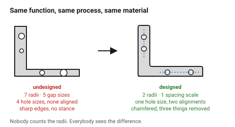
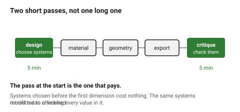

# Design — start here, on every part

The laser and FDM folders answer *can this be made?* This one answers **should
it look like this?** — and it applies to every part, not only to the ones
somebody calls a design job.

That is the point worth stating plainly: **a part is never only a
manufacturing problem.** A bracket nobody will see still has proportions, a
radius, a stance and a level of finish. Those are chosen whether or not anyone
decides them, and a part that was never designed looks exactly like a part
that was never designed.

## When this applies

Every part, at two moments:

1. **Before drawing**, to set the handful of values the whole object will
   repeat — the radius system, the spacing step, the proportion family.
2. **Before finishing**, as a review. → [`design-critique`](05-process/design-critique.md)

It applies harder when the part will be **seen**, **held** or **sold**, and
less when it is a jig or an internal bracket — but never to zero. Even a jig
is easier to use when its controls are where the hand expects them.

## Good starting values

Six numbers that carry most of the difference between "made" and "designed".
Each has its own document; these are the values to reach for when there is no
reason to do otherwise.

| What | Start with | Why |
|---|---|---|
| **Radii in one object** | **3 sizes, each ~2× the last** (e.g. 1 / 2 / 4 mm) | a radius system reads as deliberate; ten arbitrary radii read as accidental — [`edges-and-radii`](03-form/edges-and-radii.md) |
| **Spacing / step scale** | one scale, e.g. 2, 4, 8, 12, 16 mm | every gap, margin and offset comes from it — [`consistency-and-systems`](01-principles/consistency-and-systems.md) |
| **Proportion family** | 2 ratios per object, from 1:1, 1:1.25, 1:1.5, 1:1.618, 1:2 | more than two and the object stops rhyming with itself — [`proportion-and-scale`](01-principles/proportion-and-scale.md) |
| **Hierarchy levels** | 3 maximum, dominant ≥ 2× the next | everything equally important means nothing is — [`visual-hierarchy`](01-principles/visual-hierarchy.md) |
| **Alignment grids** | 1, ideally; 2 at most | a feature that aligns to nothing is the loudest thing on a part — [`seams-gaps-and-alignment`](03-form/seams-gaps-and-alignment.md) |
| **Things to remove** | one more than feels comfortable | subtraction is the cheapest improvement available — [`simplicity-and-restraint`](01-principles/simplicity-and-restraint.md) |

## How to build it

A short pass at the start, and a short pass at the end.

### Before drawing — five minutes

1. **Say what the object is for, in one sentence**, and who holds it.
   → [`design-brief`](05-process/design-brief.md)
2. **Choose the systems**: radius set, spacing scale, proportion family.
   Write them down. They are the object's grammar, and every later decision
   either follows them or has to justify itself.
3. **Decide the dominant element** — the one thing the eye should land on
   first — and commit to subordinating everything else.
4. **Decide how it is held and used**, if it is.
   → [`ergonomics-and-anthropometrics`](02-people/ergonomics-and-anthropometrics.md),
   [`affordances-and-controls`](02-people/affordances-and-controls.md)

### Before finishing — five minutes

5. **Run the critique.** → [`design-critique`](05-process/design-critique.md)
6. **Check the failure catalogue** for the specific ways parts look wrong.
   → [`failure-catalogue`](06-failures/failure-catalogue.md)
7. **Subtract one more thing.**

## When to do it differently

- **A pure jig or fixture** → the ergonomics and affordance documents still
  earn their keep; the aesthetic ones mostly do not. Say that explicitly
  rather than skipping silently.
- **A part inside a sealed assembly** → proportion and finish stop mattering.
  Consistency still does, because the next person to open it has to
  understand it.
- **A part that must match something existing** → the existing thing supplies
  the systems. Measure its radii and its spacing and adopt them rather than
  inventing new ones.
- **The brief is explicitly "ugly but working, today"** → then it is, and the
  right move is to say so once and build it, not to quietly design anyway.
- **Someone else's design language** → follow theirs. A house style you
  disagree with, applied consistently, beats two styles applied well.

## Images

*The same function, the same manufacturing constraints, the same material. The
difference is entirely a handful of repeated values: one radius system, one
spacing step, one alignment, and three things removed.*

*Five minutes before drawing to choose the systems, five minutes before
finishing to check them. The pass at the start is the one that pays.*

## Source & date

- Principles and structure assembled for this repository, 2026-09-22, from the
  sources cited in the documents linked above.
- `confidence: medium` — design guidance is practice rather than measurement.
  Where this folder gives a number (contrast ratios, grip diameters, target
  sizes) it is sourced and marked; where it gives a ratio or a count, that is
  a convention that works, not a law.
