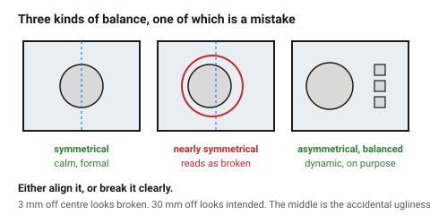
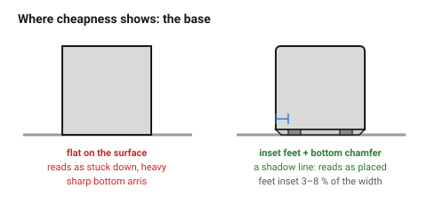

# Balance and stance

Balance is how weight is distributed across an object's composition. Stance is
how the object **sits** — whether it looks planted or about to fall over. Both
are read instantly and unconsciously, and both are usually wrong by accident
rather than by decision.

## When this applies

Any object that stands, hangs or is looked at from a fixed direction:
enclosures, instruments, displays, furniture, anything with a front.

Less relevant for parts seen from arbitrary angles or buried inside an
assembly.

## Good starting values

### Visual weight

Visual weight is not mass. These all make an element look heavier:

| Heavier | Lighter |
|---|---|
| larger | smaller |
| darker | paler |
| denser detail | plain |
| saturated colour | muted |
| sharp edges | soft radii |
| solid | perforated or transparent |

An object is balanced when the visual weight either side of its centre feels
equal — which is not the same as being geometrically symmetrical.

### Symmetry or asymmetry — pick one, deliberately

| | Reads as | Use when | Risk |
|---|---|---|---|
| **Symmetrical** | calm, formal, trustworthy, static | instruments, enclosures, anything that should feel reliable | can be dull; every deviation becomes loud |
| **Asymmetrical, balanced** | dynamic, considered, modern | objects with a clear front and a use direction | takes real work; a near-symmetry reads as an error |
| **Near-symmetrical** | **a mistake** | never | 3 mm off centre looks broken; 30 mm off looks intended |

That last row is the practical rule: **either align it or break it clearly.**
A feature 2 mm off centre is the single most common accidental ugliness in
product design.

### Stance

| What | Start with | Why |
|---|---|---|
| Base width relative to height | ≥ 1 : 1.5 for a free-standing object | taller than that and it looks tippy even when it is not |
| Visual centre of mass | in the lower half | objects that look heavy at the top look unstable |
| Feet inset from the edge | 3–8 % of the width | a base flush to the edge reads as heavy; too far in reads as precarious |
| Number of feet | 3 or 4 | three never rocks; four looks more solid |
| Undercut at the base | 1–3 mm | a slight shadow gap makes an object look placed rather than stuck down |

**The base is where cheapness shows.** A visible undercut, inset feet and a
chamfer at the bottom edge cost nothing and do more for perceived quality than
almost any other detail — which is also why the process folders both insist on
a bottom chamfer for their own reasons.
→ [`chamfers-fillets-elephant-foot`](../../fdm/03-geometry/chamfers-fillets-elephant-foot.md)

### The optical centre

Something centred by measurement looks slightly **low**. The optical centre is
about **5 % above** the geometric one. For a logo, a label or a single feature
on a face, shift it up by that much and it will look centred.

## How to build it

1. Decide symmetrical or asymmetrical, out loud, before drawing.
2. If symmetrical: **everything** on the axis, to the drawing's precision. One
   stray feature ruins it.
3. If asymmetrical: place the heaviest element off-centre by an obvious amount
   — at least 15 % of the width — and balance it with distance, not with a
   mirror.
4. Set the stance: base ratio, inset feet, bottom chamfer or undercut.
5. Put single features on the optical centre, not the geometric one.
6. Look at the object from its normal viewing angle, not from an isometric
   render. Stance only exists at eye level.

## When to do it differently

- **A part that is wall-mounted or hangs** → stance is irrelevant; balance
  still applies to the visible face.
- **Deliberate instability** as an expressive move → fine, and it must read as
  a choice: exaggerate it.
- **Function forces a tall narrow form** → widen the *visual* base: a plinth, a
  chamfer, a darker lower section. The eye judges the silhouette, not the
  footprint.

## Images

*Both are balanced. The symmetrical one is calm and unforgiving of deviation;
the asymmetrical one is dynamic and has to be done on purpose. The middle
option — nearly symmetrical — is the one that looks broken.*

*Where cheapness shows. An inset foot, a small undercut and a bottom chamfer
cost nothing and make the object look placed rather than stuck down.*

## Source & date

- Balance, visual weight and symmetry: [Quartz — 25 design principles](https://qz.com/design-principles-that-show-up-everywhere),
  [FourWeekMBA — golden ratio in design](https://fourweekmba.com/golden-ratio-in-design/) (on balance mattering more than ratio).
- The optical-centre offset is long-standing typographic and layout practice.
- `confidence: medium`.
