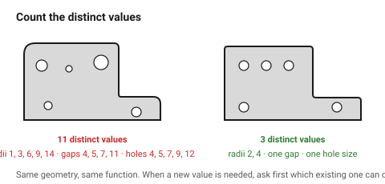

# Consistency — designing with systems

The single mechanical difference between an object that looks designed and one
that does not is **how many distinct values it contains**. A part with four
radii, three gap sizes and two wall thicknesses reads as considered. The same
part with eleven radii, nine gaps and five wall thicknesses reads as
accidental — even though nobody counts them.

This is the most teachable thing in the whole design folder, because it is
arithmetic.

## When this applies

Every part, from the first dimension onward. It costs nothing at the start and
is expensive to retrofit, because changing one value in a finished model means
checking every value.

## Good starting values

### The three systems every object needs

| System | Start with | Rule |
|---|---|---|
| **Radius set** | 3 values, each ~2× the last: **1 / 2 / 4 mm** | every fillet and chamfer comes from this set |
| **Spacing scale** | **2 / 4 / 8 / 12 / 16 mm** | every gap, margin, offset and inset comes from this |
| **Thickness set** | 2 values: a wall and a structural | e.g. 1.26 mm and 2.1 mm on a 0.4 mm nozzle |

Write them at the top of the model or the file. They are the object's grammar.

### How many distinct values is right

| Object complexity | Radii | Gaps | Thicknesses |
|---|---|---|---|
| Simple part (bracket, lid) | 2 | 2 | 1–2 |
| Normal product (enclosure) | 3 | 3–4 | 2 |
| Complex assembly | 4 | 4–5 | 3 |
| **Too many, always** | **> 5** | **> 6** | **> 3** |

When a new value is needed, the first question is **which existing value can
do this job?** Adding to the system is allowed; it just has to be a decision
rather than a drift.

### Why 2× steps

A ×2 (or ×1.5) geometric series is far more legible than a linear one. 1 / 2 /
4 reads as three distinct sizes; 1 / 1.5 / 2 reads as one size drawn three
times slightly wrong. The ear does the same thing with octaves.

### Rules that follow from the radius set

| Situation | Rule |
|---|---|
| Concentric edges (an outer edge and the inner edge of the same wall) | **outer radius = inner radius + wall thickness** — this is what keeps the wall constant and looks right |
| A radius that must be different | use the next value in the set, not an arbitrary one |
| Very small features | the smallest radius in the set, even if it could be smaller |
| The bottom edge of a printed or cut part | the process decides — see the process folders — and that value joins the set |

### Where consistency matters most

| Place | Why |
|---|---|
| **Gaps between parts** | the eye is extremely good at comparing two adjacent gaps |
| **Edges along one face** | a face with three different edge treatments looks unfinished |
| **Repeated elements** | near-identical is worse than clearly different |
| **Across a product family** | this is what makes a family read as a family |

## How to build it

1. Write the three systems down **before the first dimension**.
2. Draw only from them.
3. When a value does not fit, stop and decide: change the feature, or extend
   the system deliberately and apply the new value everywhere it belongs.
4. Before finishing, **count**. List every distinct radius, gap and thickness
   in the model. If the count is above the table, the part is not finished.
5. On a family, copy the systems from the first object rather than
   re-deriving them.

## When to do it differently

- **Matching an existing object** → adopt its systems, even if they are worse
  than the ones you would choose.
- **A process constraint forces a value** (a minimum web, a nozzle multiple)
  → the constraint wins, and that value becomes part of the system rather
  than an exception to it.
- **Deliberate contrast** → one value deliberately outside the system, once,
  reads as emphasis. Twice reads as drift.

## Images

*Nobody counts the radii, and everybody sees the difference. Left: eleven
distinct values. Right: three. Same geometry, same function.*

*The rule that keeps a wall constant around a corner. Getting it wrong gives a
wall that thickens or thins through the bend — visible on the outside, and a
manufacturing problem on the inside.*

## Source & date

- Radius consistency and choosing the largest practical radii:
  [FirstMold — fillets and chamfers in product design](https://firstmold.com/tips/fillets-and-chamfers/),
  [JLC CNC — fillet machining design guide](https://jlccnc.com/blog/fillet-in-cnc-machining-design-guide).
- The concentric-radius rule is standard practice in moulded and printed part
  design; see [`edges-and-radii`](../03-form/edges-and-radii.md).
- `confidence: medium`.
