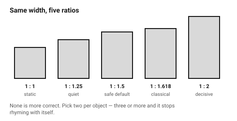
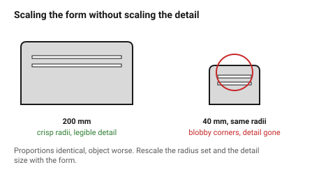

# Proportion and scale

Proportion is the relationship between an object's dimensions, and between
the object and its parts. It is the first thing the eye judges and the
cheapest thing to get right — it costs nothing to make a box 1:1.5 instead of
1:1.43.

## When this applies

Any time an overall size is being chosen, and any time a part "looks wrong"
without an identifiable fault. Wrong proportion is the most common cause of
that feeling.

## Good starting values

### The ratio family

Pick **two ratios** for one object and use them everywhere. Two is enough to
create rhythm; three or more and the object stops rhyming with itself.

| Ratio | Character | Good for |
|---|---|---|
| **1 : 1** | static, stable, formal | square faces, buttons, symmetrical objects |
| **1 : 1.25** | quiet, close to square | panels, lids, subtle rectangles |
| **1 : 1.5** | comfortable, unremarkable | the safe default for most boxes |
| **1 : 1.618** (golden) | classical, slightly tall | when a proportion should be noticed |
| **1 : 2** | decisive, elongated | bars, handles, deliberately long forms |
| **1 : 3 and beyond** | extreme | only when the function demands it |

### About the golden ratio, honestly

The golden ratio is a useful member of that list and nothing more. It is not a
law of perception, there is no good evidence that people prefer it to nearby
ratios, and a design is not improved by being forced onto it. It is worth
using when a proportion should feel classical; it is not worth measuring a
finished object against.

**Contrast, balance and consistency matter more than any specific ratio.** A
design that follows the golden ratio exactly and has no contrast still looks
flat.

### Scale within an object

| Relationship | Start with | Why |
|---|---|---|
| Dominant element to the next | **≥ 2 : 1** | below about 1.5:1 they compete instead of ranking |
| Repeated elements | identical | near-identical reads as an error, not as variety |
| Step between sizes in a set | ×1.5 or ×2 | a geometric series reads as intentional |
| Detail size to object size | detail ≥ 1/50 of the object | finer than that and it disappears at arm's length |

### Absolute scale — the number people forget

Ratios are relative; **objects are held by actual hands**. A shape that works
at 200 mm often fails at 40 mm, because detail that was legible has become
invisible and radii that looked crisp have become blobby.

| Object size | Smallest detail that still reads | Typical radius set |
|---|---|---|
| ≤ 50 mm (held in fingers) | 0.5 mm | 0.5 / 1 / 2 mm |
| 50–200 mm (held in a hand) | 1 mm | 1 / 2 / 4 mm |
| 200–600 mm (two hands, desk) | 2 mm | 2 / 4 / 8 mm |
| > 600 mm (furniture) | 4 mm | 3 / 6 / 12 mm |

Scaling a design up or down **without rescaling its details** is one of the
most common ways a good form becomes a bad one.

## How to build it

1. Choose the overall ratio from the family, and write it down.
2. Choose one secondary ratio for internal divisions.
3. Set the radius set and detail size from the absolute-size table.
4. Check the dominant element is at least twice the next thing.
5. When the object is resized later, **rescale the detail set too** — or
   accept that it is now a different design.

## When to do it differently

- **Function fixes the proportion** (a box around a PCB) → then the ratio is
  given; spend the effort on the internal divisions and the detail scale
  instead.
- **A family of objects** → keep the ratio constant across the family and let
  size vary. That is what makes a family read as one.
- **A deliberately awkward proportion** → legitimate, and it must be clearly
  deliberate: 1:2.6 reads as a choice, 1:1.47 reads as a mistake.

## Images

*The same width at five ratios. None is more correct; each has a character,
and mixing more than two of them in one object is what looks unresolved.*

*A form scaled down without rescaling its details. The radii have become
blobby and the fine features have vanished — the proportions are identical
and the object is worse.*

## Source & date

- Ratio families and the role of proportion: [IxDF — the golden ratio: principles of form and layout](https://ixdf.org/literature/article/the-golden-ratio-principles-of-form-and-layout),
  [eCampusOntario — proportions and transitions](https://ecampusontario.pressbooks.pub/sensoryaspectsofdesign/chapter/2-6-proportions-and-transitions/).
- The caution against golden-ratio dogma: [NN/g — the golden ratio and user-interface design](https://www.nngroup.com/articles/golden-ratio-ui-design/),
  [Medium — the golden ratio: a tool or an obsession?](https://medium.com/@anuj_80942/the-golden-ratio-in-design-a-tool-or-an-obsession-c561767a8129).
- `confidence: medium`.
