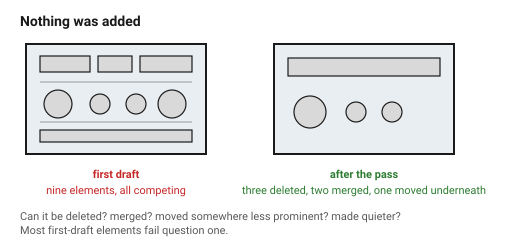
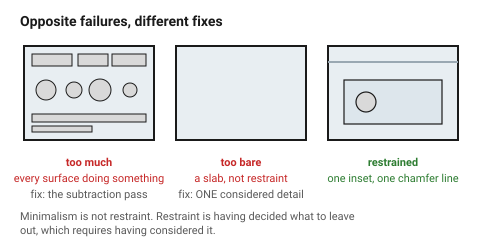

# Simplicity and restraint

Every element added to an object is another thing that has to agree with
everything else. That is why subtraction improves a design so reliably: it
does not just remove the element, it removes all the relationships the element
was part of.

"As little design as possible" is the hardest of Rams' principles to apply and
the easiest to check, because it has a procedure.

## When this applies

On every first draft, and again before finishing. Most strongly on objects
that will be seen; least on jigs, where a redundant feature costs nothing.

## Good starting values

| What | Start with | Why |
|---|---|---|
| Elements to remove from a first draft | **3** | the first three are almost always available |
| Features that justify themselves | every one, in a sentence | "it might be useful" is not a sentence |
| Decorative elements | **0** unless the object's job is decorative | decoration doing the work of form is the definition of cheap |
| Visible fasteners | as few as the joint needs | four screws where two would do reads as uncertainty |
| Distinct materials or finishes on one object | 2, 3 at most | see [`material-and-texture`](../04-cmf/material-texture-and-finish.md) |
| Text and labels on a surface | the minimum that prevents error | a label is an admission the form did not explain itself |

### The subtraction pass

Go through the object element by element and ask, in this order:

1. **Can it be deleted?** Does anything break?
2. **Can it be merged** with a neighbouring element?
3. **Can it be moved somewhere less prominent** — inside, underneath, behind?
4. **Can it be made quieter** — smaller, flatter, the same colour as its
   surroundings?

Anything that survives all four has earned its place. Most first-draft
elements do not survive question 1.

### The two failure modes, and they are opposite

| Failure | Looks like | Fix |
|---|---|---|
| **Too much** | busy, cheap, unresolved; every surface doing something | the subtraction pass |
| **Too bare** | flat, generic, unfinished; a box with no relief | one considered detail — a chamfer line, a change of plane, an inset — not five |

Minimalism is not the same as restraint. A featureless extruded rectangle is
not restrained, it is undesigned. **Restraint is having decided what to leave
out**, which requires having considered it.

### What "one considered detail" means

When an object is too plain, the answer is rarely more elements. It is
usually one of:

| Move | Effect |
|---|---|
| A chamfer or a shadow gap along one line | gives the eye an edge to follow and reads as precision |
| A single change of plane | breaks a slab into two related surfaces |
| An inset or recessed area | creates depth without adding parts |
| One material or finish change | adds interest with zero geometry |
| A deliberate proportion shift | see [`proportion-and-scale`](proportion-and-scale.md) |

One of these. Not three.

## How to build it

1. Draw the first version with everything you think you need.
2. Run the subtraction pass, element by element, all four questions.
3. Remove three things.
4. Look again. If it is now too plain, add **one** considered detail from the
   list above.
5. Stop.

## When to do it differently

- **An expressive or decorative object** → the brief is decoration, so
  decoration is function. Restraint applies to *how many* gestures, not to
  whether there are any.
- **A safety or compliance requirement** → labels, warnings and redundant
  controls stay, whatever they do to the composition.
- **A jig or fixture** → skip this entirely. A redundant feature on a jig
  costs nothing and may save a setup.
- **The user asked for more** → give them more, and say once that fewer would
  read better. Their object.

## Images

*Nothing was added. Three elements were deleted, two merged, and one moved to
the underside. The remaining features are the ones that survived all four
questions.*

*Opposite failures with different fixes. A featureless slab is not restrained,
it is undesigned — the answer is one considered detail, not five elements.*

## Source & date

- "As little design as possible" and the surrounding principles:
  [Vitsœ — good design](https://www.vitsoe.com/us/about/good-design),
  [IxDF — Dieter Rams' 10 timeless commandments](https://ixdf.org/literature/article/dieter-rams-10-timeless-commandments-for-good-design).
- `confidence: medium`.
