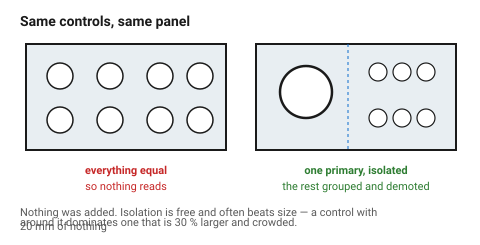
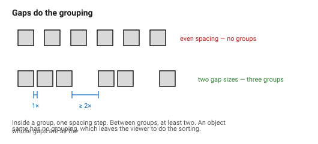

# Visual hierarchy

Hierarchy is the order in which an object tells you about itself. A part with
hierarchy has one thing the eye lands on, a second thing it finds next, and
everything else quiet. A part without it presents everything at once, which
reads as busy, cheap, or — most often — as *nobody decided*.

## When this applies

Any object with more than one feature on a face: a panel with controls, an
enclosure with a logo and a connector, a bracket with holes of several sizes.

## Good starting values

| What | Start with | Why |
|---|---|---|
| **Levels of hierarchy** | **3** | primary, secondary, quiet. A fourth level is not perceived as a level |
| Dominant to secondary | ≥ 2 : 1 in size or weight | below ~1.5:1 they compete |
| Number of primary elements | **exactly 1** | two primaries is the definition of no hierarchy |
| Quiet elements | as many as needed | they are quiet, so they do not cost attention |

### The five levers, cheapest first

| Lever | How | Note |
|---|---|---|
| **Size** | make it bigger | the bluntest and most reliable |
| **Isolation** | give it space; crowd the others | often stronger than size, and free |
| **Contrast** | different colour, finish or material | see [`colour`](../04-cmf/colour.md) |
| **Position** | the eye enters top-left in Latin reading cultures, and centre on a symmetrical object | |
| **Detail** | more detail on the primary, less on the rest | expensive; use last |

Isolation is the one most often missed. A control surrounded by 20 mm of
nothing dominates a control that is 30 % larger and crowded.

### Grouping — the part before hierarchy

Before ranking elements, **group** them. Things that belong together should be
closer to each other than to anything else, and that spacing difference should
be obvious: a 2:1 ratio between the gap inside a group and the gap between
groups is the minimum that reads.

| Gap | Start with |
|---|---|
| Between elements in a group | 1 × the spacing step (e.g. 4 mm) |
| Between groups | ≥ 2 × that (8 mm or more) |
| Between a group and the edge | ≥ 2 × the internal gap |

An object whose gaps are all the same has no grouping, which means the viewer
has to do the sorting.

### What kills hierarchy

| Mistake | What happens |
|---|---|
| Everything centred | no entry point; the eye bounces |
| Every element given its own emphasis | emphasis cancels out |
| A logo as large as the primary control | the brand competes with the function |
| Even spacing throughout | no grouping, so no structure |
| Decoration at the same weight as function | the eye cannot tell what matters |

## How to build it

1. **Name the primary element** in words before drawing it. If you cannot, the
   object does not have one yet.
2. Group everything else, and set the two gap sizes.
3. Apply the levers in order: size, then isolation, then contrast. Stop as
   soon as the ranking is obvious.
4. Demote everything that is not primary or secondary — same size, same
   finish, no emphasis.
5. Squint at the render, or look at it at thumbnail size. The primary element
   should still be identifiable. If everything blurs into one grey mass, the
   hierarchy is not there.

## When to do it differently

- **A deliberately uniform field** (a grid of identical ports, a perforated
  panel) → the field *is* one element. Rank it against everything else, not
  within itself.
- **Safety-critical controls** → hierarchy is a safety requirement, not an
  aesthetic one. The emergency stop is primary regardless of composition.
- **A purely internal part** → skip it; nobody is reading the object.

## Images

*Same controls, same sizes, same positions on the left — everything equal, so
nothing reads. On the right one element is larger and isolated, the rest are
grouped and demoted. Nothing was added.*

*Gaps do the grouping. Inside a group, one spacing step; between groups, at
least two. Even spacing throughout means the viewer has to do the sorting.*

## Source & date

- Hierarchy, grouping and emphasis: [Quartz — 25 design principles that shape everything around you](https://qz.com/design-principles-that-show-up-everywhere),
  [Prezentium — the proportion principle of design](https://prezentium.com/proportion-principle-of-design/).
- Grouping by proximity is the Gestalt principle of the same name.
- `confidence: medium`.
