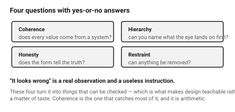

# What good looks like

"It looks wrong" is a real observation and a useless instruction. This
document turns it into things that can be checked.

The useful frame is that a well-designed object is **coherent**: every value
in it comes from a small set, every element earns its place, and nothing
contradicts the thing next to it. Coherence is what people read as quality,
and it is almost entirely mechanical — which is why a model can be taught it.

## When this applies

Whenever a part "looks off" and nobody can say why, and as the vocabulary for
any design discussion. Also the first document to reach for when a critique
needs to be more specific than an opinion.

## Good starting values

### The four tests that catch most of it

| Test | Ask | Failure looks like |
|---|---|---|
| **Coherence** | does every dimension come from a system? | ten arbitrary radii, gaps of 3.2 / 4 / 5.7 mm |
| **Hierarchy** | can you name what the eye lands on first? | everything the same weight, so nothing reads |
| **Honesty** | does the form tell the truth about the object? | fake vents, decorative screws, a moulded-in "grip" that is not gripped |
| **Restraint** | can anything be removed without losing function? | usually yes, on a first draft, three times over |

### Rams, condensed to what is checkable

Dieter Rams' ten principles are the standard reference, written for physical
products. Four of them translate directly into checks; the rest are ambitions.

| Principle | The checkable version |
|---|---|
| Good design is **useful** | every feature maps to something the object must do |
| Good design makes a product **understandable** | the form says how it is used without a label |
| Good design is **unobtrusive** | the object does not perform; it recedes until needed |
| Good design is **as little design as possible** | subtract until removing more breaks it |

The remaining six — innovative, aesthetic, honest, long-lasting, thorough to
the last detail, environmentally friendly — are worth knowing and are not
checks. Treat them as direction, not as a rubric.

### The single most reliable improvement

**Subtract.** On a first draft, removing the three least necessary elements
improves the object more often than any addition does. This is not a style
preference; it is a consequence of coherence — every element added is another
thing that has to agree with everything else.

### What "cheap" actually is

"Looks cheap" is almost never about cost. It is one of these, and each is
fixable:

| Signal | Fix |
|---|---|
| Inconsistent radii and gaps | one radius system, one spacing scale |
| Everything the same visual weight | pick a dominant element |
| Thin, flimsy proportions | thicken the visible section, or add a visible structural line |
| Misalignment by a millimetre | align to a grid, or align deliberately far off |
| Unfinished edges and visible process marks | chamfer, sand, mask — see the process folders |
| Decoration doing the work of form | remove the decoration |

## How to build it

1. Before drawing, define the systems (radius set, spacing scale, proportion
   family) and write them at the top of the file.
2. While drawing, ask of each new dimension: **does this come from the
   system?** If not, either change it or change the system.
3. Name the dominant element out loud.
4. Before finishing, remove three things.
5. Run the critique. → [`design-critique`](../05-process/design-critique.md)

## When to do it differently

- **A deliberately expressive or playful object** → coherence still applies;
  restraint may not. Exuberance done systematically reads as designed;
  exuberance done arbitrarily reads as a mess.
- **Matching an existing family** → the family supplies the systems. Adopt,
  do not invent.
- **A prototype to test function** → skip all of it, and say that is what you
  are doing so nobody mistakes the prototype for the design.

## Images

*Coherence, hierarchy, honesty, restraint. Each one is a question with a yes
or no answer, which is what makes "it looks wrong" actionable.*

## Source & date

- [Vitsœ — good design (Rams' ten principles)](https://www.vitsoe.com/us/about/good-design),
  [IxDF — Dieter Rams: 10 timeless commandments for good design](https://ixdf.org/literature/article/dieter-rams-10-timeless-commandments-for-good-design).
- The caution against treating the ten principles as a rubric follows the
  critique in [Design and Culture — a call to move beyond Rams' ten principles](https://www.tandfonline.com/doi/full/10.1080/17547075.2025.2488565).
- `confidence: medium` — this is practice, not measurement.
