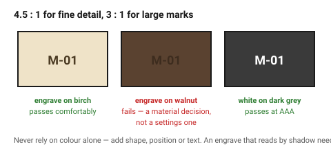
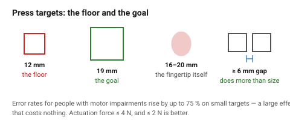

# Accessibility

Designing for the edges of the range makes an object better for everyone in
the middle of it. A latch that opens with a weak grip opens easily with a
strong one; a label readable at low contrast is readable in a dark workshop.

This document is the set of minimums worth meeting by default, not a
compliance guide.

## When this applies

Anything used by people other than its designer. Most strongly on objects used
by the public, by older people, or in bad conditions — poor light, gloves, one
hand occupied.

## Good starting values

### Seeing

| What | Minimum | Better | Source |
|---|---|---|---|
| **Contrast, normal text or fine detail** | **4.5 : 1** | 7 : 1 | WCAG AA / AAA |
| **Contrast, large text and graphics** | **3 : 1** | 4.5 : 1 | WCAG AA |
| Engraved or embossed label depth | 0.4 mm | 0.6 mm | so it reads by shadow, not only by colour |
| Label cap height, arm's length (~600 mm) | 4 mm | 6 mm | roughly 1 mm per 150 mm of viewing distance |
| Never rely on **colour alone** | — | — | add shape, position or text |

Contrast ratios are defined for screens but transfer usefully to printed,
engraved and painted marks: a dark engrave on pale birch passes comfortably; a
dark engrave on walnut does not.
→ [`engraving-wood`](../../laser/05-engraving/engraving-wood.md)

### Touching and pressing

| What | Minimum | Better | Note |
|---|---|---|---|
| **Touch / press target** | **24 × 24** units | **44 × 44** | WCAG 2.5.8 sets 24 as the floor and 44 as the goal; in physical terms, 12 mm minimum and 19 mm preferred |
| Gap between targets | 6 mm | 10 mm | mispresses come from gaps, not sizes |
| Actuation force | ≤ 4 N | ≤ 2 N | arthritis and tremor make high forces exclusionary |
| Grip required to operate | none, ideally | — | an object that must be gripped hard excludes people |
| Operable with a closed fist or a flat hand | preferred | — | the classic test for lever handles |

Error rates for people with motor impairments rise by up to **75 %** on small
targets, which is a large effect for a change that costs nothing.

### Holding and lifting

| What | Guidance |
|---|---|
| One-handed operation | the object should not need a second hand to steady it: add mass, feet or a clamp |
| Lift points | obvious, and positioned so the load is balanced |
| Weight | ≤ 5 kg for routine one-handed lifting; below that for repeated use |
| Sharp edges | none reachable. Chamfer or radius every edge a hand meets |

### Understanding

| What | Guidance |
|---|---|
| Prefer a constraint to an instruction | → [`affordances-and-controls`](affordances-and-controls.md) |
| Prefer a symbol **and** a word to either alone | |
| Language | if a label must be read, it must be in the user's language — see the glossary note below |
| Consistency across the object | the same control does the same thing everywhere |

## How to build it

1. Check contrast on **every** mark: engraving against its wood, paint against
   its substrate, label against panel.
2. Size every control from the floor values, then set gaps.
3. Check the object can be operated **one-handed, with a weak grip, in poor
   light**. These three cover most of the range.
4. Remove any reliance on colour alone.
5. Round or chamfer every edge a hand can reach.
6. Where an instruction is unavoidable, add a constraint as well.

## When to do it differently

- **A tool for a known single user** → their hands are the specification, and
  the general minimums may be beaten by fitting them exactly.
- **A safety-critical or public-facing product** → this document is a floor,
  not a standard. Real compliance requirements apply and are jurisdictional.
- **A decorative object** → contrast and edges still matter; control sizing
  does not.
- **Deliberately hard to operate** (a child-resistant closure) → the
  difficulty is the function. Make it difficult in a way that does not also
  exclude the intended user.

## Images

*4.5:1 for fine detail, 3:1 for large marks. A dark engrave on pale birch
passes; the same engrave on walnut does not, which is a material decision
rather than a settings one.*

*12 mm is the floor and 19 mm the goal for a physical press target — but the
gap between targets does more for error rate than the size does.*

## Source & date

- Contrast ratios (4.5:1 normal, 3:1 large): WCAG 2.1 Level AA, as summarised
  in [AccessibilityChecker — touch target and contrast guides](https://www.accessibilitychecker.org/wcag-guides/all-touch-targets-must-be-24px-large-or-leave-sufficient-space/).
- Target size 24 minimum / 44 preferred and the 75 % error-rate figure:
  [TestParty — WCAG 2.5.8 target size guide](https://testparty.ai/blog/wcag-target-size-guide),
  [LogRocket — all accessible touch target sizes](https://blog.logrocket.com/ux-design/all-accessible-touch-target-sizes/),
  [Siteimprove — motor impairments and the touch target problem](https://www.siteimprove.com/blog/motor-impairments-and-mobile-ui-the-touch-target-problem/).
- Physical conversions from the digital figures, and the force and lifting
  guidance, are conventional practice — treat as `starting-point`.
- `confidence: medium`.
