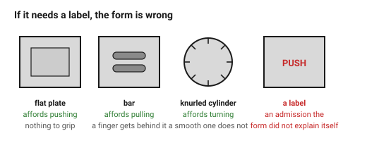
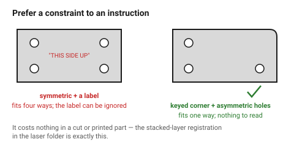
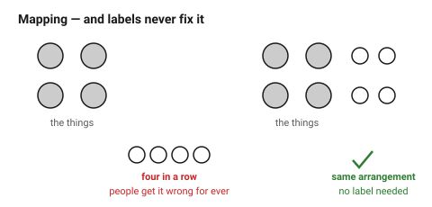

# Affordances — making the object explain itself

If an object needs a label saying PUSH, the handle is wrong. Norman's point,
and it is the most practically useful idea in product design: **the form
should say what to do**, and a label is an admission that it did not.

Five concepts, all checkable.

## When this applies

Anything with a moving part, a control, an opening, an orientation or an
insertion. Also anything that could be assembled or held the wrong way round —
which is most things.

## Good starting values

### The five concepts

| Concept | What it is | Failure |
|---|---|---|
| **Affordance** | what the object physically permits — a flat plate affords pushing, a bar affords pulling | a pull handle on a push door |
| **Signifier** | the visible cue saying *where* and *how* — a worn patch, a recess, an arrow | a control that is invisible until you know it is there |
| **Constraint** | what the object physically prevents | a connector that goes in two ways, one of which is wrong |
| **Mapping** | the relationship between a control and its effect | four knobs in a row for four burners in a square |
| **Feedback** | what tells you it worked | a switch with no detent, no click, no visible state |

### Rules that follow

| Situation | Rule |
|---|---|
| Something must be **pushed** | flat, or slightly recessed. Nothing to grip |
| Something must be **pulled** | a bar, a lip, an undercut — something a finger can get behind |
| Something must be **turned** | not round, or visibly ribbed. A smooth cylinder does not say "turn me" |
| Something must be **slid** | a ridge across the direction of travel |
| Something has **one correct orientation** | make the wrong orientation physically impossible. An asymmetric outline, a keyed corner, a pin that only fits one way |
| Something has a **state** | the state must be visible when nobody is touching it |
| Something must **not** be touched | recess it, guard it, or put it where a hand does not go |

**Prefer a constraint to a label, every time.** A part that cannot be
assembled backwards needs no instruction, no warning and no support call. This
is also cheap in a printed or cut part: an asymmetric corner costs nothing.
→ [`stacked-layer-construction`](../../laser/04-joints/stacked-layer-construction.md)
uses exactly this for layer registration.

### Mapping — the one people get wrong

A control's position should match its effect's position. Four controls in a
row for four things in a square is a mapping failure that no labelling fixes:
people will get it wrong for the life of the product.

| Arrangement | Rule |
|---|---|
| Controls for things in space | lay the controls out **in the same spatial arrangement** |
| A control with a direction | up/right = more, in every culture that reads left-to-right |
| A rotary control | clockwise = more |
| A control for something hidden | this is the hard case. Add a signifier, or move the control next to what it does |

### Feedback in a physical object

| Type | How | Note |
|---|---|---|
| **Tactile** | detent, click, over-centre snap | the most valuable, and works without looking |
| **Visual** | a state that is visible at rest | a flush button gives none |
| **Audible** | a click | free if the mechanism is right |
| **Resistance change** | a lid that suddenly gets easier | often accidental — make it deliberate |

A switch with no feedback is the commonest quiet failure in a printed
assembly, because printed mechanisms rarely click unless designed to.

## How to build it

1. List every interaction the object has, in verbs: press, pull, turn, slide,
   insert, lift, open.
2. For each, check the **form affords it** — and only it.
3. For each, check there is a **signifier** visible at rest.
4. For each orientation that matters, add a **constraint** rather than a
   label.
5. For each control, check the **mapping** to what it affects.
6. For each action, name the **feedback**. If there is none, add one.
7. Hand the object to somebody with no explanation and watch. Every hesitation
   is a finding.

## When to do it differently

- **Deliberately hidden controls** (a concealed reset, a hidden latch) → the
  lack of signifier is the point. Make sure the people who need it have
  another route.
- **An expert tool used daily** → discoverability matters less, efficiency
  more. A pilot's cockpit is not designed for first use.
- **Safety** → constraints are mandatory, not preferred; and a label is added
  *as well*, never instead.
- **A part with no interactions** → skip this document.

## Images

*A flat plate affords pushing, a bar affords pulling, a knurled cylinder
affords turning. If a label is needed, the form is wrong.*

*An asymmetric outline or a keyed corner makes the wrong assembly impossible.
It costs nothing in a cut or printed part, and unlike a label it cannot be
ignored.*

*Four controls in a row for four things in a square is a mapping failure that
labelling never fixes.*

## Source & date

- Affordances, signifiers, constraints, mapping, feedback and discoverability:
  [UX Magazine — understanding Don Norman's principles of interaction](https://uxmag.com/articles/understanding-don-normans-principles-of-interaction),
  [UX Planet — all about affordance and signifier](https://uxplanet.org/all-about-affordance-and-signifier-terms-by-don-norman-the-ux-pioneer-e0ea7b9b99f5),
  [Figr — the design of everyday things, key principles](https://figr.design/blog/the-design-of-everyday-things).
- `confidence: medium`.
