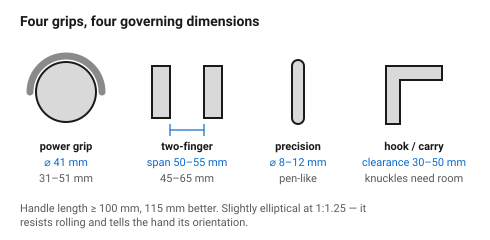
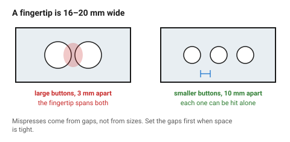
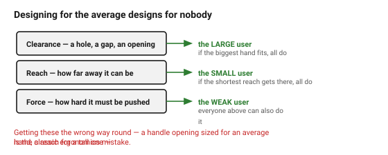

# Ergonomics and anthropometrics

The one part of design with genuine measured numbers behind it. Hands vary far
less than taste does, and a handle at 41 mm diameter is better than one at
25 mm for reasons that have nothing to do with opinion.

## When this applies

Anything held, gripped, carried, pressed, turned or reached into. Also
anything that is *not* held but sits where hands go — the edge someone grabs
to lift a box is a handle whether it was designed as one or not.

## Good starting values

### Grips and handles

| What | Start with | Works between | Why |
|---|---|---|---|
| **Power-grip handle diameter** | **41 mm** | 31–51 mm | the span where most adults reach a full wrap without strain |
| Handle length | **115 mm** | ≥ 100 mm | shorter than 100 mm and it presses into the edge of the palm |
| Clearance around a handle | 30–50 mm | | knuckles need somewhere to go |
| Cross-section | slightly elliptical, **1 : 1.25** | | resists rolling in the hand and tells the hand its orientation |
| **Two-finger grip span** (pliers-like) | **50–55 mm** | 45–65 mm | most comfortable and strongest for small and medium hands; large hands prefer 55–60 |
| Precision grip (pen-like) | 8–12 mm | 6–16 mm | |
| Maximum span an adult hand can grip | ~175 mm | | above this it is carried, not gripped |
| Minimum an adult can grip | ~10 mm | | below this it is pinched |

A useful proportional rule: **handle diameter ≈ 20 % of hand length**. For a
mixed adult population that lands near the 41 mm figure.

### Fingers, buttons and controls

| What | Start with | Why |
|---|---|---|
| Adult fingertip width | **16–20 mm** | the number every control size derives from |
| Push button, bare finger | ⌀ **12–19 mm** | below 12 mm it needs aiming rather than pressing |
| Push button, gloved or eyes-free | ⌀ ≥ 19 mm | |
| Gap between adjacent buttons | ≥ **6 mm**, ideally ≥ 10 mm | fingertip width is what creates mispresses, not button size |
| Knob diameter, finger-turned | 15–25 mm | |
| Knob diameter, whole-hand | 40–75 mm | |
| Toggle or slider travel | ≥ 6 mm | shorter and the state is not felt |
| Recessed control (deliberately hard to hit) | recess ≥ 3 mm | |

**The gap matters more than the size.** Two 10 mm buttons 12 mm apart are
easier to use than two 16 mm buttons 3 mm apart.

### Force

| Action | Comfortable | Maximum for repeated use |
|---|---|---|
| Press a button with a finger | 1–4 N | 10 N |
| Pull a lid or a latch open | 10–20 N | 40 N |
| Turn a small knob | 0.1–0.3 Nm | 0.5 Nm |
| Carry with one hand, short distance | ≤ 5 kg | 10 kg |

These are for healthy adults. Design down from them if the object will be used
by children, by older people, or repeatedly.
→ [`accessibility`](accessibility.md)

### Which percentile

Designing for "the average person" designs for nobody: the average hand fits
about half the population badly.

| Dimension type | Design to | Because |
|---|---|---|
| **Clearance** (how big a hole, gap, handle opening must be) | the **large** user (95th percentile) | if the biggest hand fits, every hand fits |
| **Reach** (how far away something can be) | the **small** user (5th percentile) | if the shortest reach gets there, everyone does |
| **Force** (how hard something must be pushed) | the **weak** user | |
| **Grip size** (something wrapped by the hand) | the middle, and make it adjustable if it matters | this is the one case where the average is right |

Getting these the wrong way round — sizing a handle opening for an average
hand, or a reach for a tall one — is the classic ergonomics mistake.

## How to build it

1. Write down **how the object is held**, in words, before drawing it.
2. Pick the grip type: power grip, two-finger, precision, or not held at all.
3. Take the diameter and clearance from the tables.
4. Size controls from fingertip width, then set the gaps — gaps first if
   space is tight.
5. Apply the percentile rule to each dimension according to its *type*, not
   uniformly.
6. **Test with a hand.** Print or cut the grip alone, before the rest of the
   object exists. Ten minutes, and no amount of modelling substitutes for it.

## When to do it differently

- **A tool used all day** → this document is a starting point; real tool
  ergonomics needs testing with the actual task and the actual load.
- **Children** → hand dimensions scale roughly with age and are not simply
  smaller adults; grip strength drops far faster than size.
- **Gloved use** → add 10–15 mm to every clearance and go to the larger
  control sizes.
- **One-handed use required** → the object must be operable without a second
  hand steadying it, which usually means mass, feet or a clamp.
- **Decorative object, never handled** → skip this document, and say so.

## Images

*Power grip, two-finger, precision, and hook. Each has a different governing
dimension, and using the wrong one is how a handle ends up at 25 mm.*

*Fingertip width is 16–20 mm, which is larger than most buttons. Two small
buttons spaced well beat two large buttons crowded together.*

*Clearances are sized for the large user, reaches for the small one. Applying
the average to both is the classic ergonomics mistake.*

## Source & date

- Handle diameter (41 mm optimal, 31–51 mm acceptable), length and clearance:
  [VelocityEHS — ergonomic handle design considerations](https://www.ehs.com/blogs/ergonomic-handle-design-considerations/).
- Grip span (50–55 mm most comfortable and strongest; 55–60 mm for large
  hands), handle length ≥ 100 mm, elliptical 1:1.25 cross-section, and
  diameter ≈ 19.7 % of hand length:
  [Hand tool handle design based on hand measurements (MATEC Web of Conferences, PDF)](https://www.matec-conferences.org/articles/matecconf/pdf/2017/33/matecconf_imeti2017_01044.pdf).
- Grip range ~10–175 mm: [RoyMech — hand grip sizes and grasping examples](https://www.roymech.co.uk/Useful_Tables/Ergonomics/Grasping_pictures.html).
- Fingertip width 16–20 mm: MIT Touch Lab, as cited in
  [LogRocket — accessible touch target sizes](https://blog.logrocket.com/ux-design/all-accessible-touch-target-sizes/).
- `confidence: medium` — the handle and grip figures are measured; the force
  table and the control sizes are conventional practice and should be treated
  as `starting-point`.
