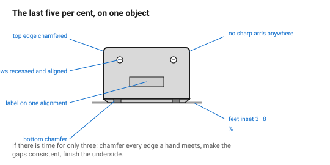
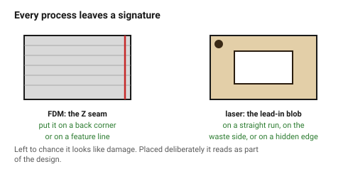

# Details and craft

The gap between a prototype and a product is almost entirely small things that
each take a few minutes. None of them is a design decision in the grand sense;
collectively they are the whole difference.

This document is the list.

## When this applies

Before calling any object finished, and especially before showing it to
anybody. It is the highest ratio of perceived improvement to effort available
anywhere in this folder.

## Good starting values

### The checklist of small things

| Detail | Do this | Why it matters |
|---|---|---|
| **Every edge a hand meets** | chamfer or radius it | sharp printed and cut edges feel unfinished and unpleasant |
| **Bottom edge** | chamfer 0.5–0.8 mm | the process folders demand it anyway; it also makes the object look placed |
| **Fastener heads** | recess or countersink them | a proud screw head is the loudest thing on a clean face |
| **Fastener count** | the minimum the joint needs | four where two would do reads as uncertainty |
| **Fastener alignment** | all slots or hex sockets can be aligned | costs seconds, reads as care |
| **Labels and marks** | on one face, on one alignment, one type size family | |
| **The underside** | finish it too | people turn objects over, always |
| **Cable and connector openings** | radiused, and sized so the cable is not pinched | |
| **Feet or pads** | inset 3–8 % from the edge | → [`balance-and-stance`](../01-principles/balance-and-stance.md) |
| **Process marks** | put them where nobody looks: the Z seam, the lead-in point, the support scars | |
| **Text orientation** | all reading the same way | mixed orientations on one object read as careless |
| **Internal surfaces** | tidy where they are visible when open | |

### The three that people notice most

If there is time for only three:

1. **Chamfer every edge a hand meets.** Touch is a stronger quality signal
   than sight, and a sharp edge is felt immediately.
2. **Make the gaps consistent.** → [`seams-gaps-and-alignment`](seams-gaps-and-alignment.md)
3. **Finish the underside.** It is the single most reliable signal that
   somebody cared, because it is the part nobody had to do.

### Where process marks should go

Both processes leave a signature, and where it lands is a design decision:

| Process | Mark | Put it |
|---|---|---|
| FDM | Z seam (a vertical line up one side) | on a back corner, or on a feature line |
| FDM | support scars | on a face that will not be seen or measured |
| FDM | elephant foot | absorbed by the bottom chamfer |
| Laser | lead-in / pierce blob | on a straight run, on the waste side, or on a hidden edge |
| Laser | corner overburn | radius the visible corners |
| Laser | ply glue lines | let them read as a stripe deliberately, or hide the edge |

Leaving these to chance is the difference between a mark that looks like part
of the design and one that looks like damage.

### A detail that is not worth it

Not every detail pays. These commonly cost more than they return:

| Detail | Why skip |
|---|---|
| Variable-radius fillets on a matte printed surface | invisible |
| Curvature continuity on anything not glossy | invisible |
| Micro-chamfers under 0.2 mm | below what either process resolves |
| Engraved text under 3 mm on wood | the grain wins |
| Hidden fasteners requiring a complex mechanism | complexity is a bigger cost than a visible screw |

## How to build it

1. Work the checklist top to bottom before declaring the object finished.
2. Decide explicitly where each process mark lands.
3. Turn the object over and look at the underside as if it were the front.
4. Hold it. Every edge that is unpleasant is a finding.
5. Photograph it. A photograph is unforgiving in a way that a render is not,
   and it is how everyone else will first see the object.

## When to do it differently

- **A functional prototype** → skip it all, and say that is what you did.
  The danger is not skipping, it is letting the prototype be mistaken for the
  design.
- **A jig** → only the edges-a-hand-meets row applies.
- **A very large batch** → a detail that takes a few minutes per part is no
  longer a detail. Choose fewer, and build them into the file rather than the
  finishing.

## Images

*None of these is a design decision in the grand sense. Together they are the
entire difference between a prototype and a product.*

*Every process leaves a signature. Deciding where it lands is what makes it
read as part of the design rather than as damage.*

## Source & date

- Assembled from the process documents in this repository plus conventional
  product-design finishing practice.
- The Z-seam, support-scar, elephant-foot, lead-in and overburn behaviours are
  documented and sourced in the `fdm/` and `laser/` folders.
- `confidence: medium`.
