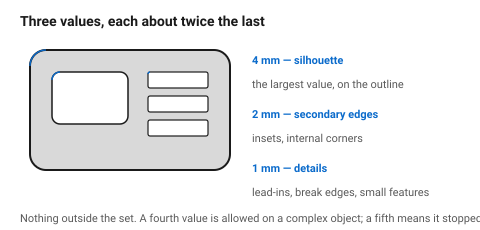
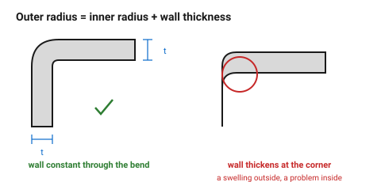
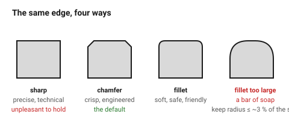

# Edges and radii as a system

Radii are where a design is most often betrayed. Not because any single one is
wrong, but because there are eleven of them and no two are related. The eye
reads that instantly as *nobody decided*, even though nobody counts.

A radius is also the cheapest way to say something about an object: sharp
reads as technical and precise, soft reads as friendly and safe, and the
choice between them is free.

## When this applies

Every edge on every part. The process folders decide what a radius must be for
manufacturing reasons; this document decides what it should be for design
reasons, and where those conflict the process wins.

## Good starting values

### The radius set

| Object size | Set | Rule |
|---|---|---|
| ≤ 50 mm | 0.5 / 1 / 2 mm | |
| 50–200 mm | **1 / 2 / 4 mm** | the default |
| 200–600 mm | 2 / 4 / 8 mm | |
| > 600 mm | 3 / 6 / 12 mm | |

**Three values, each about twice the last.** Every fillet and chamfer on the
object comes from the set. A fourth value is allowed when the object is
complex; a fifth means the set has stopped being a set.

### Which value goes where

| Edge | Use |
|---|---|
| Main outer edges — the silhouette | the **largest** in the set |
| Secondary edges, internal corners | the middle value |
| Small details, lead-ins, break edges | the **smallest** |
| Every edge a hand touches | at least the smallest — never left sharp |
| An edge the process dictates | whatever the process says, and that value joins the set |

### The concentric rule

Where an outer edge and an inner edge belong to the same wall:

```
outer radius = inner radius + wall thickness
```

This keeps the wall a constant thickness around the corner. Break it and the
wall thickens or thins through the bend — visible from outside as a swelling,
and a real problem inside for moulding and printing alike.

### Sharp, chamfer or fillet

| Treatment | Reads as | Use when | Watch out |
|---|---|---|---|
| **Sharp** | precise, technical, severe | machined-look parts, edges nobody touches | unpleasant to hold; catches; chips |
| **Chamfer** | crisp, deliberate, engineered | most visible edges; anywhere a shadow line helps | a 45° chamfer is the default; other angles should be a decision |
| **Fillet** | soft, safe, organic, moulded | handheld objects, children's products, anything that should feel friendly | large fillets everywhere read as bland and toy-like |
| **Chamfer + fillet** | considered | a chamfer with its own small fillets reads as expensive | costly in modelling time |

A useful default for an enclosure: **chamfer the bottom, fillet the top and
sides.** The bottom chamfer also happens to be what both process folders
demand for manufacturing reasons, which is a rare case of the aesthetic and
the practical agreeing exactly.
→ [`chamfers-fillets-elephant-foot`](../../fdm/03-geometry/chamfers-fillets-elephant-foot.md),
[`corners-and-overburn`](../../laser/03-geometry/corners-and-overburn.md)

### Radius and perceived quality

| Radius relative to the object | Reads as |
|---|---|
| Very small (< 1 % of the size) | sharp, technical, potentially cheap if the material is thin |
| Small (1–3 %) | precise, engineered — the usual choice for tools and instruments |
| Medium (3–8 %) | friendly, consumer, safe |
| Large (> 10 %) | soft, toy-like, pillowy — rarely right above a certain size |

The commonest mistake is **too large**: a 5 mm fillet on a 40 mm object is
12 % and turns a crisp form into a bar of soap.

## How to build it

1. Choose the set from the size table and write it down.
2. Assign: largest to the silhouette, middle to secondary edges, smallest to
   details.
3. Apply the concentric rule wherever a wall turns a corner.
4. Decide chamfer or fillet per face family, not per edge.
5. Before finishing, **list every distinct radius in the model**. More than
   four means going back.

## When to do it differently

- **A machined-look part** → sharp edges and small chamfers only; fillets
  where a tool radius forces them, and that tool radius becomes the set.
- **Matching an existing object** → measure its radii and adopt them.
- **A process minimum forces a value** → it wins, and it joins the set rather
  than becoming an exception.
- **Deliberate contrast** → one edge treated unlike all the others reads as
  emphasis. Once.

## Images


*Three values, each roughly twice the last. Largest on the silhouette,
smallest on the details, and nothing outside the set.*


*Outer radius = inner radius + wall thickness. Break it and the wall thickens
through the bend — a swelling visible from outside, and a real problem inside.*


*The same edge four ways. Sharp reads technical, chamfer reads engineered,
fillet reads friendly, and a large fillet on a small object reads as a bar of
soap.*

## Source & date

- Radius consistency, choosing the largest practical radii, and radius ≈ 0.5–2
  × wall thickness: [FirstMold — fillets and chamfers in product design](https://firstmold.com/tips/fillets-and-chamfers/),
  [JLC CNC — fillet machining design guide](https://jlccnc.com/blog/fillet-in-cnc-machining-design-guide),
  [3D Printing Expert — what is a radius for product design](https://3d-printing-expert.com/what-is-a-radius-for-product-design/).
- The concentric rule is standard moulded and printed part practice:
  [SWCPU — injection molding corner design guide](https://www.swcpu.com/blog/injection-molding-corner-design/).
- `confidence: medium`.
