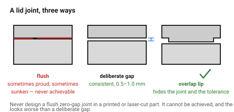
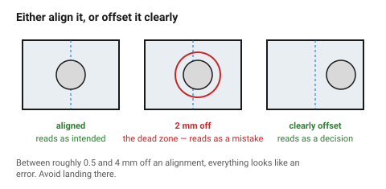

# Seams, gaps and alignment

Gaps are where perceived quality actually lives. People cannot see a 0.1 mm
dimensional error on a surface, but they can see that two adjacent gaps are
different widths from across a room — the eye is extraordinarily good at
comparing two parallel lines.

This is why a cheap product and an expensive one can have the same geometry
and look nothing alike.

## When this applies

Any object made of more than one part, any lid, any panel, any joint that
shows. Also any single part with a visible process seam.

## Good starting values

| What | Start with | Why |
|---|---|---|
| **Visible gap width** | **0.5–1.0 mm** | below 0.4 mm it closes up unevenly; above 1.5 mm it reads as slack |
| **Consistency of one gap** | ± 0.15 mm along its length | this is the number the eye actually judges |
| Consistency between parallel gaps | identical, or obviously different | 0.6 and 0.9 mm side by side looks broken |
| Shadow gap (deliberate recess) | 1–3 mm deep | reads as precision and hides tolerance |
| Flush surfaces | flush, or stepped by ≥ 0.5 mm | a 0.2 mm step reads as a mistake |
| Alignment grids per object | **1**, 2 at most | |

### The rule that covers most of it

> **Either align it, or offset it clearly.**

A feature 1 mm off an alignment reads as an error. The same feature 8 mm off
reads as a decision. There is a dead zone roughly between 0.5 mm and 4 mm
where everything looks like a mistake — avoid landing in it.

### Hiding tolerance instead of fighting it

Printed and cut parts do not hold tight tolerances, so a design that *requires*
a perfect flush joint will not get one. The professional move is to design so
that variation does not show:

| Technique | How it helps |
|---|---|
| **Shadow gap** | a deliberate recess between two parts; variation happens in the shadow where nobody reads it |
| **Overlap / lip** | one part overlaps the other, so the joint line is hidden and the gap is invisible — see [`enclosure-shell-and-lid`](../../fdm/05-features/enclosure-shell-and-lid.md) |
| **Deliberate step** | a clear 1 mm step is easier to hold than a perfect flush |
| **Break the line** | a chamfer on both parts turns one uncertain joint into two crisp edges |
| **Put the seam on an edge** | a parting line on a corner is far less visible than one across a face |

**Never design a flush, zero-gap joint in a printed or laser-cut part.** It
cannot be achieved, and the attempt produces a joint that is sometimes proud
and sometimes sunken — which looks worse than a deliberate 1 mm gap.

### Where the seam goes

| Option | Reads as |
|---|---|
| On a corner or an edge | almost invisible — the default |
| Along a feature line, a change of plane | deliberate |
| Across a flat face | cheap, unless it is symmetrical and obviously intended |
| Asymmetrically across a face | an accident |

### Alignment

Everything on a face should align with something else on that face: an edge, a
centreline, another feature. A single element aligned to nothing is the
loudest thing on the object.

| Check | |
|---|---|
| Do all the controls share a centreline or a baseline? | |
| Do the gaps between them come from the spacing scale? | |
| Does the logo align with something, or is it floating? | |
| Do features on adjacent faces line up where they meet at the edge? | |

## How to build it

1. Decide the gap width once, and use it everywhere on the object.
2. Choose where every seam runs — corners and feature lines first.
3. Pick the technique that hides tolerance: lip, shadow gap or step. Do not
   attempt flush.
4. Establish **one** alignment grid and put everything on it.
5. Check the dead zone: no feature 0.5–4 mm off an alignment.
6. Look at the object from 2 m. Gap inconsistency is visible at that distance
   and dimensional error is not — which tells you where to spend effort.

## When to do it differently

- **A machined or moulded part with real tolerance control** → flush joints
  become possible, and a 0.3 mm gap reads as precision rather than slack.
- **A single-piece object** → only the process seams matter: the print's Z
  seam, the laser's lead-in point. Put them where nobody looks.
  → [`corners-and-overburn`](../../laser/03-geometry/corners-and-overburn.md)
- **A deliberately rough or handmade aesthetic** → gap consistency stops
  mattering, and pretending otherwise is worse.

## Images

*A flush joint in a printed or cut part is sometimes proud and sometimes
sunken. A deliberate gap is consistent. A lip hides the joint entirely, and is
why every enclosure in the FDM folder has one.*

*Aligned reads as intended. Clearly offset reads as intended. Between roughly
0.5 and 4 mm, everything reads as a mistake.*

## Source & date

- Gap, seam and tolerance-hiding practice is conventional product design;
  the enclosure lip technique and its clearances are documented in
  [`enclosure-shell-and-lid`](../../fdm/05-features/enclosure-shell-and-lid.md),
  which sources them.
- `confidence: medium` — the numbers are practice, calibrated to what printed
  and laser-cut parts can actually hold.
