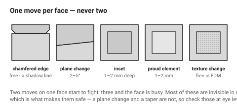
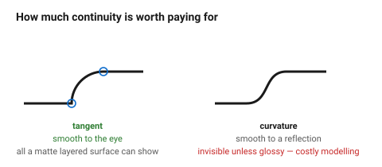

# Surfaces and transitions

Most parts from a laser or a printer are made of flat surfaces meeting at
right angles, because that is what the processes are good at. The result reads
as a box, and a box is a fine thing to be — but the difference between a box
that looks designed and one that looks like a slab is a small number of moves
on its surfaces.

## When this applies

Any object with faces larger than about 40 × 40 mm, which is where flatness
starts to read as emptiness.

## Good starting values

### The five moves, cheapest first

| Move | What it is | Cost | Effect |
|---|---|---|---|
| **Chamfer a long edge** | a 1–3 mm chamfer along the top edge of a face | free | a shadow line; the object gains an edge the eye follows |
| **Change of plane** | split one large face into two at a shallow angle (2–5°) | low | the face catches light differently across the break |
| **Inset / recess** | a shallow recessed panel, 1–2 mm deep | low | depth without parts; a natural home for controls and labels |
| **Proud element** | one element standing 1–2 mm off the face | low | hierarchy, and a place for a different finish |
| **Texture change** | one area textured, the rest smooth | free in FDM, cheap in laser | see [`material-and-texture`](../04-cmf/material-texture-and-finish.md) |

**One of these per face.** Two moves on one face start to fight; three and the
face is busy.

### Proportions for the moves

| What | Start with | Why |
|---|---|---|
| Inset depth | 1–2 mm | deep enough to cast a shadow, shallow enough not to weaken the wall |
| Inset margin from the face edge | ≥ 2 × the spacing step | a recess crowding the edge looks like a mistake |
| Plane-change angle | 2–5° | below 2° it looks like a defect; above ~8° it becomes a facet and changes the silhouette |
| Proud element height | 1–2 mm | |
| Chamfer along a long edge | the largest value in the radius set | it is the silhouette |

### Transitions between surfaces

| Transition | Reads as | Note |
|---|---|---|
| Sharp intersection | technical, machined | fine on small parts; harsh on large ones |
| Constant-radius fillet | standard, slightly generic | the default, and it is fine |
| Variable-radius fillet | expensive, organic | hard to model, easy to do badly |
| Chamfer between two curved faces | crisp | a good way to avoid a difficult fillet |
| **Tangent** continuity | smooth to the eye | the minimum for any curve meeting a flat |
| **Curvature** continuity | smooth to the hand and to a reflection | worth it only on glossy, held objects |

For printed and cut parts, **tangent continuity is enough**. Curvature
continuity is invisible on a matte, layered surface and costs a great deal of
modelling time.

### Draft and taper as a design choice

Both processes here can produce vertical walls, so draft is not required —
which means any taper is a *decision*. A slight taper (1–3°) makes an object
look lighter and planted; a vertical wall looks industrial and stable. Neither
is wrong, and a taper that varies from face to face is.

## How to build it

1. List the faces that will be seen.
2. For each, pick **one** move from the table — or deliberately leave it flat.
3. Set the depths and margins from the spacing scale.
4. Check the moves relate to each other: an inset on the front and an inset on
   the side should be the same depth and share a margin.
5. Check the silhouette. Most moves are invisible in outline, which is what
   makes them safe; a plane change and a taper are not, so check those from
   the object's normal viewing angle.

## When to do it differently

- **A small object (< 40 mm)** → leave the faces alone. Surface moves at that
  scale read as clutter.
- **A part in a family** → the same move, the same depth, across the family.
- **Laser-cut flat parts** → faces are the sheet's own surface, so the moves
  available are engraving and stacking rather than modelling.
  → [`stacked-layer-construction`](../../laser/04-joints/stacked-layer-construction.md)
- **A deliberately raw, industrial object** → flat slabs, sharp intersections,
  no moves. That is a valid choice and should be stated as one.

## Images

*One move per face. A chamfered edge, a plane change, an inset, a proud
element, a texture change — each breaks a slab without adding parts.*

*On a layered matte surface, tangent continuity is all the eye can read.
Curvature continuity costs real modelling time and shows up only on glossy,
held objects.*

## Source & date

- Transitions and proportion: [eCampusOntario — proportions and transitions](https://ecampusontario.pressbooks.pub/sensoryaspectsofdesign/chapter/2-6-proportions-and-transitions/).
- Fillet and chamfer behaviour: [FirstMold — fillets and chamfers in product design](https://firstmold.com/tips/fillets-and-chamfers/).
- `confidence: medium`.
