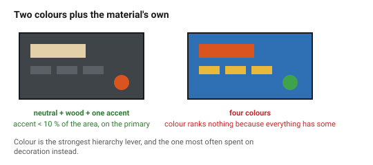
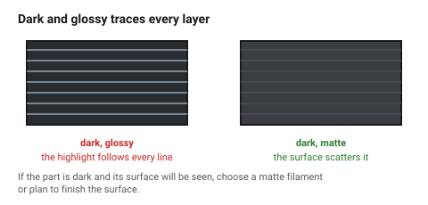

# Colour

Colour is the cheapest way to change how an object reads and the easiest way
to make it look worse. In printed and cut work the palette is largely chosen
for you — filament colours, wood tones, one coat of paint — which is a
constraint worth using rather than fighting.

## When this applies

Any object that will be seen. Also any object made of more than one material,
because two materials are already a two-colour scheme whether or not anyone
chose it.

## Good starting values

| What | Start with | Why |
|---|---|---|
| **Colours per object** | **2**, plus a neutral | three colours is already a lot on a small object |
| Accent colour coverage | ≤ 10 % of the visible area | an accent stops being an accent above that |
| Dominant colour | a neutral: black, grey, white, or the wood's own tone | |
| Contrast for anything read | ≥ **4.5 : 1** for fine detail, **3 : 1** for large | → [`accessibility`](../02-people/accessibility.md) |
| Saturated colours | one, at most | two saturated colours compete and neither wins |

### The scheme that works by default

```
neutral body  +  one accent  +  the material's own colour as the third
```

For a wooden object, the wood *is* the dominant colour and it is not neutral —
it is warm. That constrains what an accent can be: cool greys and blacks sit
well against birch; most blues fight it.

### Colour and hierarchy

Colour is the strongest hierarchy lever and the one most often wasted. If
everything is coloured, colour ranks nothing.

| Use colour to | Not to |
|---|---|
| mark the one control that matters | decorate |
| distinguish states (on/off, locked/open) | fill space |
| separate functional groups | signal "this is a product" |
| warn | hide a form problem |

### What each choice says

| Colour | Reads as | Risk |
|---|---|---|
| Black | serious, technical, recessive | shows dust, scratches and layer lines badly |
| Dark grey | the safest technical neutral | |
| White / off-white | clean, clinical, modern | shows every mark; yellows in some materials |
| Natural wood | warm, crafted, honest | varies sheet to sheet |
| Saturated primary | playful, toy-like, or safety | reads cheap in a matte printed finish |
| Muted / desaturated | considered, expensive | can read as drab without a crisp accent |

### Colour in these two processes specifically

| | Practical palette | Notes |
|---|---|---|
| **FDM** | whatever filament exists | matte filaments hide layer lines far better than glossy; dark colours hide them worst of all, because the highlight follows every layer |
| **Laser on wood** | the wood, plus the engrave's brown-black | the engrave is your second colour whether you wanted one or not |
| **Laser + paint** | any | MDF takes paint best; ply telegraphs its grain |
| **Two-tone** | a wood body with a printed accent part | one of the most reliable ways to make a mixed-process object look intentional |

**Dark grey or black filament with a visible layer line is a worse
combination than most people expect.** If the part will be printed in a dark
colour and its surface will be seen, choose a matte filament or plan to
finish the surface.

## How to build it

1. Start from the material's own colour — it is already in the scheme.
2. Choose **one** additional colour, usually a neutral.
3. Choose **one** accent, and give it ≤ 10 % of the area, on the element the
   hierarchy already made primary.
4. Check every mark that must be read against the contrast minimums.
5. Remove any colour that is not doing one of the four jobs in the table
   above.

## When to do it differently

- **A brand or house palette exists** → use it, exactly. Consistency beats
  preference.
- **Safety colours** → those are specified, not chosen.
- **A single-material object** → the palette is one colour and the job is
  form and finish instead.
- **Deliberately colourful** → fine, and then colour is the design; apply
  restraint to the number of *forms* instead.

## Images


*Two colours plus the material's own tone. The accent is under 10 % of the
area and sits on the element that was already primary. On the right, colour
ranks nothing because everything has some.*


*The highlight runs along every layer. A matte filament scatters it; a glossy
dark one traces each line individually.*

## Source & date

- CMF as a discipline and its effect on perceived value:
  [Formlabs — what is CMF design](https://formlabs.com/blog/what-is-cmf-color-material-finish-opportunities-for-3d-printing/),
  [Blue Frog Design — integrating colour, material and finish](https://bluefrogdesign.co.uk/2025/04/color-material-finish-cmf/),
  [CMF design (Wikipedia)](https://en.wikipedia.org/wiki/CMF_design).
- Contrast minimums: WCAG 2.1 AA, see [`accessibility`](../02-people/accessibility.md).
- `confidence: medium`.
