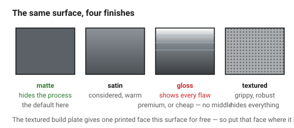
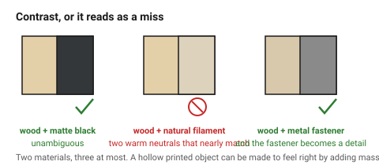

# Material, texture and finish

Colour, Material and Finish are one discipline because they are read together:
CMF is what decides whether an object feels cheap or expensive, fragile or
durable — often before its form registers at all.

Of the three, **finish is the one most under your control and the one most
often left to chance.**

## When this applies

Every object that will be touched. Touch is a faster and more trusted quality
signal than sight, which is why a beautiful object with a slightly tacky
surface still feels wrong.

## Good starting values

| What | Start with | Why |
|---|---|---|
| **Materials per object** | **2**, 3 at most | each additional material is another set of relationships |
| Finishes per material | 1, or 2 if one is an accent | |
| **Texture** | one textured area at most | texture everywhere is the same as texture nowhere |
| Matte vs gloss | **matte by default** | matte hides process marks; gloss advertises them |
| Contrast between materials | make it obvious | two similar materials read as a failed attempt at one |

### What each finish says

| Finish | Reads as | Hides | Shows |
|---|---|---|---|
| **Matte** | modern, technical, calm | layer lines, sanding marks, fingerprints | little |
| **Satin** | considered, warm | most process marks | some highlights |
| **Gloss** | premium, or cheap — no middle ground | nothing | every flaw, and every layer line |
| **Textured** | grippy, industrial, robust | everything | almost nothing |
| **Raw material** | honest, crafted | — | the process, deliberately |

For FDM and laser work, **matte and satin are almost always right**. Gloss on
a layered or charred surface is a decision to display the process, which is
occasionally the point and usually not.

### Texture in these processes

| Process | Available texture | Cost |
|---|---|---|
| FDM | layer lines (inherent), modelled texture, fuzzy-skin surfaces | free to near-free |
| FDM | a textured build plate on the bottom face | free, and a genuinely good surface |
| Laser on wood | engraved patterns, hatching, the wood's own grain | engraving time |
| Laser on wood | the material itself — grain is a texture you did not have to make | free |

**The textured build plate is underused.** It gives one face of a printed part
a uniform, fine, matte texture for nothing, which is usually the best surface
on the object — so put that face where it will be seen or touched.

### Combining materials

A wood body with a printed part, or a printed body with a wooden face, is one
of the most reliable ways to make a mixed-process object look intentional
rather than assembled from whatever was available.

| Combination | Works when |
|---|---|
| Wood + matte black plastic | almost always — high contrast, both matte |
| Wood + natural filament | rarely — two warm neutrals that nearly match |
| Two woods | only with a clear tone difference; near-matching woods look like a mistake |
| Wood + metal fastener | always, and the fastener becomes a detail — align them |
| Three materials | needs a reason |

### Haptics — what the hand reads

| Signal | Reads as |
|---|---|
| Weight above expectation | quality, substance |
| Weight below expectation | cheap, hollow |
| Warm to touch (wood, textured plastic) | friendly, natural |
| Cool (metal, glossy plastic) | precise, clinical |
| Sharp edges | unfinished, regardless of how it looks |
| Slight texture underhand | grip, control, care |

Mass is the one people forget. A hollow printed object can be made to feel
right by adding a weight, a metal base plate or higher infill in the base
alone — a cheap trick that works because expectation is set by size.

## How to build it

1. Count the materials. If more than two, justify each.
2. Choose matte unless there is a reason.
3. Choose **one** area to texture, if any.
4. Decide which face gets the best surface — the textured plate face, the
   masked wood face — and orient the part so that face is the one seen.
5. Hold it. If it feels lighter than it looks, consider adding mass at the
   base.
6. Check every edge a hand meets. → [`details-and-craft`](../03-form/details-and-craft.md)

## When to do it differently

- **A part that must be cleaned** → smooth and matte; texture holds dirt.
- **A part that must be gripped** → texture the grip area only, and leave the
  rest smooth so the texture reads as functional.
- **A showpiece** → gloss becomes possible, and it means committing to the
  surface preparation that gloss demands: sanding, filling, priming.
- **A single-material object** → then finish and texture carry the whole CMF
  job, which makes the one texture decision more important, not less.

## Images

*Matte hides the process, gloss advertises it. On a layered or charred surface
that is a decision, and it is usually the wrong one.*

*Wood against matte black works because the contrast is unambiguous. Wood
against natural filament fails because the two nearly match — which reads as
an attempt that missed.*

## Source & date

- CMF as a discipline, and its effect on whether a product feels cheap or
  luxurious, durable or fragile:
  [Formlabs — what is CMF design](https://formlabs.com/blog/what-is-cmf-color-material-finish-opportunities-for-3d-printing/),
  [LEADRP — CMF design basics](https://leadrp.net/blog/cmf-design-basics-what-you-need-to-know/),
  [Blue Frog Design — integrating colour, material and finish](https://bluefrogdesign.co.uk/2025/04/color-material-finish-cmf/).
- Process-specific surface behaviour is documented in the `fdm/` and `laser/`
  folders.
- `confidence: medium`.
