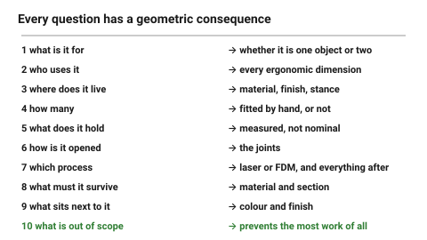

# The brief — what to establish before drawing

Most bad parts are not badly drawn; they are drawn before anyone decided what
they were for. Ten questions, answered in a few sentences, prevent more
rework than any amount of modelling skill.

This is deliberately short. A brief that takes an hour does not get written.

## When this applies

Before the first line of any object that is more than a bracket. For a
bracket, questions 1, 3 and 7 alone are enough.

## Good starting values

### The ten questions

| # | Question | Why it changes the geometry |
|---|---|---|
| 1 | **What is it for**, in one sentence? | if this takes a paragraph, the object is doing two jobs and should be two objects |
| 2 | **Who uses it**, and what are their hands like? | decides every ergonomic dimension → [`ergonomics`](../02-people/ergonomics-and-anthropometrics.md) |
| 3 | **Where does it live?** desk, workshop, pocket, outdoors | decides material, finish, and whether it needs a stance |
| 4 | **How many** will exist? | one changes everything: a one-off can be fitted by hand, a batch cannot |
| 5 | **What does it attach to or contain?** | every bought component is a measured constraint, not a nominal one |
| 6 | **How is it opened, serviced or replaced?** | decides the joints → [`wood-joint-selection`](../../laser/04-joints/wood-joint-selection.md) |
| 7 | **Which process?** | laser or FDM is a material and geometry decision, not a preference |
| 8 | **What must it survive?** load, heat, drops, water, time | |
| 9 | **What does it have to look like** — and next to what? | an object never exists alone |
| 10 | **What is explicitly out of scope?** | the question that prevents the most work |

### Choosing the process — question 7 in detail

| The part is | Use |
|---|---|
| Flat, or buildable from flat layers | **laser** — faster, cheaper, stronger per gram |
| Genuinely three-dimensional, with cavities or curves | **FDM** |
| Flat but needs an internal cavity | laser, stacked → [`stacked-layer-construction`](../../laser/04-joints/stacked-layer-construction.md) |
| Needed in quantity, flat | laser, by a wide margin |
| A single complex part with many features | FDM |
| Both, in one object | common, and usually right — wood body, printed details |

### The output

A brief is not a document. It is a handful of lines at the top of the file:

```
Cable tidy for a workshop bench.
Used by one person, both hands free, grabbed without looking.
Lives on a bench, gets knocked. Ten of them.
Holds 4-8 cables, 4-10 mm diameter.
Laser, 6 mm birch ply. Screwed to the bench edge.
Must look like it belongs next to the printer: matte black and birch.
Out of scope: adjustability, cable labelling.
```

Seven lines. Every one of them constrains the geometry, and the object is
already half designed.

## How to build it

1. Answer the ten questions in sentences, not bullet points. Sentences expose
   the ones you cannot actually answer.
2. Write them at the top of the model file, not in a separate document that
   nobody opens again.
3. **Measure everything in question 5** before drawing — bought components
   are nominal in the catalogue and real on the bench.
4. Re-read the brief before the final critique. Most late-stage arguments are
   really about question 1 or question 10.

## When to do it differently

- **A jig or fixture** → questions 1, 3, 7. The rest do not apply.
- **An exploratory sketch model** → skip the brief entirely; the point is to
  find out what the brief should say.
- **Somebody else's brief** → do not improve it silently. Note where you
  disagree, then build what was asked.
- **The brief keeps changing** → that is normal early and a problem late. Fix
  question 1 and question 10 first; the others can move.

## Images


*Every question maps to a geometric consequence. The two that prevent the most
work are the first — what is it for, in one sentence — and the last — what is
explicitly out of scope.*

## Source & date

- Structure assembled for this repository; the process-choice table follows
  from the capabilities documented in the `laser/` and `fdm/` folders.
- Design critique practice: [NN/g — design critiques](https://www.nngroup.com/articles/design-critiques/).
- `confidence: medium`.
