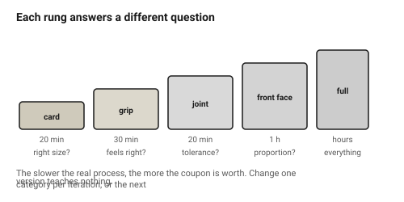
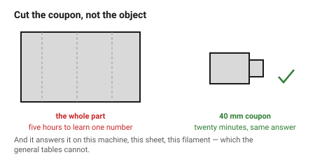

# Iteration and mock-ups

The single highest-value habit in physical design: **make a rough one early.**
A cardboard version costs twenty minutes and answers questions that no amount
of modelling can, because the questions are about size, reach and feel rather
than about geometry.

## When this applies

Any object that will be held, that contains something, or whose size is not
obvious. Which is most objects.

## Good starting values

| Stage | Material | Time | Answers |
|---|---|---|---|
| **Size check** | 1.5 mm greyboard, tape | 20 min | is it the right size? does the hand fit? does the PCB go in? |
| **Ergonomics check** | the grip alone, printed | 30 min | does it feel right in the hand? |
| **Fit check** | the joint alone, cut or printed | 20 min | does the tolerance work on this machine and this sheet? |
| **Appearance check** | the front face only, in the real material | 1 h | proportions, finish, contrast |
| **Full prototype** | the real material | hours | everything at once, and by now most of it is already known |

**Cut the coupon, not the object.** A 40 mm test piece of the one joint that
matters answers the question that a five-hour print was going to answer, and
it answers it before the five hours are spent.

### How many iterations

| Object | Expect |
|---|---|
| A simple bracket | 1–2 |
| An enclosure with bought components | 3–4 |
| Anything held and used | 4+, and the early ones should be cardboard |
| A press fit on a new material | 1 coupon, then 1 part |

If the first version is right, the object was simpler than it looked or the
brief was very good. If the fifth version is still wrong, the problem is
usually in the brief rather than in the geometry.

### What to change between iterations

**One category at a time.** Changing size, joint and finish together means the
next version teaches nothing, because there is no way to tell which change
did what.

| Iteration | Change |
|---|---|
| 1 → 2 | size and layout |
| 2 → 3 | joints and tolerances |
| 3 → 4 | detail, finish, marks |

### Keep the rejected versions

Line them up. A row of versions is the most useful design document there is:
it shows what was tried, it prevents re-trying it, and it makes the final
choice defensible to somebody who was not there.

## How to build it

1. Before modelling in earnest, **build the size check in card**. Tape is
   fine. Twenty minutes.
2. Hold it, put the components in it, put it where it will live.
3. Fix what that revealed, then model properly.
4. **Cut or print coupons** for every joint and fit before committing to the
   whole part.
5. Change one category per iteration.
6. Keep every version, labelled, in order.

## When to do it differently

- **A part with no user interaction and known dimensions** → go straight to
  the real thing; a mock-up teaches nothing.
- **Very fast processes** (small laser parts) → the "mock-up" is just the real
  part in cheap material, which is better.
- **Very slow processes** (a twelve-hour print) → more mock-up stages, not
  fewer. The slower the real process, the more the coupon is worth.
- **A one-off for yourself** → iterate in the real material and enjoy it.

## Images

*Each rung answers a different question, and each is cheaper than the rung
above it. The cardboard size check is the one that pays for itself most often.*

*A 40 mm test piece answers the tolerance question before the five-hour print
does — and it answers it on this machine, this sheet, this filament.*

## Source & date

- The coupon and test-part practice is documented and sourced in
  [`kerf-test-comb`](../../laser/01-basics/kerf-test-comb.md) and
  [`tolerance-test-part`](../../fdm/01-basics/tolerance-test-part.md).
- Iteration practice: [NN/g — design critiques](https://www.nngroup.com/articles/design-critiques/).
- `confidence: medium`.
