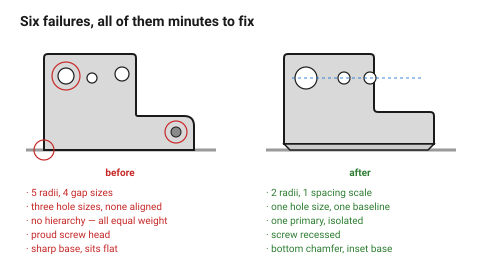

# Design failure catalogue — why it looks wrong

Symptom, cause, fix — for the things people notice and cannot name. The
column that matters is the last one: nearly every entry here is a **cheap**
fix, because these are failures of decision rather than of execution.

## When this applies

When an object is finished and something is wrong with it, and when a critique
needs a vocabulary more specific than "hmm".

## Good starting values

### "It looks cheap"

| Symptom | Cause | Fix |
|---|---|---|
| Hard to say why — it just does | too many distinct values: radii, gaps, thicknesses | count them; reduce to a system → [`systems`](../01-principles/consistency-and-systems.md) |
| The gaps look uneven | they are — the eye compares parallel lines extremely well | one gap width everywhere, or an obvious difference → [`seams-and-alignment`](../03-form/seams-gaps-and-alignment.md) |
| It feels flimsy | thin visible sections, sharp arrises, low mass | thicken the *visible* section; add a chamfer; add weight at the base |
| The edges are unpleasant | sharp, unchamfered | chamfer everything a hand meets |
| A screw head stands proud on a clean face | not recessed | countersink or recess it |
| It looks like it fell out of a machine | process marks left where they landed | place the Z seam, the lead-in, the support scars deliberately |

### "It looks like nobody designed it"

| Symptom | Cause | Fix |
|---|---|---|
| Everything is equally important | no hierarchy | name a primary element, make it ≥ 2× → [`hierarchy`](../01-principles/visual-hierarchy.md) |
| Even spacing throughout | no grouping | two gap sizes: inside a group, between groups |
| A feature floats, aligned to nothing | no alignment grid | one grid, everything on it |
| It is a plain extruded rectangle | no decision was made | one considered detail → [`restraint`](../01-principles/simplicity-and-restraint.md) |
| Proportions feel arbitrary | they are | pick a ratio from the family → [`proportion`](../01-principles/proportion-and-scale.md) |
| It looks like a parametric generator made it | every value derived, none chosen | choose the visible ones by eye and keep them |

### "Something is subtly off"

| Symptom | Cause | Fix |
|---|---|---|
| A feature looks slightly wrong on centre | it is 1–3 mm off — the dead zone | align it exactly, or move it 10 mm |
| A logo or label looks low | centred geometrically | raise it ~5 % — the optical centre |
| The object looks tippy | narrow base, visual weight high | widen the base, or move weight down |
| Two panels nearly match but not quite | near-symmetry | make them identical or clearly different |
| Two woods, or two greys, nearly match | insufficient contrast between materials | increase the contrast, or use one |
| A corner radius looks blobby | too large for the object's scale | radius ≤ ~3 % of the object dimension |

### "It looks 3D printed" / "it looks laser cut"

Neither is inherently bad — but when it is unwanted:

| Symptom | Cause | Fix |
|---|---|---|
| Layer lines dominate a dark glossy surface | dark glossy filament traces every layer | matte filament, or finish the surface → [`colour`](../04-cmf/colour.md) |
| A bulging base | elephant foot | bottom chamfer → [`chamfers-fillets-elephant-foot`](../../fdm/03-geometry/chamfers-fillets-elephant-foot.md) |
| Rough patch on one face | supports were there | reorient, or design them out |
| Visible brown halo around every cut | no masking | mask both faces → [`char-and-cleanup`](../../laser/10-wood-finishing/char-and-cleanup.md) |
| Ply glue lines read as cheap | they are on a visible edge | put the edge where it is not seen, or let the stripe read as deliberate |
| Every corner is a 90° box | the process's default, unexamined | one surface move per face → [`surfaces`](../03-form/surfaces-and-transitions.md) |

### "I can't work out how to use it"

| Symptom | Cause | Fix |
|---|---|---|
| People push what should be pulled | the form affords the wrong action | flat to push, a bar to pull → [`affordances`](../02-people/affordances-and-controls.md) |
| It gets assembled backwards | nothing prevents it | add a physical constraint, not a label |
| Controls are hit by mistake | gaps too small | gaps before sizes; ≥ 6 mm |
| Nobody finds the control | no signifier | recess, texture or mark it |
| A control does not feel like it did anything | no feedback | a detent, a click, a visible state |

## How to build it

1. Find the symptom in the left column.
2. Read the cause — it is usually one level more abstract than the symptom.
3. Apply the fix, then re-run the two tests from
   [`design-critique`](../05-process/design-critique.md).
4. If the symptom is not here, it is probably a systems failure: count the
   distinct values first.

## When to do it differently

- **The "failure" is the intention** (a raw, industrial or handmade
  aesthetic) → then it is not a failure. State it as a choice so it is not
  fixed by accident later.
- **Nothing on this list matches** → the problem is more likely the brief than
  the form. → [`design-brief`](../05-process/design-brief.md)

## Images

*Inconsistent radii, uneven gaps, no hierarchy, a floating feature, a proud
screw and a sharp base. Each fix is minutes of work, and together they are the
whole difference.*

## Source & date

- Assembled from the documents in this folder.
- Process-specific symptoms are sourced in the `laser/` and `fdm/` failure
  catalogues.
- `confidence: medium`.
