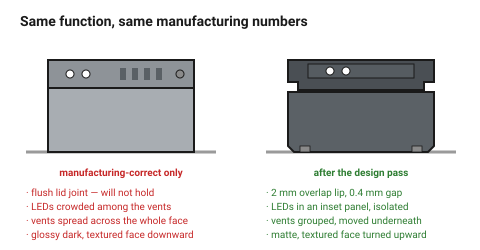

# Worked example — designing a printed enclosure

The FDM folder has a worked example for the same object: it derives walls,
clearances, boss sizes and orientation.
→ [`electronics-enclosure`](../../fdm/10-worked-examples/electronics-enclosure.md)

This document is the **other half** — the decisions that example does not
make, taken in the order this folder recommends. It is the clearest
demonstration of the point that manufacturing correctness and design are two
separate passes over the same object.

## When this applies

As a template for the design pass on any enclosure, and as a demonstration of
how the two folders interlock.

## Good starting values

### Step 0 — the brief, in seven lines

```
Housing for an 80 x 55 mm control board on a workshop bench.
One user, opened occasionally with a screwdriver, knocked regularly.
Lives beside a 3D printer. Five of them.
USB-C on the short face, two status LEDs on top.
FDM, PETG, opened with M3 screws into heat-set inserts.
Should look like it belongs with the printer: matte, dark, quiet.
Out of scope: wall mounting, sealing, a display.
```

### Step 1 — the systems, chosen before drawing

| System | Value | Why |
|---|---|---|
| **Radius set** | 1 / 2 / 4 mm | object is ~85 mm, so the 50–200 mm band |
| **Spacing scale** | 2 / 4 / 8 / 12 mm | |
| **Proportion family** | 1 : 1.5 (plan), 1 : 1 (lid inset) | the plan is 85 × 60, already close to 1:1.4 — round the design to 1:1.5 |
| **Thicknesses** | 2.1 mm wall, 1.2 mm floor | from the FDM example; these are given, not chosen |

### Step 2 — hierarchy

| Element | Rank | Treatment |
|---|---|---|
| The two status LEDs | **primary** | isolated: 12 mm of clear space, nothing else on the top face |
| USB-C opening | secondary | on the short face, centred on the optical centre |
| Four lid screws | quiet | recessed, aligned, all sockets the same way up |
| Vents | quiet | one group, on the underside |
| Label | quiet | recessed into the underside |

One primary. The LEDs get isolation rather than size, which is free.

### Step 3 — form decisions

| Decision | Value | From |
|---|---|---|
| Bottom edge | chamfer 0.8 mm × 45° | serves elephant foot **and** stance → [`balance-and-stance`](../01-principles/balance-and-stance.md) |
| Top and side edges | fillet 2 mm | the middle value; friendly without being soapy |
| Silhouette edges | fillet 4 mm at the vertical corners | largest value on the silhouette |
| Lid joint | 2 mm overlap lip, 0.4 mm gap | hides the joint and the tolerance → [`seams-and-alignment`](../03-form/seams-gaps-and-alignment.md) |
| One surface move | a 1.5 mm inset panel on the top face, holding the LEDs | one move per face |
| Feet | four, inset 4 mm, 1 mm proud | |
| Stance | base 85 mm wide, 22 mm tall → 1:0.26 | comfortably planted |

### Step 4 — CMF

| Decision | Value |
|---|---|
| Materials | one: PETG. Plus the steel of the four screws, which counts |
| Colour | dark grey body, no accent — it should be quiet beside the printer |
| Finish | **matte filament**, textured build plate face on the **bottom**… |
| …except | the bottom is the face nobody sees. Reorient so the textured face is the **lid**, which is the face always seen |
| Screws | black, to disappear into the body |

That reorientation is the single best decision in this example, and it costs
nothing: the best surface the process produces for free is put where it is
seen.

### Step 5 — the critique, and what it caught

| Finding | Rank | Action |
|---|---|---|
| Five distinct radii (1, 2, 4, 0.8, 1.5) | 2 | the 1.5 inset depth became 2 mm; 0.8 is a process value and stays |
| The label was 2 mm off the underside centreline | 2 | aligned |
| Vents were evenly spaced across the whole underside | 2 | grouped into one block with 8 mm around it |
| A moulded-in "grip" texture on the sides | 3 | **removed** — the box is not gripped |
| The LED inset had a chamfer *and* a fillet | 3 | fillet only |
| I would have preferred a lighter grey | 4 | noted, not acted on |

## How to build it

1. Write the brief.
2. Choose the three systems and write them at the top of the file.
3. Name the primary element before modelling it.
4. Run the FDM worked example for the manufacturing numbers.
5. Apply the form and CMF decisions.
6. Critique, rank, fix ranks 1 and 2, subtract for rank 3.
7. Photograph it.

## When to do it differently

- **A wooden enclosure** → the same structure, different materials and joints.
  → [`laser-box-design`](laser-box-design.md)
- **A product in a family** → steps 1–4 are inherited from the family, and the
  work is entirely in step 5.
- **A one-off for the bench** → steps 1, 3 and 6. Twenty minutes total.

## Images


*Identical function, identical manufacturing constraints, identical material.
The differences: one radius system, one primary element given isolation, a lid
lip instead of a flush joint, grouped vents, and the textured face turned
upward.*

## Source & date

- Manufacturing numbers: [`electronics-enclosure`](../../fdm/10-worked-examples/electronics-enclosure.md).
- Design decisions follow the documents in this folder.
- `confidence: medium` — the object is an example, the method is the content.
