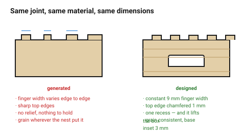
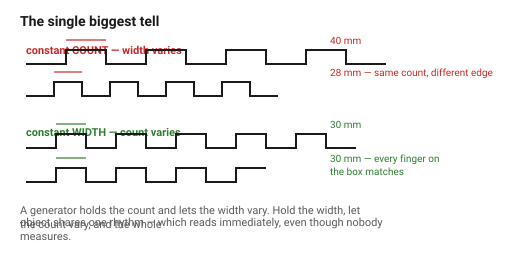

# Worked example — designing a wooden box

The laser folder derives this box's dimensions, finger counts and kerf
compensation.
→ [`finger-joint-box`](../../laser/09-worked-examples/finger-joint-box.md)

This document adds the decisions that example does not make. It is the more
interesting of the two worked examples, because a finger-jointed plywood box
is the most **generic** object in the whole repository — every laser cutter
produces them, they all look the same, and the difference between one that
looks made and one that looks designed is entirely in this pass.

## When this applies

Any wooden box, tray or case. Also a good illustration of what to do when the
process forces most of the geometry and there is very little left to decide.

## Good starting values

### Step 0 — the brief

```
Open tray for small parts on a workshop bench.
One user, grabbed and moved with one hand, lid never needed.
Lives on a bench next to a dark grey printer. Three of them, stacking.
Holds M3-M6 hardware in bags; 150 x 100 x 60 internal.
Laser, 3 mm birch ply, finger jointed and glued.
Should look intentional, not like a box generator made it.
Out of scope: dividers, a lid, labelling.
```

That last line of intent is the whole brief: **not like a generator made it.**

### Step 1 — the systems

| System | Value | Note |
|---|---|---|
| Radius set | 1 / 2 / 4 mm | object ~155 mm |
| Spacing scale | 3 / 6 / 12 / 24 mm | chosen as multiples of the material thickness, which is a nice trick in sheet work |
| Proportion family | 1 : 1.5 (plan), 1 : 2.5 (height to length) | plan is 155 × 105, essentially 1:1.5 already |
| Thickness | 2.85 mm measured | given by the sheet, not chosen |

Using the **material thickness as the spacing unit** is worth knowing: every
gap, inset and margin becomes a multiple of *t*, so the object's rhythm and
its construction share one number.

### Step 2 — what makes a generated box look generated

| Generated | Designed |
|---|---|
| Finger count derived from a formula, different on every edge | finger **width** held constant across the box, so the count varies instead |
| Fingers starting and ending arbitrarily | odd counts, starting and ending with a finger |
| Sharp top edges | top edge chamfered |
| No relief anywhere | one move: a finger recess |
| Grain wherever the nest put it | grain running the same way on all four sides |
| Identical panels, no orientation | panels marked, engraved inside |

The first row is the biggest single tell. A generator holds the *count* and
lets the width vary; a designer holds the **width** and lets the count vary.
The result is that every finger on the object is the same size, which reads
immediately even though nobody measures.

### Step 3 — the design decisions

| Decision | Value | Why |
|---|---|---|
| **Finger width, constant** | 9 mm (≈ 3 t) across all edges | the object's visual rhythm |
| Finger counts | 17 long, 11 short, 7 vertical — all odd | falls out of the constant width |
| Top edge | chamfered 1 mm, all round | catches light; removes the arris that a hand meets |
| **One surface move** | a finger recess on each short end: 60 × 20 mm, cut through | makes it liftable one-handed, which the brief asked for, and is the only decorative-looking element on the object |
| Recess corners | 4 mm radius | largest in the set — it is a silhouette edge |
| Base | inset 3 mm from the sides, so the box sits on its side panels | a shadow line at the bottom → [`balance-and-stance`](../01-principles/balance-and-stance.md) |
| Grain | face grain along the long axis on all four sides | → [`grain-and-ply-direction`](../../laser/03-geometry/grain-and-ply-direction.md) |
| Panel marks | `A1`…`B2` engraved on inside faces | |
| Stacking | the base inset doubles as the stacking register | one feature, two jobs — always worth looking for |

### Step 4 — CMF

| Decision | Value |
|---|---|
| Materials | one: birch ply. The glue does not count; nothing else added |
| Colour | the wood's own, plus the engrave's brown — that is already two |
| Accent | none. Against a dark grey printer the pale birch **is** the contrast |
| Finish | sanded 240 → 320, one coat hard wax oil |
| Masking | both faces, so there is no smoke halo to sand out |
| Edges | char sanded off the top edges only; the inside edges left as cut |

Sanding only what is seen and touched is a legitimate decision, and stating it
is what makes it a decision rather than an omission.

### Step 5 — the critique

| Finding | Rank | Action |
|---|---|---|
| Base inset 3 mm, chamfer 1 mm, recess radius 4 mm, finger 9 mm — four values, all from the systems | — | passes |
| The finger recess was centred geometrically | 2 | raised to the optical centre, 5 % up |
| Panel marks were on the outside | 1 | moved inside; they were visible in use |
| A second recess was drawn on the long sides too | 3 | **removed** — one move per object, and two recesses weakened the joint |
| Considered a painted interior | 3 | removed; it would have made a second material for no reason |
| I would prefer 6 mm ply | 4 | noted, not acted on |

## How to build it

1. Write the brief, including the sentence about what it should not look like.
2. Choose the systems — and consider using the material thickness as the
   spacing unit.
3. **Hold the finger width constant**, not the count.
4. Pick one surface move, and prefer one that also does a job.
5. Run the laser worked example for the kerf and finger arithmetic.
6. Critique, rank, fix, subtract.
7. Sand, oil, photograph.

## When to do it differently

- **A box with a lid** → the lid is the primary element and gets the surface
  move; the body goes quiet.
- **A box that will be seen from across a room** → the silhouette is all that
  reads. Spend the effort on proportion and the top edge, nothing else.
- **A batch of twenty** → the finishing decisions dominate. Choose fewer
  operations and build them into the file.
- **Solid wood instead of ply** → grain direction becomes a structural
  constraint on every panel, not just an aesthetic one.
  → [`solid-wood`](../../laser/02-materials/solid-wood.md)

## Images


*Same joint, same material, same dimensions. Constant finger width, a
chamfered top edge, one recess that also makes it liftable, an inset base and
consistent grain. Nothing was added that does not also do a job.*


*The single biggest tell. A generator holds the count and lets the width vary
edge to edge; hold the width and let the count vary, and every finger on the
object matches.*

## Source & date

- Manufacturing numbers: [`finger-joint-box`](../../laser/09-worked-examples/finger-joint-box.md).
- Design decisions follow the documents in this folder.
- `confidence: medium`.
