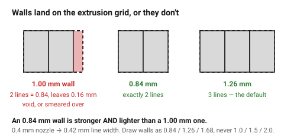
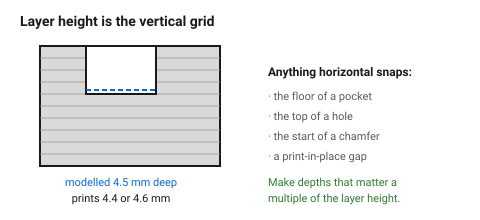

# Nozzle, line width and layer height — the grid everything lands on

A 0.4 mm nozzle lays a thread about 0.42 mm wide. Every wall in the part is
built from a whole number of those threads, and every horizontal feature lands
on a layer boundary. **The printer works on a grid, and geometry that ignores
the grid gets silently rounded.**

A 1.0 mm wall on a 0.42 mm line width is not a 1.0 mm wall. It is two lines
(0.84 mm) plus a 0.16 mm gap the slicer either leaves hollow or smears full.
Making that wall 0.84 mm — or 1.26 mm — produces a *better* part with *less*
material.

## When this applies

Every wall, rib, boss and thin feature. This is the document behind most of
the numbers in the rest of the FDM folder.

## Good starting values

| Nozzle | Typical line width | 2 lines | 3 lines | 4 lines |
|---|---|---|---|---|
| 0.25 mm | 0.26 mm | 0.52 | 0.78 | 1.04 |
| **0.4 mm** (the default) | **0.42 mm** | **0.84** | **1.26** | **1.68** |
| 0.6 mm | 0.62 mm | 1.24 | 1.86 | 2.48 |
| 0.8 mm | 0.82 mm | 1.64 | 2.46 | 3.28 |

| What | Start with | Works between | Why |
|---|---|---|---|
| Layer height | 0.2 mm | 0.1–0.3 mm | 0.25 × nozzle to 0.75 × nozzle is the usable band |
| Layer height for strength | 0.3 mm | 0.2–0.32 | thicker layers bond better — fewer, hotter welds |
| Layer height for detail | 0.12 mm | 0.08–0.16 | slower, and no stronger |
| First layer height | 0.25 mm | 0.2–0.3 | thicker first layer sticks better |
| Wall thickness | a multiple of line width | — | the whole point of this document |
| Minimum printable feature | 1 line width | — | below this, the slicer drops it entirely and says nothing |

### Practical wall thicknesses on a 0.4 mm nozzle

| Use | Thickness | Lines |
|---|---|---|
| Cosmetic shell, no load | 0.84 mm | 2 |
| General-purpose wall | 1.26 mm | 3 |
| Load-bearing wall, snap fits | 1.68 mm | 4 |
| Around a heat-set insert | ≥ 1.6 mm of plastic | — |

Anything over about 2.5 mm of solid wall is usually wasted: at that point add
a rib instead. → [`ribs-and-gussets`](../05-features/ribs-and-gussets.md)

### Layer height sets the vertical resolution

Every horizontal feature — the top of a hole, the start of a chamfer, the
floor of a pocket — snaps to a layer boundary. At 0.2 mm layers, a 4.5 mm
pocket becomes 4.4 or 4.6 mm. For features that must be exact in Z, choose a
depth that is a multiple of the layer height.

## How to build it

1. Decide the nozzle and layer height **before** drawing walls. On a shared
   printer, assume 0.4 mm and 0.2 mm.
2. Draw every wall as *n* × line width. 0.84, 1.26, 1.68 — not 1.0, 1.5, 2.0.
3. Make pocket depths and step heights multiples of the layer height where
   they matter.
4. Check the smallest feature in the part against one line width. A 0.3 mm
   rib on a 0.4 mm nozzle does not exist.
5. Where a part will be printed on unknown hardware, design at 0.4/0.2 and
   keep walls at 3 lines — it degrades gracefully on both finer and coarser
   setups.

## When to do it differently

- **Large, chunky parts** → a 0.6 or 0.8 mm nozzle halves the print time.
  Redesign the walls to that grid; a part designed for 0.4 mm prints badly at
  0.8 mm because every wall is now a fraction.
- **Fine detail, small parts** → 0.25 mm nozzle, 0.12 mm layers. Expect three
  times the print time.
- **Maximum strength** → thicker layers (0.3 mm), more walls, less infill.
  Walls carry load; infill mostly does not.
- **The part will be printed by someone else** → state the intended nozzle and
  layer height in the model or the filename. It is the only way the grid
  survives the handover.

## Images

*A 1.0 mm wall does not fit two lines or three. The slicer leaves a 0.16 mm
void or over-extrudes to fill it — and an 0.84 mm wall would have been both
stronger and lighter.*

*Every horizontal feature snaps to a layer boundary. Pocket depths that matter
should be multiples of the layer height.*

## Source & date

- Wall/line-width relationship and minimum feature size:
  [Hydra Research — design rules](https://www.hydraresearch3d.com/design-rules),
  [UltiMaker — design for FFF](https://ultimaker.com/learn/design-for-fff-3d-printing-maximize-your-success/).
- Wall thickness of 3 × nozzle for load-bearing features:
  [Sovol — 3D printed snap-fit joints](https://www.sovol3d.com/blogs/news/3d-printed-snap-fit-joints-how-to-design-clips-that-work).
- `confidence: high` — this is arithmetic about how the slicer works.
