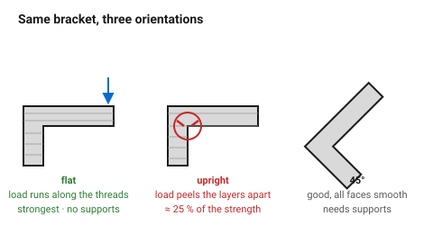
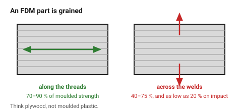

# Orientation and strength — the most important decision

An FDM part is not a solid. It is a stack of welded threads, and the welds
between layers are weaker than the threads themselves. A printed part behaves
like wood or like plywood, not like injection-moulded plastic: strong along
the grain, splittable across it.

**Z-axis strength is typically 40–75 % of XY strength, and under tension can
be four to five times lower.** That single fact decides more about whether a
part survives than material choice, wall count, or infill.

This is why orientation is decided **first**, before any other geometry.

## When this applies

Every part that carries load, and every part that might be dropped. For purely
cosmetic parts, orient for surface finish and print time instead and ignore
the rest of this page.

## Good starting values

| What | Value | Note |
|---|---|---|
| XY tensile strength | 70–90 % of injection-moulded | along the extruded threads |
| Z tensile strength | 40–75 % of XY | the layer welds |
| Z strength under sharp impact | as low as 20 % | this is what actually breaks |
| Practical design rule | **never let the main tensile load run along Z** | |

### What orientation decides, all at once

| Property | Best when |
|---|---|
| Strength | the load runs **across** layers, not pulling them apart |
| Top surface finish | the surface is horizontal and on top |
| Vertical wall finish | tall and vertical — layer lines are visible but even |
| Hole roundness | the hole axis is **vertical** (parallel to Z) |
| Support need | overhangs point upward, not down |
| Print time | the part is short in Z |
| Warping risk | the footprint is small and compact |

These pull against each other. There is no orientation that wins all seven,
which is why this is a decision and not a rule.

### The three orientations of a bracket

An L-bracket carrying a load on its arm, in three orientations:

| Orientation | Strength | Support | Verdict |
|---|---|---|---|
| **Flat on the bed, L lying down** | strongest — the load runs along the layers | none | usually correct |
| **Standing up, L vertical** | weakest — the load peels the layers apart at the corner | none | the classic failure |
| **On its corner, 45°** | good, all faces smooth | needed | for appearance, not strength |

## How to build it

1. **Find the main load path** and sketch the arrow.
2. Orient the part so the arrow runs **in the XY plane** — along the layers.
3. Check what that orientation does to the overhangs. If it creates a large
   unsupported face, either accept supports or reconsider.
4. Check what it does to the holes: a hole whose axis is vertical prints
   round; one whose axis is horizontal needs a teardrop or a sacrificial
   bridge. → [`holes-shafts-and-teardrops`](../03-geometry/holes-shafts-and-teardrops.md)
5. **State the intended orientation in the model** — an engraved arrow on the
   bottom face, or a note. A part printed in the wrong orientation looks
   identical and fails at a fifth of the load.
6. Where a part cannot avoid a Z-direction load, **add material there**: a
   fillet, a gusset, or a larger cross section. You cannot fix a layer weld,
   but you can give it more area.

## When to do it differently

- **The part must be strong in two directions** → this is where FDM runs out.
  Split it, print the two halves in their best orientations, and bond them;
  or move to a different process.
- **Appearance matters more than strength** → orient for the visible face and
  say so explicitly, so nobody later assumes the part is strong.
- **Annealed PLA / PETG or a heated-chamber machine** → layer adhesion
  improves markedly and Z-strength rises. Still not isotropic.
- **A part under compression only** → orientation barely matters; layers are
  strong in compression. Design for surface finish instead.

## Images

*The same bracket three ways. Standing up, the load pulls directly on the
layer welds at the inside corner — the classic failure, and it looks identical
to the strong version on screen.*

*The mental model that works: an FDM part is grained. Strong along the
threads, splittable between the layers.*

## Source & date

- Z vs XY strength ratios: [Protolabs Network — how part orientation affects a 3D print](https://www.hubs.com/knowledge-base/how-does-part-orientation-affect-3d-print/),
  [MLC CAD — why FDM prints are weaker on the Z axis](https://www.mlc-cad.com/resources/3d-printing/why-fdm-3d-prints-are-weaker-on-the-z-axis-anisotropy-explained/),
  [RapidMade — isotropic vs anisotropic strength](https://rapidmade.com/isotropic-vs-anisotropic-strength-in-3d-printing/).
- `confidence: high` — anisotropy is a property of the process, not of a
  machine. The exact percentages vary with material and settings; the
  direction of the effect never does.
