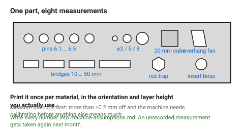

# Measuring your own tolerances — the test part

Every clearance number in this folder is a guess about someone else's printer.
One test part, about 40 minutes, replaces all of them with measurements of
yours — and the measurements will hold until the nozzle wears or the filament
brand changes.

## When this applies

- A new printer, nozzle, slicer profile or filament brand.
- Before any project with moving parts, press fits or bought hardware.
- When a design that used to fit stops fitting.

## Good starting values

| Feature on the test part | What it measures |
|---|---|
| Five pins, ⌀6 mm, in holes 6.1 / 6.2 / 6.3 / 6.4 / 6.5 | press, sliding and loose fit clearances |
| Three holes, ⌀3 / 5 / 8 mm, printed and measured | hole undersize |
| One shaft, ⌀8 mm, printed and measured | shaft oversize |
| A 20 mm cube | overall dimensional accuracy and elephant foot |
| Overhang fan at 30 / 40 / 45 / 50 / 60 / 70° | the real self-supporting angle |
| Bridge steps at 10 / 20 / 30 / 40 / 50 mm | the real bridging limit |
| A hex pocket for an M3 nut, at +0.1 / +0.2 / +0.3 | nut-trap clearance |
| A boss with a 4.0 mm hole for an M3 heat-set insert | insert fit |

Print it **once per material**, in the orientation you actually use, at the
layer height you actually use.

## How to build it

1. Print the part. No supports, standard profile, the real filament.
2. **Measure the 20 mm cube** in X, Y and Z with callipers. Anything more than
   ±0.2 mm off means the machine needs calibrating before the rest of the
   measurements mean anything.
3. **Measure the cube at the very bottom** and 5 mm up. The difference is the
   elephant foot. → [`chamfers-fillets-elephant-foot`](../03-geometry/chamfers-fillets-elephant-foot.md)
4. **Measure the printed holes.** Printed ⌀5 measuring 4.85 means a 0.15 mm
   undersize on this machine and material.
5. **Try each pin.** The one that needs a firm push is your press fit; the one
   that slides with no rattle is your sliding fit.
6. **Look at the overhang fan.** Find the first angle where the underside goes
   rough. That is your real limit, and on a well-cooled machine it is often
   better than 45°.
7. **Look at the bridges.** Find the first span that sags visibly.
8. **Write every number into
   [`machine-assumptions`](machine-assumptions.md).**

## When to do it differently

- **New filament, same brand and type** → measure the cube and one pin. Five
  minutes.
- **New material type** (PLA → PETG) → print the whole part again. PETG
  behaves differently in every one of these measurements.
- **A service or print farm** → ask for their numbers; most publish a
  tolerance spec. If they do not, print the test part as part of the first
  order.

## Images

*One part, eight measurements. Print it once per material and the numbers hold
until the nozzle wears.*

## Source & date

- Test-part structure assembled from the measurements the rest of this folder
  depends on; clearance bands from
  [Protolabs Network](https://www.hubs.com/knowledge-base/how-design-snap-fit-joints-3d-printing/)
  and the sources in [`clearance-table`](../04-fits/clearance-table.md).
- `confidence: high` — procedure, not measurement.
