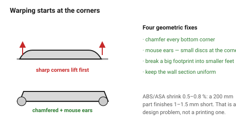

# ABS and ASA

Two closely related materials that solve the same problem — heat and outdoor
durability — and share the same cost: **an enclosure, and warping**.

ASA is ABS with the UV weakness fixed. If the part goes outside, it is ASA;
there is little reason to choose ABS over ASA today except price.

## When this applies

Parts that live above 80 °C, parts in direct sunlight, parts that must be
vapour-smoothed. Anything else is better served by PETG.

## Good starting values

| What | Value | Note |
|---|---|---|
| Heat limit | ~95 °C | |
| Clearance adjustment | +0.1 mm | plus a shrinkage allowance on long dimensions |
| **Shrinkage** | **0.5–0.8 %** | a 200 mm part finishes 1–1.5 mm short |
| Max bridge | ~30 mm | |
| Min overhang | 45° | |
| Enclosure | **required** | without one, tall parts split along a layer mid-print |
| Part fan | off, or ≤ 20 % | cooling is what causes the splitting |
| Max unsupported footprint | ~150 mm | beyond this, corners lift |

### Designing around warping

Warping is caused by the part shrinking as it cools while the bed holds the
bottom still. Geometry can fight it:

| Technique | Effect |
|---|---|
| Chamfer or fillet every bottom corner | removes the sharp corner that lifts first |
| "Mouse ears" — small discs at the corners | sacrificial bed adhesion, snipped off afterwards |
| Break a large flat footprint into smaller feet | less area to lift |
| Avoid long thin footprints | the worst possible shape for warping |
| Keep wall thickness uniform | uneven sections cool at different rates and pull |

## How to build it

1. Confirm an enclosure exists **before** designing in ABS or ASA.
2. Chamfer every bottom edge, 0.6 mm at 45°, and add corner discs on anything
   with a footprint over ~100 mm.
3. Add a shrinkage allowance on long dimensions that must mate with bought
   hardware — or move those features to a separate PLA/PETG part.
4. Keep sections uniform. A part that is 2 mm thick in one place and 8 mm in
   another will warp at the transition.
5. Ventilate. ABS and ASA fumes are unpleasant and should not be printed in
   an occupied room without extraction.

## When to do it differently

- **No enclosure** → do not. Use PETG and accept the lower heat limit, or PC
  if an enclosure can be arranged.
- **Direct sunlight** → ASA, never ABS. ABS yellows and chalks in a season.
- **A smooth, glossy finish** → ABS vapour-smooths in acetone; ASA does too
  but less readily. This is the one remaining reason to pick ABS.
- **Large flat parts** → split them, or change material. Warping scales with
  footprint and no design trick fully defeats it.

## Images

*Warping starts at the sharp bottom corners of a large footprint. Chamfers,
corner discs and a broken-up footprint all attack the same mechanism.*

## Source & date

- [Simple Machining — FDM materials guide](https://www.simplemachining.com/blogs/fdm-materials-guide-pla-abs-asa-petg-tpu-compared),
  [Bambu Lab — filament guide](https://bambulab.com/en-us/filament/guide).
- `confidence: medium`.
