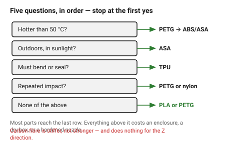

# Choosing a filament

Most parts should be PLA or PETG. The other materials exist for specific
problems, and each of them costs something — an enclosure, a dry box, a
hardened nozzle, or all three. Choosing ABS for a part that never gets warm
buys nothing and adds warping.

## When this applies

At the start of every project, and again when a part fails — a part that
cracks, softens or warps is often a material decision rather than a geometry
one.

## Good starting values

### The decision, in order

| Ask | If yes | Then |
|---|---|---|
| Will it be **hotter than 50 °C**? (a car, a window sill, near electronics) | | not PLA — PETG to 80 °C, ABS/ASA above |
| Will it live **outdoors in sunlight**? | | **ASA**. PLA embrittles, ABS yellows and chalks |
| Must it **bend or seal**? | | **TPU**, and check the extruder is direct drive |
| Must it survive **repeated impact**? | | **PETG** or nylon; PLA is brittle |
| Must it be **stiff and dimensionally exact**? | | **PLA** — it is the most accurate material here |
| Does it need **real mechanical strength**? | | nylon or PC, with an enclosure; or reconsider the design |
| None of the above | | **PLA** for accuracy and speed, **PETG** for toughness |

### What each one actually costs

| Material | Needs | Pain |
|---|---|---|
| PLA | nothing | softens at ~55 °C, brittle |
| PETG | nothing | stringy, sticks to the bed too well, slightly soft |
| ABS | enclosure, ventilation | warps badly, smells |
| ASA | enclosure, ventilation | same as ABS, more expensive |
| TPU | direct drive, slow printing | no bridging, no sharp overhangs |
| Nylon | enclosure **and** a dry box | absorbs water in hours |
| PC | enclosure, high temps | warps, expensive |
| CF composites | **hardened nozzle** | abrasive, brittle, no stronger in Z |

### The trap worth naming

**Carbon-fibre filled filaments are stiffer, not stronger** — and they are no
better in the Z direction, because the fibres are short and lie in the layer
plane. A CF part that is loaded across layers fails exactly like an unfilled
one, and costs four times as much. Fibre fill buys stiffness and dimensional
stability, not layer adhesion.

## How to build it

1. Answer the questions above in order and stop at the first yes.
2. Check that the chosen material's requirement is actually available — an
   ABS part on an open-frame printer in a cold room is a warped part.
3. Read that material's page for what it does to the *geometry*: TPU cannot
   bridge, PETG needs bigger clearances, nylon shrinks.
4. State the material in the model. Clearances and wall thicknesses are
   material-dependent, so a part redesigned in another filament is a redesign,
   not a reprint.

## When to do it differently

- **Prototype now, material later** → prototype in PLA regardless. It is the
  most accurate and the least trouble; move to the real material once the
  geometry is settled, and expect to adjust clearances.
- **Someone else will print it** → design for PLA/PETG. Assume no enclosure
  and no dry box.
- **Food contact, medical, or structural in a safety sense** → FDM parts are
  porous and layered. Say so rather than choosing a filament.

## Images

*Five questions, in order, and most parts stop at the last one. The exotic
materials each solve one problem and add an enclosure.*

## Source & date

- Material properties and requirements:
  [Bambu Lab — filament comparison guide](https://bambulab.com/en-us/filament/guide),
  [Simple Machining — FDM materials guide](https://www.simplemachining.com/blogs/fdm-materials-guide-pla-abs-asa-petg-tpu-compared),
  [MatterHackers — filament comparison](https://www.matterhackers.com/3d-printer-filament-compare).
- `confidence: medium`.
