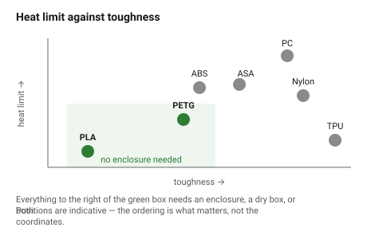

# Filament comparison table

The numbers behind [`choosing-a-material`](choosing-a-material.md), in one
place. The columns that change **geometry** are the ones that matter for
design: shrinkage, warping, bridging and the clearance adjustment.

## When this applies

Comparing candidates, or checking what a material change does to a design
that already works.

## Good starting values

### Process and environment

| Material | Nozzle °C | Bed °C | Enclosure | Dry box | Part fan |
|---|---|---|---|---|---|
| PLA | 200–220 | 55–60 | no | no | 100 % |
| PETG | 230–250 | 70–85 | no | helpful | 30–50 % |
| ABS | 240–270 | 100–110 | **required** | no | off |
| ASA | 250–270 | 100–110 | **required** | no | off |
| TPU (95A) | 220–235 | 40–60 | no | helpful | 30–50 % |
| Nylon (PA) | 250–280 | 70–90 | **required** | **required** | off |
| PC | 270–310 | 110–120 | **required** | helpful | off |

### Properties that decide whether the part works

| Material | Heat limit | Stiffness | Toughness | UV | Shrinkage | Warping |
|---|---|---|---|---|---|---|
| PLA | ~55 °C | high | low (brittle) | poor | very low | very low |
| PETG | ~80 °C | medium | good | good | low | low |
| ABS | ~95 °C | medium | good | poor | high | **high** |
| ASA | ~95 °C | medium | good | **excellent** | high | high |
| TPU | ~70 °C | very low | excellent | fair | low | very low |
| Nylon | ~100 °C | medium | excellent | fair | **high** | high |
| PC | ~115 °C | high | excellent | fair | high | high |

### What each does to the geometry

| Material | Clearance adjust | Max bridge | Min overhang | Note |
|---|---|---|---|---|
| PLA | baseline | ~50 mm | 45° | the reference for every other number in this folder |
| PETG | **+0.05 to +0.1 mm** | ~30 mm | 50° | flows more; holes come out tighter |
| ABS | +0.1 mm and allow for shrink | ~30 mm | 45° | large parts shrink measurably across their length |
| ASA | as ABS | ~30 mm | 45° | |
| TPU | +0.2 mm | **does not bridge** | 60° | design every overhang out |
| Nylon | +0.1 mm, varies with moisture | ~25 mm | 50° | dimensions drift as the part absorbs water |
| PC | +0.1 mm | ~30 mm | 45° | |

**Shrinkage is a design problem, not a printing one.** An ABS part 200 mm long
can finish 1–1.5 mm short. For anything that must mate with bought hardware
across a long span, use PLA or PETG, or scale the model.

## How to build it

1. Choose with [`choosing-a-material`](choosing-a-material.md).
2. Look up the **clearance adjustment** and apply it to every fit in the part.
3. Look up the **bridge and overhang limits** and re-check the geometry — a
   design that prints cleanly in PLA may need supports in TPU.
4. For anything longer than ~150 mm in a high-shrink material, check whether
   the part still fits what it has to fit.

## When to do it differently

- **Composite (CF/GF) versions** → treat as the base material for geometry,
  but stiffer, more brittle, and needing a hardened nozzle. No better in Z.
- **"High-speed" or "tough" PLA blends** → behave like PLA for clearances,
  usually a little tougher. Do not assume PETG-like heat resistance.
- **Recycled or unknown filament** → print the tolerance test part. Batch
  variation in cheap filament exceeds the differences in this table.

## Images

*Where each material sits. PLA and PETG cover most parts; everything above and
to the right costs an enclosure.*

## Source & date

- [Bambu Lab — filament comparison guide](https://bambulab.com/en-us/filament/guide),
  [MatterHackers — filament comparison](https://www.matterhackers.com/3d-printer-filament-compare),
  [Simple Machining — FDM materials guide](https://www.simplemachining.com/blogs/fdm-materials-guide-pla-abs-asa-petg-tpu-compared),
  [UAVMODEL — filament guide](https://blog.uavmodel.com/3d-printing-filament-guide-pla-petg-abs-tpu-nylon-asa-and-polycarbonate-compared/).
- `confidence: medium` — temperatures and properties vary by brand; the
  relative ordering does not.
