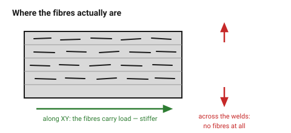

# Nylon, PC and fibre composites

The engineering end of the shelf. All three deliver real mechanical
performance, and all three demand hardware most desktop setups do not have.
The most common mistake with them is buying the filament before the enclosure,
the dry box or the hardened nozzle.

## When this applies

Gears, living hinges that must survive, load-bearing brackets, high-temperature
parts, parts that must be both stiff and dimensionally stable. Only after PETG
has been honestly ruled out.

## Good starting values

| | Nylon (PA6/PA12) | Polycarbonate | CF/GF composites |
|---|---|---|---|
| Heat limit | ~100 °C | ~115 °C | as the base polymer |
| Toughness | excellent | excellent | **reduced** — fibres embrittle |
| Stiffness | medium | high | **much higher** |
| Needs | enclosure **+ dry box** | enclosure, high temps | **hardened nozzle** |
| Shrinkage | high, and moisture-dependent | high | slightly lower than the base |
| Clearance adjustment | +0.1 mm, drifting | +0.1 mm | as the base |
| Layer adhesion | good | good | **no better than the base** |

### Three things that are routinely got wrong

1. **Nylon absorbs water in hours.** A spool left out overnight prints with
   bubbles, rough surfaces and poor layer bonding. Worse for design: the
   finished part keeps absorbing moisture and **changes dimension** — up to
   0.5 % over weeks. Do not use nylon for anything that must hold a precise
   fit with bought hardware.

2. **Carbon fibre does not fix the Z direction.** The fibres are short and lie
   in the layer plane, so they stiffen the part along XY and do nothing for
   the layer welds. A CF part loaded across layers fails exactly like an
   unfilled one. Fibre fill buys **stiffness and dimensional stability**, not
   strength in Z.

3. **Composites eat brass nozzles.** A filled filament wears a brass nozzle
   out in a few hundred grams, and the first symptom is that every dimension
   quietly drifts. Hardened steel or ruby, always.

## How to build it

1. Confirm the hardware — enclosure, dry box, hardened nozzle — before
   committing the design.
2. For nylon, design **generous** clearances and avoid press fits into bought
   metal parts. The part will move.
3. For composites, keep the design's flexing features (snap fits, thin
   cantilevers) in mind: fibre-filled material is stiffer and breaks sooner.
   Derate the deflection in [`snap-fit-cantilever`](../05-features/snap-fit-cantilever.md)
   by roughly half.
4. Orient with extra care. These materials are expensive, and a part that
   fails along a layer weld wastes the entire benefit.

## When to do it differently

- **No dry box** → not nylon. There is no workaround.
- **Stiffness is the requirement** → a CF composite is the right answer, and
  cheaper than redesigning.
- **Strength in Z is the requirement** → no filament fixes this. Reorient,
  redesign, or split and bond the part.
- **PETG would do** → use PETG. Most parts that reach for nylon do not need it.

## Images

*The fibres are short and lie in the layer plane. Along XY they stiffen the
part; across the layer welds they are simply not there.*

## Source & date

- [UAVMODEL — filament guide](https://blog.uavmodel.com/3d-printing-filament-guide-pla-petg-abs-tpu-nylon-asa-and-polycarbonate-compared/),
  [MatterHackers — filament comparison](https://www.matterhackers.com/3d-printer-filament-compare),
  [CNC Lathing — ABS vs PLA vs PETG vs TPU vs ASA vs PBT vs nylon](https://www.cnclathing.com/guide/abs-vs-pla-vs-petg-vs-tpu-vs-asa-vs-pbt-vs-nylon-plastic-what-is-the-difference).
- `confidence: medium`.
