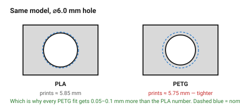

# PETG

The functional default. Tougher than PLA, more heat-resistant, still needs no
enclosure — the right choice for a part that has a job rather than a look.

The trade is accuracy: PETG flows more, so holes come out tighter, small
features come out fatter, and **every clearance needs 0.05–0.1 mm more than
the PLA number.**

## When this applies

Brackets, housings, mounts, anything that gets warm, anything that gets
dropped, anything with a fastener through it. Also the practical choice for
parts that live outdoors but not in strong sun.

## Good starting values

| What | Value | Note |
|---|---|---|
| Heat limit | ~80 °C | comfortably survives a car interior |
| **Clearance adjustment** | **+0.05 to +0.1 mm** | on every fit, in addition to the PLA number |
| Max bridge | ~30 mm | noticeably worse than PLA |
| Min overhang | 50° | needs a little more support than PLA |
| Shrinkage | ~0.4 % | low |
| Toughness | good — bends before it breaks | |
| Layer adhesion | **better than PLA** | Z-strength is a smaller penalty |
| Typical wall | 3 lines = 1.26 mm | |

### The two PETG quirks that change geometry

- **It sticks to the bed too well.** A large flat face printed directly on
  smooth PEI can tear the sheet. Design in a chamfer on the bottom edge, and
  prefer a textured plate.
- **It strings.** Parts with many separate towers (bosses, pins) come out with
  webs between them. Group features where the design allows.

## How to build it

1. Take a PLA design and **add 0.05–0.1 mm to every clearance**: holes, pins,
   nut traps, sliding fits. This is the single adjustment that matters.
2. Reduce unsupported spans: 30 mm rather than 50 mm.
3. Add the bottom chamfer — both for elephant foot and for bed release.
4. Keep the part fan at 30–50 %. Full cooling weakens PETG layer bonds badly.

## When to do it differently

- **A part that must be dimensionally exact** → PLA. PETG is the tougher
  material and the less precise one.
- **Strong sunlight** → ASA. PETG is UV-stable enough for a garden, not for a
  roof.
- **Above 80 °C** → ABS, ASA or PC, and an enclosure with them.
- **A snap fit** → PETG is the best of the common materials for this: it
  deflects further before breaking than PLA. Use the ductile L/t ratio from
  [`snap-fit-cantilever`](../05-features/snap-fit-cantilever.md).

## Images

*Identical model, two materials. PETG flows more, so the hole comes out
tighter — which is why every clearance gets 0.05–0.1 mm more.*

## Source & date

- [Bambu Lab — filament guide](https://bambulab.com/en-us/filament/guide),
  [UAVMODEL — filament guide](https://blog.uavmodel.com/3d-printing-filament-guide-pla-petg-abs-tpu-nylon-asa-and-polycarbonate-compared/).
- `confidence: medium`.
