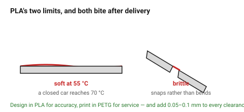

# PLA

The default, and for good reason: it is the most **dimensionally accurate**
material on a desktop printer, it does not warp, it needs no enclosure and it
prints fast. Every clearance number in this folder is a PLA number.

Its two limits are hard ones: it softens around 55 °C, and it is brittle.

## When this applies

Prototypes, jigs, fixtures, display parts, indoor mechanical parts, anything
where accuracy matters more than toughness. Always the right choice for a
first article, even when the final part will be another material.

## Good starting values

| What | Value | Note |
|---|---|---|
| Heat limit | 55 °C | a closed car reaches 70 °C |
| Clearance adjustment | baseline (0) | all other materials are quoted relative to this |
| Max bridge | ~50 mm | the best bridging material here |
| Min overhang | 45°, often 40° with good cooling | |
| Shrinkage | ~0.3 % | negligible on desktop-sized parts |
| Brittleness | high | it snaps rather than bends; no plastic hinges |
| Typical wall | 3 lines = 1.26 mm | |

## How to build it

1. Use PLA to get the geometry right, whatever the final material will be.
2. Give it full part cooling — PLA's overhang and bridging performance is
   mostly a cooling result.
3. Avoid designing anything that relies on flex: PLA cantilevers, snap fits
   and living hinges all fail early.
4. For a part that will see any warmth, design it in PLA and print it in PETG,
   adding 0.05–0.1 mm to every clearance.

## When to do it differently

- **Anything warm** → PETG minimum. This is the most common PLA failure and it
  happens weeks later, in a car or on a window sill.
- **Anything that flexes** → PETG, TPU or nylon.
- **Outdoors** → ASA. PLA embrittles in UV and degrades in months.
- **Annealed PLA** → heat-treating raises the heat limit but shrinks the part
  unpredictably. Not for anything that must fit.

## Images

*The two ways PLA parts fail in service, and both happen after delivery: soft
at 55 °C, and brittle under impact.*

## Source & date

- [Bambu Lab — filament guide](https://bambulab.com/en-us/filament/guide),
  [Simple Machining — FDM materials](https://www.simplemachining.com/blogs/fdm-materials-guide-pla-abs-asa-petg-tpu-compared).
- `confidence: medium`.
