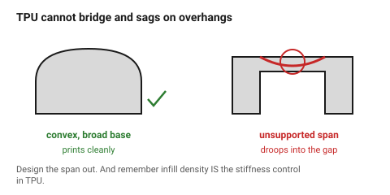

# TPU and flexible filaments

The only material here that bends and returns. TPU makes gaskets, bumpers,
grips, straps, feet and seals — and it breaks most of the geometry rules in
this folder, because a material that flexes while printing cannot bridge and
cannot hold a sharp overhang.

## When this applies

Anything that must compress, seal, grip or absorb a shock. Not for structure
of any kind, and not for anything that must hold a dimension under load.

## Good starting values

| What | Value | Note |
|---|---|---|
| Hardness | 95A general purpose | 85A is much softer and much harder to print |
| **Bridging** | **none** | design every unsupported span out of the part |
| Min overhang | 60° | far worse than rigid materials |
| Clearance adjustment | +0.2 mm | it deforms as it is fitted |
| Print speed | 20–30 mm/s | flexible filament buckles if pushed faster |
| Extruder | direct drive | a Bowden tube turns the filament into a spring |
| Min wall | 2 lines = 0.84 mm | thinner walls are floppy rather than flexible |
| Typical infill for a soft part | 10–20 % gyroid | infill density *is* the stiffness control |

### Infill is the stiffness dial

In a rigid material, infill barely affects stiffness. In TPU it is the primary
control: the same gasket at 10 % and at 40 % infill behaves like two different
materials. Design the part, then specify the infill as part of the spec.

## How to build it

1. Design **only convex, well-supported shapes**. No bridges, no steep
   overhangs, no thin unsupported ribs.
2. Make walls 2–3 lines and let infill carry the stiffness choice.
3. Add 0.2 mm to every clearance, and expect the part to be squeezed into
   place rather than dropped in.
4. Give the part a large flat face on the bed — TPU adheres well and prints
   best from a broad base.
5. Round every corner. Sharp internal corners in a flexing part tear.

## When to do it differently

- **Bowden extruder** → 95A only, slowly, and expect trouble. Softer grades
  will not feed.
- **A seal that must be airtight** → print with more walls and no infill gaps,
  or accept that FDM parts are porous and use a moulded O-ring instead.
- **A living hinge** → TPU will flex for ever, but so will polypropylene, and
  PP prints more precisely. For a rigid part with one flexing area, consider
  printing two parts.
- **Fine detail** → TPU rounds everything off. Below about 1 mm nothing reads.

## Images

*TPU cannot bridge and sags on steep overhangs. Convex shapes with a broad
base print cleanly; the same part with an unsupported span does not.*

## Source & date

- [Bambu Lab — filament guide](https://bambulab.com/en-us/filament/guide),
  [Sinterit — filament types](https://sinterit.com/3d-printing-guide/materials-for-3d-printing/filament-types-for-3d-printing/).
- `confidence: medium`.
