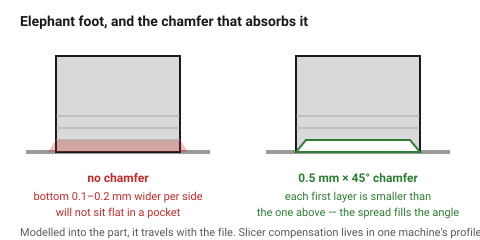
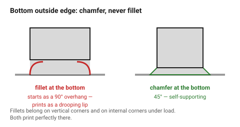

# Chamfers, fillets and elephant foot

The first few layers of a print are squashed: the nozzle presses them down,
the hot bed keeps them soft, and the weight of the part above adds to it. The
result is that the bottom 0.2–0.5 mm of the part is **wider than the model** —
elephant foot.

It is the reason a part that measures correctly will not sit flat in a pocket,
and it is fixed in the model, not the slicer.

## When this applies

Every bottom edge of every part. Also every internal corner where a wall meets
a floor, for a different reason.

## Good starting values

| What | Start with | Works between | Why |
|---|---|---|---|
| **Bottom edge chamfer** | **0.5 mm × 45°** | 0.4–0.8 mm | each of the first layers is slightly smaller than the one above, so the squash fills the chamfer rather than bulging past the edge |
| Elephant foot to expect without one | 0.1–0.2 mm per side | 0.05–0.4 | measure it on the test cube |
| Top edge chamfer | 0.4 mm | optional | cosmetic; removes the sharp top arris |
| Internal corner fillet (wall to floor) | 1–2 mm | 0.5–3 | stress relief; this is a strength feature |
| Fillet on a **bottom** outside edge | **avoid** | — | a fillet at the base is an overhang that starts at 90° — it prints as a rough, drooping lip |

### Chamfer or fillet — the rule

| Edge | Use | Why |
|---|---|---|
| Bottom outside edge | **chamfer** | a fillet there is an unprintable overhang |
| Top outside edge | either | both print fine |
| Vertical corner | fillet | prints perfectly, and looks better |
| Internal corner under load | fillet | spreads the stress; this is structural |
| Lead-in on a hole or pin | chamfer | guides assembly |

### Why a modelled chamfer beats slicer compensation

Every slicer has an elephant-foot compensation setting. It works, and it lives
in a profile on one particular machine. A chamfer modelled into the part
travels with the file: anyone who prints it, on any machine, gets a clean
base. For a part that will be shared or reprinted later, model it.

## How to build it

1. Put a **0.5 mm × 45° chamfer on every bottom outside edge** as a matter of
   routine. It costs nothing and solves three problems at once: elephant foot,
   bed release, and the sharp arris that catches.
2. Fillet internal corners that carry load — 1–2 mm.
3. Never fillet a bottom outside edge.
4. Add a small chamfer as a lead-in to any hole or pin that must be assembled
   by hand.
5. For a part that must sit exactly flush in a pocket, chamfer **and** measure
   the first article.

## When to do it differently

- **A part printed on a raft** → the raft absorbs the elephant foot; the
  chamfer is then cosmetic.
- **A part whose bottom face must be perfectly square** (a datum) → print it
  with that face upward, or machine it after printing.
- **Very small parts** → a 0.5 mm chamfer may be most of the feature. Scale it
  to 0.2–0.3 mm.
- **A part designed for a specific machine with tuned compensation** → the
  chamfer is redundant, but harmless.

## Images

*The first layers spread outward. A chamfer makes each of them slightly
smaller than the one above, so the spread fills the angle instead of bulging
past the true edge.*

*A fillet on a bottom outside edge starts as a 90° overhang and prints as a
drooping lip. The same edge chamfered at 45° prints cleanly.*

## Source & date

- Elephant foot mechanism and compensation: [Prusa — elephant foot compensation](https://help.prusa3d.com/article/elephant-foot-compensation_114487),
  [Creality — elephant foot causes and fixes](https://www.creality.com/blog/3d-printer-elephant-foot).
- Chamfer size and the chamfer-vs-fillet rule: [BigRep — fillets vs chamfers in 3D printed parts](https://bigrep.com/posts/fillets-vs-chamfers-in-3d-printed-parts/).
- `confidence: high`.
