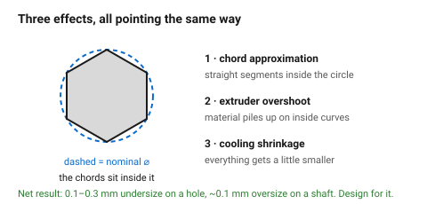
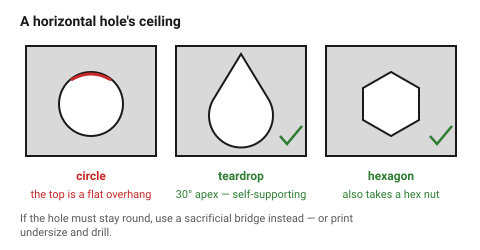

# Holes, shafts and teardrops

Printed holes come out **too small** and printed shafts come out **too big**,
every time, in the same direction. Three effects stack up: the slicer
approximates the circle with straight segments inside the nominal diameter,
the extruder overshoots slightly on inside curves, and the plastic shrinks as
it cools.

The size of the error is predictable enough to design for.

## When this applies

Every hole and every cylindrical feature. Especially any hole that receives
bought hardware — a screw, a bearing, a shaft, a magnet.

## Good starting values

| What | Typical error | Design response |
|---|---|---|
| Vertical hole (axis along Z) | 0.1–0.3 mm **undersize** | add it to the drawn diameter |
| Horizontal hole (axis in XY) | undersize **and** droops at the top | teardrop or sacrificial bridge |
| Printed shaft / pin | ~0.1 mm **oversize** | subtract it |
| Small holes (< 3 mm) | proportionally worse | drill after printing where it matters |

### Drawn diameters for common hardware

Vertical holes in PLA; add 0.05–0.1 mm in PETG.

| For | Drawn ⌀ | Note |
|---|---|---|
| M3 clearance (free) | 3.6 mm | 3.4 nominal + 0.2 print allowance |
| M3 close fit | 3.4 mm | |
| M4 clearance | 4.7 mm | |
| M5 clearance | 5.7 mm | |
| 3 mm dowel, sliding | 3.3 mm | |
| 3 mm dowel, press | 3.1 mm | |
| 608 bearing (⌀22) press | 21.9 mm | large ⌀, so the error is proportionally smaller |
| 5 mm magnet, press | 5.1 mm | magnets are brittle; err loose and glue |

### Horizontal holes

A horizontal hole's ceiling is an overhang that gets steeper and steeper until
it is horizontal at the top — the worst possible geometry. Three fixes:

| Fix | Result | Use when |
|---|---|---|
| **Teardrop** — replace the top of the circle with a 30° point | prints cleanly, no support | a clearance hole; the point does not matter |
| **Sacrificial bridge** — a flat 0.2–0.4 mm floor across the top | round hole preserved; the floor is drilled out | the hole must stay round |
| **Hexagonal hole** | self-supporting, no support needed | a hole for a hex nut or a rough clearance |

A teardrop with a 30° apex angle prints with no support in any material that
prints overhangs at all.

### When to print undersize and drill

For a hole that must be accurate — a bearing seat, a dowel, a rotating shaft —
print it **1 mm undersize** and drill or ream to size. A drilled hole in a
printed part is round, on-axis and repeatable, which no printed hole is.

## How to build it

1. Decide the hole's axis direction from the print orientation.
2. Vertical: add the print allowance from the table to the nominal.
3. Horizontal: apply a teardrop, a sacrificial bridge, or a hex.
4. Anything that must be accurate: design undersize and drill.
5. Where a screw passes through and threads into something else, use a
   **clearance** hole, never a close fit. Printed parts move slightly and a
   close fit turns a four-screw pattern into a fight.
6. Keep at least 2 mm of material around any hole; 3 mm around a press fit.

## When to do it differently

- **A hole that will take a heat-set insert** → different rules entirely; see
  [`screw-boss-heat-set-insert`](../05-features/screw-boss-heat-set-insert.md).
- **A threaded hole** → do not print threads under M6. Use an insert or a nut
  trap. Above M8 a printed thread works for low load.
- **A very large hole (>30 mm)** → the percentage error matters less; draw it
  nominal.
- **A hole for a self-tapping screw** → this is a different calculation:
  ⌀ ≈ 0.8 × screw ⌀. See [`self-tapping-boss`](../05-features/self-tapping-boss.md).

## Images

*The slicer approximates the circle with chords that sit inside the nominal
diameter, and the extruder overshoots on inside curves. Both errors point the
same way.*

*The top of a horizontal circular hole is a horizontal overhang — the worst
case. A 30° teardrop point, a hex, or a sacrificial bridge all avoid it.*

## Source & date

- Hole undersize and the 0.2–0.5 mm allowance:
  [Layer X — FDM design rules](https://layerx3d.in/blog/fdm-design-rules-wall-thickness-overhangs-bridging-tolerances),
  [Yorkshire3D — designing for FDM](https://www.yorkshire3d.co.uk/blog/designing-for-fdm-tolerances-overhangs-wall-thickness).
- Teardrop 30° apex and sacrificial bridges:
  [Pollen AM — holes](https://www.pollen.am/design_for_3d_printing_holes/),
  [Hackaday — sacrificial bridge](https://hackaday.com/2017/10/17/sacrificial-bridge-avoids-3d-printed-supports/).
- `confidence: high` for the direction of the error; `medium` for its size,
  which is machine-dependent — measure with
  [`tolerance-test-part`](../01-basics/tolerance-test-part.md).
