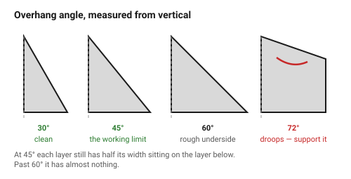
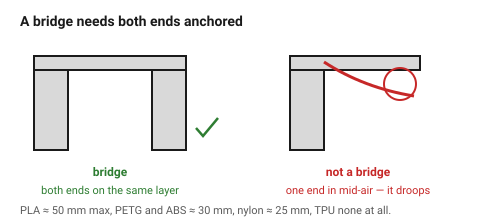
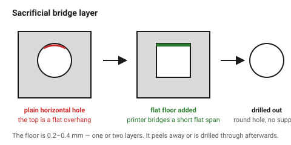

# Overhangs and bridging

A printer can only build on what is already there. Two things let it cheat:
each layer can sit slightly outside the one below (an **overhang**), and it
can stretch a thread across a gap (a **bridge**).

Both have limits, and both are cheaper to design around than to support.

## When this applies

Every downward-facing surface in the part, once the orientation is chosen.
Check this immediately after
[`orientation-and-strength`](../01-basics/orientation-and-strength.md), because
the two interact.

## Good starting values

### Overhangs

Angles measured **from vertical** — 0° is a vertical wall, 90° is a flat
ceiling.

| Angle | Result | Action |
|---|---|---|
| 0–40° | clean | none |
| **45°** | **the working limit** | the number to design to |
| 50–60° | rough underside, usable | acceptable on hidden faces |
| 60–70° | visibly drooping | support, or redesign |
| >70° | fails | support, or redesign |

| Material | Practical limit |
|---|---|
| PLA, well cooled | 45°, often 40° |
| PETG | 50° |
| ABS / ASA (no fan) | 45° |
| TPU | 60° |
| Nylon | 50° |

### Bridges

A bridge is a *flat* span between two supports — the printer stretches the
thread and it sags in the middle.

| Material | Comfortable | Maximum | Note |
|---|---|---|---|
| PLA | 20 mm | ~50 mm | the best bridging material |
| PETG | 15 mm | ~30 mm | |
| ABS / ASA | 15 mm | ~30 mm | no fan, so more sag |
| Nylon | 10 mm | ~25 mm | |
| TPU | — | **does not bridge** | design the span out |

A bridge needs **both ends anchored on the same layer**. A span with one end
in mid-air is not a bridge, it is an overhang, and it will droop.

### The three ways to remove an overhang

| Technique | Use when |
|---|---|
| **Chamfer it to 45°** | the underside of a boss, a lip, a shelf |
| **Turn a circle into a teardrop** | a horizontal hole — see [`holes-shafts-and-teardrops`](holes-shafts-and-teardrops.md) |
| **Add a sacrificial bridge layer** | a horizontal hole or pocket ceiling: give it a flat floor 0.2–0.4 mm thick that the printer bridges, then print the round feature on top of it |

The sacrificial bridge is the trick worth knowing: it converts an impossible
ceiling into a short flat bridge plus a thin layer that peels away or is
drilled out.

## How to build it

1. Rotate the part into its chosen orientation and look at it **from below**.
   Every face you can see is an overhang.
2. For each one, measure the angle. Above 45°, pick one of the three fixes.
3. For every horizontal hole, apply a teardrop or a sacrificial bridge.
4. For every ceiling over an internal cavity, check the span against the
   bridge table.
5. Only after all three: decide whether the remaining overhangs justify
   support. → [`designing-without-supports`](../06-support-strategy/designing-without-supports.md)

## When to do it differently

- **A cosmetic underside** → support and then sand, or accept a rough face.
  A 45° chamfer is visible; sometimes that matters more than the surface.
- **Very small overhangs (under ~2 mm)** → they print fine at almost any
  angle. Do not chamfer a 1 mm lip.
- **A part that must be watertight** → avoid bridges over the sealed volume;
  the underside of a bridge is porous.
- **Organic or sculptural shapes** → supports are usually the right answer.
  The 45° rule is for engineering parts.

## Images

*Measured from vertical. At 45° the layer still has half its width supported
by the layer below; beyond about 60° it has almost nothing to sit on.*

*A bridge needs both ends anchored on the same layer. With one end in mid-air
it is not a bridge — it is an overhang, and it droops.*

*Give the cavity a flat floor 0.2–0.4 mm thick. The printer bridges the flat
span easily, and the round feature is printed on top of it. The layer is
peeled or drilled out afterwards.*

## Source & date

- 45° rule and bridge limits: [UltiMaker — design for FFF](https://ultimaker.com/learn/design-for-fff-3d-printing-maximize-your-success/),
  [Forge Labs — FDM design guidelines](https://forgelabs.com/design-guides/fdm),
  [Layer X — FDM design rules](https://layerx3d.in/blog/fdm-design-rules-wall-thickness-overhangs-bridging-tolerances).
- Sacrificial bridge technique: [Hackaday — sacrificial bridge avoids 3D printed supports](https://hackaday.com/2017/10/17/sacrificial-bridge-avoids-3d-printed-supports/).
- `confidence: high` — the 45° relationship is geometric; the exact material
  limits vary with cooling.
