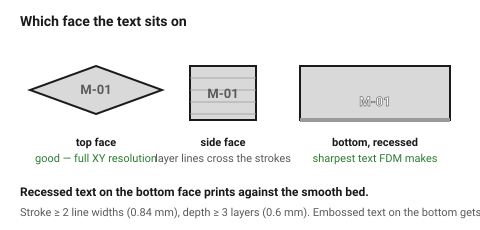

# Text, embossing and engraving

Text on a printed part is limited by the same grid as everything else: a
letter stroke narrower than one extrusion does not exist, and a letter shallower
than one layer does not exist either.

Which face the text sits on matters as much as its size.

## When this applies

Part numbers, labels, logos, orientation marks, anything that has to be read
on the finished part.

## Good starting values

| What | Start with | Floor | Why |
|---|---|---|---|
| Stroke width | 0.8 mm | 0.42 mm (1 line) | below one line width the slicer drops it silently |
| Emboss height (raised) | 0.6 mm | 0.4 mm | 2–3 layers at 0.2 mm |
| Engrave depth (recessed) | 0.6 mm | 0.4 mm | shallower and it fills with the next layer's squash |
| Cap height | 6 mm | 4 mm | for reliably readable text |
| Gap between letters | 0.8 mm | 0.5 mm | closer and the letters fuse |
| Corner radius on strokes | 0.2 mm | — | sharp stroke ends print rounded anyway |

### Which face

| Face | Quality | Note |
|---|---|---|
| **Top** | best | flat, full resolution in XY |
| Vertical side | good | layer lines cross the letters; keep strokes ≥ 1 mm |
| **Bottom** | very good if recessed | prints against the bed, comes out crisp — but embossed text on the bottom is squashed by elephant foot |
| Angled or curved | poor | the strokes vary in width as the angle changes |

### Embossed or engraved

| | Embossed (raised) | Engraved (recessed) |
|---|---|---|
| Top face | good | good |
| Bottom face | squashed by elephant foot | **excellent — the sharpest text FDM makes** |
| Side face | good | good, may fill slightly |
| Readability | high contrast in raking light | needs paint or a colour change to read well |
| Risk | catches and wears off | fills with the next layer if too shallow |

**Recessed text on the bottom face is the sharpest text an FDM printer
produces.** It is printed directly against the smooth bed. For part numbers
and marks that must last, this is the place to put them.

## How to build it

1. Decide the face first, from the print orientation.
2. Set the stroke width to **at least 2 line widths** (0.84 mm) — not the
   font's default at a small point size.
3. Set the depth or height to **at least 3 layers**.
4. Choose a medium-weight sans with open counters. Thin and script faces do
   not survive.
5. For orientation marks and internal part numbers, recess them into the
   bottom face.
6. For a two-colour label, emboss 0.6 mm and specify a filament change at that
   layer — far more legible than any single-colour text.

## When to do it differently

- **Very small text unavoidable** → 0.25 mm nozzle and 0.1 mm layers; expect
  4 mm cap height to be the floor even then.
- **Text on a curved surface** → wrap it, keep strokes thick, and accept
  variable quality. Or print a separate flat badge.
- **Text that must be read at a distance** → emboss and paint the raised
  faces by wiping paint across them after printing.
- **A mould or a stamp** → remember to mirror.

## Images

*The same label on top, side and bottom faces. Recessed text on the bottom
face prints against the bed and comes out sharpest.*

## Source & date

- Emboss/engrave depth and stroke width:
  [Wikifactory — ultimate design guide for 3D printing](https://medium.com/@wikifactory/ultimate-design-guide-for-3d-printing-2e1ae463a0ff),
  [Voxel Magic — minimum requirements](https://voxel-magic.com/minimum-requirements-for-making-your-design-3d-printable-in-pla-petg-and-abs).
- `confidence: medium`.
