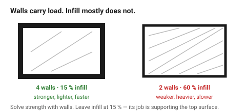
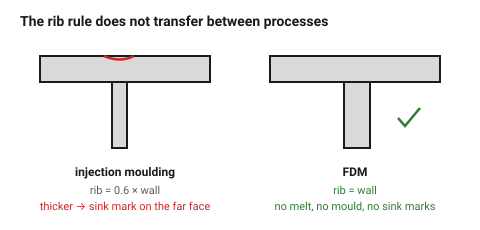

# Walls and thin features

Walls carry the load in an FDM part. Infill mostly does not — it stops the top
surface sagging and adds a little stiffness, and that is close to all. A part
made strong by raising infill to 80 % is a part that should have had thicker
walls and printed in half the time.

## When this applies

Every shell, rib, boss wall, pin and thin projection.

## Good starting values

For a 0.4 mm nozzle at 0.42 mm line width:

| Use | Thickness | Lines | Why |
|---|---|---|---|
| Absolute minimum printable | 0.42 mm | 1 | fragile, and the slicer may drop it |
| Cosmetic shell, no load | 0.84 mm | 2 | the practical minimum |
| **General-purpose wall** | **1.26 mm** | **3** | the default for most parts |
| Load-bearing, snap fits, screw bosses | 1.68 mm | 4 | |
| Around a heat-set insert | ≥ 1.6 mm of plastic | — | thin bosses crack; see [`screw-boss-heat-set-insert`](../05-features/screw-boss-heat-set-insert.md) |
| More than this | use a rib instead | — | solid walls over ~2.5 mm are wasted material and print time |

| Feature | Minimum | Why |
|---|---|---|
| Free-standing pin ⌀ | 2 mm | thinner pins wobble as they print and snap in handling |
| Free-standing wall height:thickness | 10:1 | taller than this it oscillates and the surface ripples |
| Rib thickness | **= wall thickness** | see below |
| Gap between two walls | 0.5 mm | closer and they fuse into one |
| Embossed feature width | 0.8 mm | 2 lines |

### The rib rule that is different from injection moulding

In injection moulding, a rib must be **thinner** than the wall it sits on
(0.6 ×) or it leaves a sink mark on the opposite face. **FDM has no sink
marks.** There is no melt shrinking against a mould wall, so:

> In FDM, make a rib the **same** thickness as the wall.

This is one of the few places where DFM knowledge transfers badly between
processes, and applying the injection-moulding rule here produces ribs that
are needlessly weak.

### Infill, honestly

| Infill | Use |
|---|---|
| 0 % | hollow, for a shell with no top face |
| **15 %** | **the default — supports the top surface** |
| 25–40 % | parts under moderate load, TPU stiffness control |
| >50 % | rarely worth it; add walls instead |
| 100 % | small, highly loaded parts only — and expect warping |

Strength scales far better with wall count than with infill. Four walls at
15 % infill beats two walls at 60 %, uses less filament and prints faster.

## How to build it

1. Choose the wall thickness from the table, as a whole number of lines.
2. Keep it **uniform**. Sudden changes in section are where warping and
   cracking start.
3. Where stiffness is needed, add a rib at wall thickness rather than
   thickening the wall.
4. Check every thin feature against the minimum column, in the orientation
   the part will actually print.
5. Leave infill at 15 % and solve strength problems with walls.

## When to do it differently

- **A large flat panel that must not flex** → a ribbed panel is stiffer than a
  thick one at the same weight and far faster to print.
- **A part that must be watertight** → 4+ walls and 3 top/bottom layers.
  Porosity is a wall-count problem, not an infill problem.
- **A tiny part under 10 mm** → print it solid; the wall arithmetic stops
  mattering.
- **A part that must be light** → thin walls plus ribs, not low infill.

## Images

*Four walls at 15 % infill against two walls at 60 %. The first is stronger,
lighter and faster — walls carry load, infill mostly supports the top surface.*

*Injection moulding wants a rib thinner than its wall, to avoid sink marks.
FDM has no sink marks, so the rib is the same thickness as the wall.*

## Source & date

- Minimum wall and feature sizes: [UltiMaker — design for FFF](https://ultimaker.com/learn/design-for-fff-3d-printing-maximize-your-success/),
  [Forge Labs — FDM design guidelines](https://forgelabs.com/design-guides/fdm),
  [Voxel Magic — minimum requirements for PLA, PETG and ABS](https://voxel-magic.com/minimum-requirements-for-making-your-design-3d-printable-in-pla-petg-and-abs).
- Wall-count-over-infill: [Hydra Research — design rules](https://www.hydraresearch3d.com/design-rules).
- `confidence: high`.
