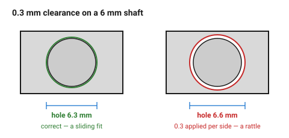
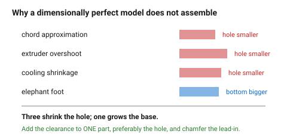

# Clearances and fits

The single most useful table in the FDM folder, and the one most often applied
wrongly — because **clearance is diametral, not per side.**

> A 0.3 mm clearance means the hole is modelled **0.3 mm larger than the
> shaft**, not 0.3 mm larger on each side. A 6 mm shaft in a sliding fit gets
> a 6.3 mm hole, not 6.6 mm.

## When this applies

Every place two parts meet: a pin in a hole, a lid in a rim, a shaft in a
bearing, a printed part against bought hardware.

## Good starting values

PLA at 0.4 mm nozzle, 0.2 mm layers. Add 0.05–0.1 mm for PETG, 0.2 mm for TPU.

| Fit | Clearance (diametral) | Feel | Use for |
|---|---|---|---|
| **Interference** | −0.1 mm | needs a press or heat | permanent assembly |
| **Press** | 0.1 mm | firm push, stays put | pins, dowels, bearings |
| **Close** | 0.15 mm | pushes with thumb pressure | locating features |
| **Sliding** | 0.2–0.3 mm | slides freely, no rattle | shafts, drawers, lids |
| **Loose / running** | 0.4–0.5 mm | obvious play | rotating parts, print-in-place |
| **Clearance (fastener)** | 0.4–0.6 mm | drops in | screws through a part |

### By feature

| Feature | Clearance | Note |
|---|---|---|
| Lid into a rim | 0.3 mm all round | any tighter and thermal movement jams it |
| Hex nut into a trap | +0.2 mm across flats, +0.3 mm on depth | see [`nut-trap`](../05-features/nut-trap.md) |
| Magnet into a pocket | +0.1 mm, and glue | magnets are brittle; never press them hard |
| Bearing into a seat | −0.05 to 0 mm | press fit; add a lead-in chamfer |
| Printed pin into a printed hole | 0.2 mm | both parts have their own error |
| Print-in-place hinge | 0.3–0.5 mm | see [`print-in-place`](print-in-place.md) |
| Snap-arm side clearance | 0.2–0.3 mm | so it flexes without rubbing |
| Two mating printed faces | 0.2 mm | printed faces are never perfectly flat |

### Why printed fits differ from machined ones

| Effect | Size | Direction |
|---|---|---|
| Slicer chord approximation | 0.05–0.1 mm | holes smaller |
| Extruder overshoot on inside curves | 0.05–0.15 mm | holes smaller |
| Cooling shrinkage | 0.1–0.3 % | everything smaller |
| Elephant foot | 0.1–0.2 mm | bottom edges larger |

The first three all shrink holes; the fourth grows the bottom of the part.
Together they are why a "perfect" model does not assemble.

## How to build it

1. Pick the fit from the first table by **how the joint should feel**, not by
   how it looks.
2. Apply the clearance to **one** part, and preferably to the hole. Adjusting
   both makes the error impossible to trace when the test print is wrong.
3. Add the material adjustment (PETG, TPU).
4. Add a **lead-in chamfer** — 0.5 mm × 45° — to every pin and every hole that
   is assembled by hand. It absorbs the elephant foot and guides the part in.
5. Print the fit first, as a small coupon, on anything with more than two
   mating pairs.

## When to do it differently

- **A part that will be hot in service** → open the clearance by 0.1 mm.
  Plastic expands, and a sliding fit that jams at 50 °C is a common failure.
- **A fit that must be exact** → print undersize and drill or ream.
- **A fit against bought metal hardware** → measure the hardware; catalogue
  dimensions are nominal and tolerances are wide.
- **A print-in-place mechanism** → use the loose column, not the sliding one.
  The two surfaces are printed against each other and will fuse at tighter
  clearances.

## Images

*The mistake worth naming: 0.3 mm clearance on a 6 mm shaft is a 6.3 mm hole,
not 6.6 mm. Doubling it turns a sliding fit into a rattle.*

*Three effects shrink the hole and one grows the bottom of the part. Together
they are why a model that is dimensionally perfect does not assemble.*

## Source & date

- Clearance bands: [Zbotic — 3D printing tolerances, gaps for press fits](https://zbotic.in/3d-printing-tolerances-designing-gaps-for-press-fits-threads-and-snap-fits/),
  [3DPut — tolerances and fit for moving parts](https://3dput.com/complete-guide-to-3d-printing-tolerances-and-fit-clearance-for-moving-parts-2/),
  [Creative3DP — press-fit tolerances](https://tools.creative3dp.com/blog/press-fit-tolerances-3d-printing/).
- Diametral-not-per-side and the compounding errors: same sources.
- `confidence: medium` — measure yours with
  [`tolerance-test-part`](../01-basics/tolerance-test-part.md).
