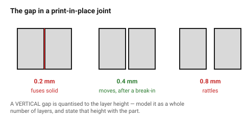

# Print-in-place mechanisms

A hinge, a latch or a joint printed already assembled, with the moving
surfaces printed directly against each other. It works because the two
surfaces never fuse — provided the gap between them is at least one layer of
air.

The design rule is simple and unforgiving: **too tight and it welds solid;
too loose and it rattles**, and there is no second chance to adjust it.

## When this applies

Hinges, living joints, captive latches, chain links, compliant mechanisms,
anything where assembly would be fiddly or impossible.

Not for anything load-bearing, not for anything that must be precise, and not
in TPU.

## Good starting values

| What | Start with | Works between | Why |
|---|---|---|---|
| Gap between moving surfaces | **0.4 mm** | 0.3–0.5 | below 0.3 mm the surfaces fuse; above 0.5 mm it rattles |
| Gap in PETG | 0.5 mm | 0.4–0.6 | PETG flows more and bridges the gap |
| Gap, vertical (across layers) | 0.4 mm = 2 layers at 0.2 | — | must be a whole number of layers |
| Hinge pin ⌀ | 3 mm minimum | 2.5–6 | thinner pins shear |
| Hinge knuckle length | ≥ 2 × pin ⌀ | — | short knuckles split |
| Break-in | expected | — | the first movement breaks small fused bridges; design for it |

### The layer-height rule

A horizontal gap is whatever you model it. A **vertical** gap — between a
hinge knuckle and the part above it — is quantised to the layer height. A
0.35 mm gap at 0.2 mm layers is really 0.4 mm, or 0.2 mm, depending on where
the layer boundaries fall.

Model vertical gaps as whole multiples of the layer height, and state the
layer height with the part.

## How to build it

1. Orient the mechanism so the moving surfaces are **vertical** where
   possible. A vertical gap is more predictable than a horizontal one and
   needs no bridging.
2. Set the gap to 0.4 mm, as a whole number of layers.
3. Avoid any overhang inside the joint — the inside of a hinge knuckle is
   hard to cool and easy to droop.
4. Keep the mechanism **small relative to the part**. A print-in-place hinge
   on a 300 mm lid will bind as the part warps.
5. Design in a **break-in movement**: the first open/close will feel stiff and
   break a few fused points. That is normal; a joint that moves freely
   straight off the bed was probably too loose.
6. Print a coupon of just the joint before committing the whole part.

## When to do it differently

- **The joint must last** → print it in two parts with a metal pin. A
  print-in-place hinge is a convenience, not a bearing.
- **TPU** → do not. Flexible material fuses across any gap.
- **Fine detail or a small joint** → 0.1 mm layers, and expect the gap to need
  re-tuning.
- **A joint that must not move in transit** → add a small sacrificial tab that
  is snipped after delivery.

## Images

*0.2 mm fuses solid, 0.4 mm moves, 0.8 mm rattles. There is no adjusting it
afterwards, which is why the coupon is worth printing.*

## Source & date

- Print-in-place clearances: [3DPut — tolerances and fit for moving parts](https://3dput.com/complete-guide-to-3d-printing-tolerances-and-fit-clearance-for-moving-parts-2/),
  [Zbotic — tolerances for press fits, threads and snap fits](https://zbotic.in/3d-printing-tolerances-designing-gaps-for-press-fits-threads-and-snap-fits/).
- `confidence: medium`.
