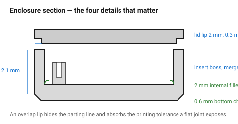
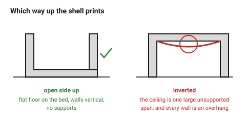

# Enclosure shell and lid

The most-printed object there is. Its difficulties are all in the details:
how the lid locates, how the walls stay stiff, where the screws go, and how
anything gets in or out.

## When this applies

Electronics housings, project boxes, covers, instrument cases.

## Good starting values

| What | Start with | Works between | Why |
|---|---|---|---|
| Wall thickness | 2.1 mm (5 lines) | 1.68–2.5 | stiff enough to handle, thin enough to print quickly |
| Floor / ceiling thickness | 1.2 mm (6 layers at 0.2) | 0.8–2.0 | |
| Internal corner fillet | 2 mm | 1–3 | stiffness, and it prints better than a sharp corner |
| **Bottom outside chamfer** | 0.6 mm × 45° | 0.4–0.8 | elephant foot, bed release, handling |
| Lid overlap lip | 2 mm deep | 1.5–4 | locates the lid and hides the seam |
| Lid clearance all round | **0.3 mm** | 0.25–0.4 | tighter and thermal movement jams it |
| PCB standoff height | 4 mm | 3–8 | clearance for solder tails underneath |
| PCB pocket clearance | +0.3 mm each side | 0.2–0.5 | board outlines are not exact |
| Screw bosses | 4, in the corners | | see [`screw-boss-heat-set-insert`](screw-boss-heat-set-insert.md) |
| Connector cutout clearance | +0.3 mm | 0.2–0.5 | measure the connector, not the datasheet |
| Ventilation slot width | 1.5–3 mm | | narrower slots close up; wider ones let fingers in |

### How the lid locates

| Method | Seals | Serviceable | Use when |
|---|---|---|---|
| **Overlap lip** (a rim on the base, a recess in the lid) | well | yes | the default |
| **Tongue and groove** | best | yes | when dust matters |
| **Snap fit** | poorly | yes | no tools — see [`snap-fit-cantilever`](snap-fit-cantilever.md) |
| **Flat with screws only** | poorly | yes | simplest, but the seam gapes |

An overlap lip is the right default: it hides the parting line, it stops
light and dust, and it takes up the printing tolerance that a flat joint
exposes.

## How to build it

1. **Orient the shell open-side up.** The walls print as vertical surfaces,
   the floor is on the bed and comes out flat, and there are no supports. The
   inside of the ceiling — which would be a large bridge — becomes the open
   top instead.
2. Draw walls as 5 lines, floor as 6 layers.
3. Add the 0.6 mm bottom chamfer to the outside edge.
4. Fillet the internal corners 2 mm.
5. Add the lid lip: 2 mm tall on the base, matching recess in the lid, 0.3 mm
   clearance all round.
6. Put a boss in each corner, merged into the wall where possible, with
   gussets where not.
7. Cut the connector openings from **measured** components, +0.3 mm.
8. Add standoffs for the PCB, and check the screw heads clear anything above.
9. Chamfer the lid's bottom edge too — it also suffers elephant foot.

## When to do it differently

- **Weatherproof** → a gasket groove and a compressed O-ring. FDM walls are
  porous, so a printed enclosure is not sealed by geometry alone: 5+ walls,
  and consider a coating.
- **Heat inside** → PETG or ABS, not PLA. Electronics warm their own box, and
  a PLA enclosure in a warm room can sag.
- **EMC or shielding** → a printed box is transparent to RF. Line it, or use
  metal.
- **Very large enclosure** → split it and bolt the halves.
  → [`splitting-large-parts`](splitting-large-parts.md)
- **A single opening face** → consider printing the lid *and* the shell in one
  piece with a living hinge, in PP.

## Images

*The four details that decide whether an enclosure is pleasant: the lid lip,
the corner boss, the internal fillet and the bottom chamfer.*

*Open-side up, the floor is on the bed and there are no bridges. Inverted, the
ceiling is one large unsupported span and every wall is an overhang.*

## Source & date

- Assembled from the documents it links to, plus general practice in
  [UltiMaker — design for FFF](https://ultimaker.com/learn/design-for-fff-3d-printing-maximize-your-success/)
  and [Forge Labs — FDM design guidelines](https://forgelabs.com/design-guides/fdm).
- `confidence: medium`.
