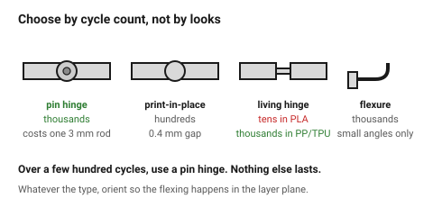
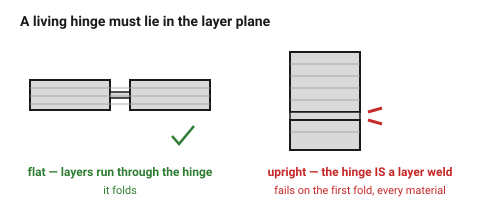

# Hinges

Four ways to make a printed part open, each with a different lifetime. The
choice is made by **how many times it will be opened**, and getting that
wrong is why printed hinges have a poor reputation.

## When this applies

Lids, doors, covers, flaps, cases — anything with a moving joint that is not
carrying load.

## Good starting values

| Type | Cycles | Cost | Use when |
|---|---|---|---|
| **Pin hinge** (printed knuckles, metal pin) | thousands | a 3 mm rod | the default for anything used regularly |
| **Print-in-place knuckle hinge** | hundreds | none | convenience, light use |
| **Living hinge** (thin flexure) | tens in PLA, thousands in PP/TPU | none | material decides everything |
| **Compliant flexure** (a designed spring) | thousands | none | small angles, precise motion |

### Pin hinge

| What | Start with | Why |
|---|---|---|
| Pin ⌀ | 3 mm steel rod | cheap, stiff, available |
| Knuckle bore | pin ⌀ + 0.3 mm | sliding fit |
| Knuckle length | ≥ 2 × pin ⌀ | short knuckles split |
| Number of knuckles | 3 minimum (2 on one part, 1 on the other) | 5 for a long lid |
| Wall around the bore | ≥ 1.5 mm | |
| Orientation | knuckle axis **horizontal**, bore printed as a teardrop or bridged | see [`holes-shafts-and-teardrops`](../03-geometry/holes-shafts-and-teardrops.md) |

### Living hinge

| Material | Verdict |
|---|---|
| Polypropylene (PP) | **excellent** — this is what commercial living hinges are made of |
| TPU | excellent, but floppy |
| PETG | fair — tens to low hundreds of cycles |
| PLA | **poor** — it will crack, usually within ten cycles |
| Nylon | good |

| What | Start with | Works between |
|---|---|---|
| Hinge thickness | 0.4–0.6 mm | 0.3–0.8 |
| Hinge length (along the bend) | 2–4 mm | 1.5–6 |
| Orientation | the hinge must lie **in the layer plane** | — |

A living hinge printed standing up — so that bending pulls the layers apart —
fails on the first fold, every time, in every material.

## How to build it

1. **Count the cycles.** A battery cover opened twice a year is not the same
   design problem as a lid opened daily.
2. Over a few hundred cycles, use a pin hinge. Nothing else lasts.
3. For a pin hinge: size the knuckles, orient so the bores print with a
   teardrop or a sacrificial bridge, and leave 0.3 mm on the bore.
4. For a living hinge: choose the material first — PP or TPU — then the
   thickness. In PLA, do not.
5. Whatever the type, orient so that **flexing happens in the layer plane**.
6. Print a coupon of just the hinge and cycle it twenty times.

## When to do it differently

- **A lid that must stay open** → add a detent or a friction hinge (an
  over-tight pin bore, +0.1 mm instead of +0.3).
- **A precision mechanism** → a compliant flexure, not a hinge; it has no
  backlash.
- **A hinge that carries load when open** → put the load somewhere else. A
  printed hinge is a pivot, not a bracket.
- **A very long lid** → 5+ knuckles and a steel rod; a long printed hinge
  binds as the part warps.

## Images

*The choice is made by cycle count. A pin hinge with a steel rod is the only
one that lasts, and it costs one 3 mm rod.*

*The hinge must lie in the layer plane. Printed standing up, bending pulls the
layer welds apart and it fails on the first fold — in any material.*

## Source & date

- Living-hinge material behaviour: [RapidMade — snap fits and living hinges for MJF](https://rapidmade.com/designing-snap-fits-and-living-hinges-for-mjf-3d-printing-a-complete-guide-for-pa11-pa12-and-pp/),
  [Bambu Lab — filament guide](https://bambulab.com/en-us/filament/guide).
- Print-in-place clearances: [`print-in-place`](../04-fits/print-in-place.md).
- `confidence: medium`.
