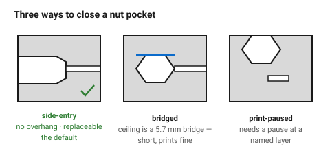
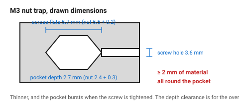

# Nut traps

A hex pocket that holds a standard nut captive while a screw is tightened into
it. Cheaper than an insert, needs no tools, and stronger in pull-out — the nut
is a solid piece of steel bearing on a large plastic face.

The cost is space, and one geometry decision: how the pocket is closed.

## When this applies

Enclosures, frames, anything with room for a nut inside. Particularly good
where the joint will be opened often, or where the pull-out load is high.

## Good starting values

| Screw | Nut across flats | **Pocket AF** | Nut thickness | **Pocket depth** | Screw hole |
|---|---|---|---|---|---|
| M2 | 4.0 mm | 4.2 mm | 1.6 mm | 1.9 mm | 2.4 mm |
| **M3** | **5.5 mm** | **5.7 mm** | **2.4 mm** | **2.7 mm** | **3.6 mm** |
| M4 | 7.0 mm | 7.2 mm | 3.2 mm | 3.5 mm | 4.7 mm |
| M5 | 8.0 mm | 8.2 mm | 4.0 mm | 4.3 mm | 5.7 mm |

| What | Start with | Why |
|---|---|---|
| Clearance across flats | +0.2 mm | the nut must drop in but not rotate |
| Clearance on depth | +0.3 mm | the pocket floor over-extrudes slightly |
| Material around the pocket | ≥ 2 mm | thinner and the pocket bursts when the screw is tightened |
| Lead-in chamfer | 0.3 mm | guides the nut |

### The three ways to close the pocket

| Type | How | Use when |
|---|---|---|
| **Side-entry** | pocket open on one side; the nut slides in horizontally | the best default — no overhang, no bridge, nut can be replaced |
| **Bridged (buried)** | pocket fully enclosed; the ceiling is a short bridge | the nut is captive for ever; needs the bridge to print well |
| **Print-paused** | pocket open upward; the print is paused and the nut dropped in | when neither of the above fits; needs a slicer pause at a named layer |

A **side-entry** trap is almost always the right answer. It has no unsupported
ceiling, it can be inspected, and a stripped nut can be replaced.

If the pocket must be buried, keep the bridge span short — it is the width of
the pocket, so an M3 bridge is only 5.7 mm and prints cleanly in any material
that bridges at all.

## How to build it

1. Choose side-entry unless there is a reason not to.
2. Draw the pocket at nut AF + 0.2 mm, depth + 0.3 mm.
3. Put the screw clearance hole through the far wall, on the nut's axis.
4. Keep ≥ 2 mm of material around the pocket in every direction.
5. Orient the part so the pocket's opening does not face downward.
6. For a buried trap, check the ceiling bridge against
   [`overhangs-and-bridging`](../03-geometry/overhangs-and-bridging.md).
7. Add a small retaining bump (0.2 mm) at the mouth of a side-entry pocket if
   the nut might fall out during assembly.

## When to do it differently

- **No room** → heat-set insert. → [`screw-boss-heat-set-insert`](screw-boss-heat-set-insert.md)
- **The joint is opened very often** → a nut trap is better than an insert
  here; the thread is steel on steel.
- **Square nuts** → thinner for the same thread, and they self-align against
  two pocket walls. Worth considering in thin parts.
- **The screw is tightened hard** → put a washer under the screw head and keep
  ≥ 3 mm of material around the pocket; the plastic creeps under load.

## Images

*Side-entry is the default: no unsupported ceiling, the nut is visible, and it
can be replaced. A buried trap needs a short bridge, which is only as wide as
the pocket.*

*Across flats +0.2 mm, depth +0.3 mm, and at least 2 mm of material all round.
Thinner and the pocket bursts when the screw is tightened.*

## Source & date

- Hex pocket clearances (+0.2 mm on flats, +0.3 mm on depth):
  [3DPut — tolerances and fit](https://3dput.com/complete-guide-to-3d-printing-tolerances-and-fit-clearance-for-moving-parts-2/),
  [Zbotic — tolerances for press fits, threads and snap fits](https://zbotic.in/3d-printing-tolerances-designing-gaps-for-press-fits-threads-and-snap-fits/).
- Nut dimensions: ISO 4032.
- `confidence: medium`.
