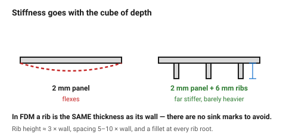
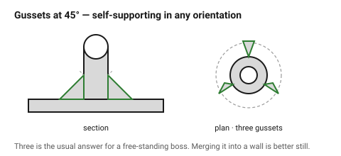

# Ribs and gussets

The cheapest stiffness in printed design. A rib adds depth to a section, and
stiffness scales with the **cube** of depth — so a 6 mm rib on a 2 mm panel is
worth far more than a 4 mm panel, at a fraction of the material and print time.

## When this applies

Any panel that flexes, any boss that stands alone, any bracket that bends
under its own load. Reach for a rib before thickening a wall.

## Good starting values

| What | Start with | Works between | Why |
|---|---|---|---|
| **Rib thickness** | **= wall thickness** | 0.8×–1.0× | FDM has no sink marks — see below |
| Rib height | 3 × wall thickness | 2×–5× | taller ribs buckle rather than stiffen |
| Rib spacing | 5–10 × wall thickness | — | closer ribs add weight without stiffness |
| Draft on a rib | none needed | — | no mould, no draft |
| Fillet at the rib root | 0.5 × rib thickness | 0.3×–1× | stress concentration, exactly as on a snap-fit arm |
| Gusset thickness | = wall thickness | | |
| Gusset angle | 45° | 30–60 | 45° is self-supporting in any orientation |
| Gussets per boss | 2–4 | | 3 is the usual answer for a free-standing boss |

### The rule that differs from injection moulding

In injection moulding, a rib **must** be thinner than its wall (0.5–0.6 ×), or
the thicker section cools more slowly and pulls the visible surface inward —
a sink mark.

**FDM has no sink marks.** Nothing is shrinking against a mould wall. So:

> In FDM, a rib is the **same thickness** as the wall it sits on.

Carrying the injection-moulding rule across produces ribs at 60 % thickness
that are needlessly weak — and, at a 0.4 mm nozzle, may not even be a whole
number of extrusion lines.

### Where ribs beat thicker walls

| | Thicker wall | Ribs |
|---|---|---|
| Stiffness per gram | low | **high** |
| Print time | high | low |
| Warping risk | **high** — thick sections cool unevenly | low |
| Surface finish | flat | rib lines visible on the back |

## How to build it

1. Find where the part actually bends — usually a flat panel or a long
   unsupported arm.
2. Run ribs **across** the bending direction, on the non-visible face.
3. Set the rib thickness to the wall thickness, height to 3 × wall.
4. Fillet every rib root.
5. For a free-standing boss, add 3 gussets at 45° to the nearest wall or
   floor. → [`screw-boss-heat-set-insert`](screw-boss-heat-set-insert.md)
6. Check the rib is self-supporting in the chosen orientation — a rib that
   overhangs at 70° needs support, which defeats the point.

## When to do it differently

- **A visible face on both sides** → ribs will show. Use a closed box section
  or a thicker wall.
- **A part in tension, not bending** → ribs do nothing. Add cross section.
- **A very thin panel (< 1 mm)** → a rib on a 0.84 mm wall is 0.84 mm and
  fragile. Thicken the panel first, then rib it.
- **TPU** → ribs do not stiffen flexible material meaningfully; change infill
  instead.

## Images

*Stiffness scales with the cube of section depth. A shallow rib is worth more
than a much thicker panel, at a fraction of the material and print time.*

*Three gussets at 45° — self-supporting in any orientation, and the difference
between a boss that survives tightening and one that snaps at its root.*

## Source & date

- Rib proportions and the no-sink-mark difference:
  [Hydra Research — design rules](https://www.hydraresearch3d.com/design-rules),
  [UltiMaker — design for FFF](https://ultimaker.com/learn/design-for-fff-3d-printing-maximize-your-success/);
  the injection-moulding rule being contrasted is from
  [RJC Mold](https://rjcmold.com/guides/snap-fit-design).
- `confidence: medium`.
