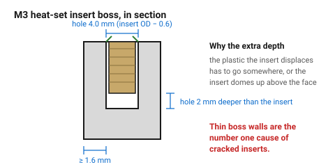
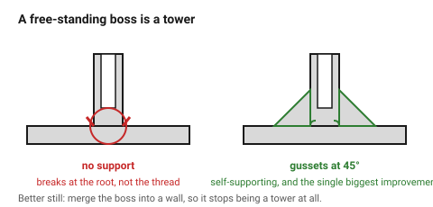

# Screw boss with a heat-set insert

The right way to put a machine thread into a printed part. A knurled brass
insert is pushed in with a soldering iron; the plastic melts around the
knurls and re-solidifies, and the result takes a screw hundreds of times
without stripping.

It is more reliable than a printed thread, more compact than a nut trap, and
the single most common reason an insert fails is a boss wall that is too thin.

## When this applies

Enclosures, panels, anything assembled with machine screws and opened more
than once. The standard solution for M2–M5 threads in a printed part.

## Good starting values

For the common tapered brass inserts (SPI/Ruthex style):

| Screw | Insert OD | **Hole ⌀** | **Boss OD** | Hole depth | Min wall of plastic |
|---|---|---|---|---|---|
| M2 | 3.2 mm | 3.0 mm | 6 mm | insert + 1.5 mm | 1.4 mm |
| **M3** | **4.6 mm** | **4.0 mm** | **8 mm** | insert + 2 mm | **1.6 mm** |
| M4 | 5.6 mm | 5.0 mm | 10 mm | insert + 2 mm | 2.0 mm |
| M5 | 6.4 mm | 5.8 mm | 11 mm | insert + 2 mm | 2.2 mm |

| What | Start with | Works between | Why |
|---|---|---|---|
| Hole ⌀ | insert OD − 0.6 mm | −0.4 to −0.8 | too tight and the insert splits the boss; too loose and it spins |
| **Wall around the insert** | **1.6 mm min, 2× insert OD ideally** | — | **thin bosses are the number one cause of cracked inserts** |
| Hole depth | insert length + 1.5–2 mm | — | the displaced plastic has to go somewhere, or the insert domes up |
| Lead-in chamfer | 0.5 mm × 45° | — | centres the insert as it starts |
| Boss fillet at the base | 1 mm | 0.5–2 | the boss breaks off at its root, not at the thread |
| Boss height | ≥ insert length + 2 mm | — | |

### The boss is a tower, and towers are weak

A free-standing boss is a thin vertical cylinder — poorly cooled, printed with
a small cross-section, and loaded sideways when the screw is tightened.

| Fix | Effect |
|---|---|
| Fillet at the base | spreads the load into the wall |
| Two or three gussets to the nearest wall | the single biggest improvement |
| Merge the boss into a wall | best of all — it stops being a tower |
| Keep it short | height ≤ 3 × diameter where possible |

## How to build it

1. Look up the insert's **actual** dimensions — manufacturers differ. Measure
   if unsure.
2. Draw the hole at insert OD − 0.6 mm, **1.5–2 mm deeper than the insert**.
3. Draw the boss at ≥ 2 × insert OD, or merge it into a wall.
4. Add a 0.5 mm lead-in chamfer at the top of the hole.
5. Add a 1 mm fillet at the base, and gussets if the boss stands alone.
6. Orient so the boss hole axis is **vertical** — the hole prints round and
   the insert goes in square.
7. Install at 200–250 °C for PLA, 250 °C for PETG, straight down, with the
   iron tip square to the boss. Let it cool before loading it.

## When to do it differently

- **Thin-walled part, no room for a boss** → use a nut trap instead.
  → [`nut-trap`](nut-trap.md)
- **A screw used once** → a self-tapping boss is cheaper and needs no
  hardware. → [`self-tapping-boss`](self-tapping-boss.md)
- **High pull-out load** → use a through bolt and a nut on the far side. An
  insert resists torque well and axial pull-out only moderately.
- **Nylon or PC** → inserts work but need a higher iron temperature; check the
  insert is rated for it.

## Images

*Hole 0.6 mm under the insert OD, 2 mm deeper than the insert, and at least
1.6 mm of plastic all round. The extra depth is where the displaced plastic
goes.*

*Thin-walled bosses are the number one cause of cracked inserts. Gussets to
the nearest wall are the single biggest improvement, and merging the boss into
a wall is better still.*

## Source & date

- Hole and boss dimensions: [Markforged — using heat set inserts](https://markforged.com/resources/blog/heat-set-inserts),
  [Sovol — design strong screw bosses](https://www.sovol3d.com/blogs/news/3d-printing-with-heat-set-inserts-design-strong-screw-bosses-that-last),
  [Insert Guide — engineering guides](https://insertguide.com/engineering-guides/).
- Hole depth 1–2 mm deeper than the insert, and the thin-boss failure mode:
  same sources.
- `confidence: medium` — insert geometry varies by manufacturer; measure.
