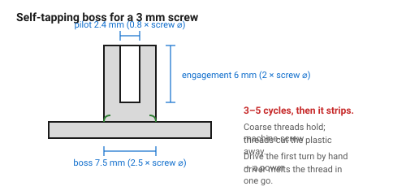

# Self-tapping screw boss

A screw driven directly into a plain printed hole, cutting its own thread.
Cheapest possible fastening: no insert, no nut, no tools beyond a driver.

The trade is that it is good for **a handful of assembly cycles**, not
hundreds. Each time the screw goes in it cuts a little more material away.

## When this applies

Prototypes, low-cost parts, internal fixings that will be assembled once or
twice, lids that are rarely opened.

Not for anything that will be serviced regularly, and not for anything where a
stripped boss means a scrapped part.

## Good starting values

| What | Value | Why |
|---|---|---|
| **Pilot hole ⌀** | **0.8 × screw ⌀** | enough material for the thread to bite, not so much that it splits |
| Pilot for M3 | 2.4 mm | |
| Pilot for a #4 / 3 mm self-tapper | 2.4 mm | |
| Hole depth | screw engagement + 2 mm | the tip needs somewhere to go |
| Thread engagement | 2 × screw ⌀ | 6 mm for an M3 |
| Boss OD | 2.5 × screw ⌀ | 7.5 mm for an M3 |
| Wall around the hole | ≥ 1.5 mm | below this the boss splits on the first screw |
| Lead-in chamfer | 0.5 mm × 45° | starts the screw square |
| Expected cycles | 3–5 | after that the thread is gone |

### Which screw

| Screw type | Suitability |
|---|---|
| Plastite / plastic-specific (30–45° thread) | best — designed for this |
| Sheet-metal / self-tapping | good |
| Wood screw | acceptable, coarse thread bites well |
| **Machine screw (M3 etc.)** | poor — the fine thread strips plastic quickly |

The thread **pitch** is what matters: coarse threads have more plastic between
them and hold far better.

## How to build it

1. Choose a coarse-threaded screw, not a machine screw.
2. Pilot hole at 0.8 × the screw's outer diameter, 2 mm deeper than the
   engagement length.
3. Boss OD ≥ 2.5 × screw ⌀, with a 1 mm fillet at its base.
4. Orient the hole axis vertically so it prints round.
5. Drive the screw **slowly, by hand for the first turn**. A power driver
   generates heat, melts the thread and strips it in one go.
6. If the part will be opened more than a few times, stop and use an insert
   instead. Deciding this at design time is much cheaper than discovering it.

## When to do it differently

- **More than ~5 cycles** → heat-set insert.
  → [`screw-boss-heat-set-insert`](screw-boss-heat-set-insert.md)
- **PETG** → drill 0.1 mm larger; PETG is tougher and splits less but grips
  more, so the driving torque is higher.
- **A stripped boss in the field** → design a rescue: make the boss thick
  enough that it can be drilled out for an insert later.
- **Very small screws (M2 and below)** → the tolerance band is narrower than
  the printing error. Use inserts.

## Images

*Pilot at 0.8 × screw ⌀, engagement 2 × screw ⌀, boss 2.5 × screw ⌀, and a
fillet at the base. Coarse threads hold; machine-screw threads strip.*

## Source & date

- Pilot-hole ratio and boss proportions adapted from thermoplastic
  boss-design practice ([RJC Mold — snap-fit and boss design](https://rjcmold.com/guides/snap-fit-design))
  and FDM-specific guidance in
  [Sovol — screw bosses](https://www.sovol3d.com/blogs/news/3d-printing-with-heat-set-inserts-design-strong-screw-bosses-that-last).
- `confidence: medium`; the cycle-life figure is `starting-point`.
