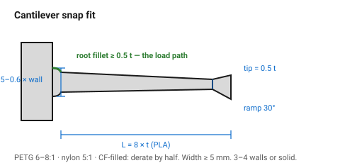
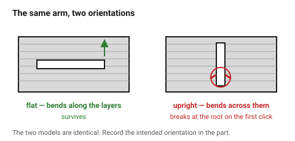

# Cantilever snap fit

A flexible arm with a hook on the end. The most useful fastening feature in
printed design — no hardware, no tools, and it can be opened.

Three things decide whether it works: the **length-to-thickness ratio**, the
**root fillet**, and the **print orientation**. Get any of them wrong and it
snaps off on the first assembly.

## When this applies

Battery doors, lids, covers, clips, panels — anything opened by hand and not
carrying load once closed.

## Good starting values

| What | Start with | Works between | Why |
|---|---|---|---|
| Root thickness *t* | 0.5–0.6 × wall thickness | — | thicker is **not** better: it raises the strain at the root |
| **Length : thickness (L/t)** | **8:1 for PLA** | 8–10 for stiff, 5–8 for ductile | shorter arms are stiff and snap; longer ones are floppy |
| Tip thickness | 0.5 × root thickness | — | tapering evens the strain along the arm |
| Width | 5 mm minimum | 5–15 mm | wider is stronger and barely less flexible |
| **Root fillet** | **≥ 0.5 × t** | 0.5–1 × t | the arm always fails at the root |
| Insertion ramp | 30° | 20–45° | how easily it clicks in |
| Retention face | 60–90° | | 90° cannot be opened without releasing the arm |
| Deflection | ≤ 0.02 × L | | strain limit for PLA/PETG |
| Side clearance in the housing | 0.2–0.3 mm | | so the arm flexes without rubbing |
| Walls in the arm | 3–4, or solid | | a partially hollow arm has a weak point exactly where the stress is |

### Material changes the ratio

| Material | L/t | Note |
|---|---|---|
| PLA | 10:1 | stiff and brittle — the longest arm of the three |
| PETG | 6:1 to 8:1 | the best snap-fit material here |
| ABS/ASA | 7:1 | good |
| Nylon | 5:1 | very ductile; short arms work |
| CF-filled anything | **derate by half** | fibres make it stiffer and much more brittle |

### Orientation is the failure most people meet first

> **Print the arm so it flexes parallel to the layers, not across them.**

An arm printed standing up — where bending pulls the layers apart — fails at a
fraction of its designed load, at the root, on the first click. The same arm
lying flat survives. This is the single most common snap-fit failure in FDM
and it is invisible in the model.

## How to build it

1. Set the root thickness from the wall: 0.5–0.6 × wall.
2. Set the length from the L/t ratio for the material.
3. Taper the arm to half thickness at the tip.
4. **Add the root fillet.** ≥ 0.5 × t, always.
5. Choose the orientation so the arm bends in the layer plane, and mark it.
6. Make the arm solid or 4-walled.
7. Give the housing 0.2–0.3 mm side clearance and 0.1–0.2 mm past the
   undercut.
8. Print one as a coupon and cycle it ten times before committing.

## When to do it differently

- **A one-time closure** → a rigid hook is fine; no flexing needed.
- **Hundreds of cycles** → PETG or nylon, longer arm, lower deflection. PLA
  will fatigue.
- **The clip must not be visible** → put the arm inside and the ramp on the
  mating part.
- **The joint carries load when closed** → do not rely on the snap. Add a
  screw, and let the snap only locate.
- **TPU** → a snap fit in TPU does not click; it simply deforms.

## Images

*Root thickness from the wall, length from the L/t ratio, tapered to half at
the tip, and a fillet at the root that is not a detail but the load path.*

*Flat, the arm bends along the layers and survives. Standing up, bending pulls
the layer welds apart and it breaks at the root on the first click — and the
two models are identical.*

## Source & date

- L/t ratios, taper and root fillet: [Protolabs Network — how to design snap-fit joints for 3D printing](https://www.hubs.com/knowledge-base/how-design-snap-fit-joints-3d-printing/),
  [Meshra — snap-fit joints for 3D printing](https://meshra.ai/blog/snap-fit-joints-3d-printing),
  [Sovol — 3D printed snap-fit joints](https://www.sovol3d.com/blogs/news/3d-printed-snap-fit-joints-how-to-design-clips-that-work).
- Root thickness 0.5–0.6 × wall and tip taper to half:
  [RJC Mold — snap-fit design guide](https://rjcmold.com/guides/snap-fit-design).
- Orientation rule and solid-infill advice: Sovol, above.
- `confidence: medium`.
