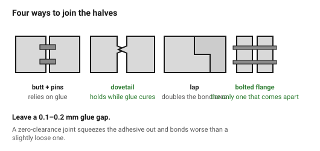
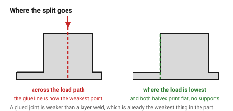

# Splitting large parts

A part larger than the bed is not a problem to be scaled around. Splitting it
is often the *better* design anyway: each piece can be oriented for its own
strength and surface, supports disappear, and a failed print costs one piece
instead of twelve hours.

The joint is the whole design problem.

## When this applies

Any part that exceeds the build volume, any part whose orientation forces a
compromise, and any part where one region needs a different material.

## Good starting values

| What | Start with | Works between | Why |
|---|---|---|---|
| Joint clearance (rigid materials) | 0.25 mm | 0.2–0.5 | the two halves have their own errors |
| Alignment pin ⌀ | 4–6 mm | 3–8 | thinner pins shear during assembly |
| Pins per joint | 2 minimum | 2–4 | two fix position and rotation |
| Pin chamfer | 0.5 mm × 45° | — | guides the pin past the elephant foot |
| Dovetail angle | 10–15° | 8–20 | steeper and it wedges; shallower and it slides out |
| Glue gap | 0.1–0.2 mm | — | a joint with zero gap squeezes all the adhesive out |
| Overlap length in a lap joint | ≥ 3 × wall | — | the bond area is what carries the load |

### Which joint

| Joint | Strength | Alignment | Note |
|---|---|---|---|
| **Flat butt + pins** | low without glue | good | the simplest; relies entirely on adhesive |
| **Dovetail** | good in one axis | excellent | mechanical interlock before the glue cures |
| **Lap / stepped** | good | good | doubles the bond area |
| **Puzzle / jigsaw** | good in-plane | excellent | pretty, and weak out-of-plane |
| **Bolted flange** | best | good | serviceable, and the only one that comes apart |

### Adhesives

| Material | Use |
|---|---|
| PLA | cyanoacrylate (thin CA), or dichloromethane |
| PETG | CA, or epoxy for a structural joint |
| ABS/ASA | **acetone** — it welds the plastic, not glues it. The strongest option here |
| Nylon | epoxy; most glues fail on nylon |
| TPU | flexible CA or contact adhesive |

## How to build it

1. **Put the split where the load is lowest**, and never across the main load
   path. A glued joint is weaker than a layer weld, which is already the
   weakest thing in the part.
2. Prefer a split that lets **both halves print flat**, with no supports.
   This is usually the real win, not the size.
3. Add two alignment pins, chamfered, with 0.25 mm clearance.
4. Add a dovetail or a lap if the joint carries any load.
5. Leave a glue gap — 0.1–0.2 mm. A zero-clearance joint squeezes the
   adhesive out and bonds worse than a loose one.
6. **Dry-fit before gluing**, and glue in stages on a multi-part assembly.
7. Mark each piece (recessed text on the bottom face) — four printed segments
   are indistinguishable an hour later.

## When to do it differently

- **A part that must be watertight** → do not split it through the sealed
  volume. Move the joint, or add a gasket groove.
- **A cosmetic surface** → put the joint on an edge or a feature line, where
  a visible seam reads as intentional.
- **A part that will be transported** → a bolted flange lets it ship flat and
  be assembled on site.
- **The part is only slightly too big** → rotating it 45° on the bed often
  gains 40 % of the diagonal. Try that first.

## Images

*Butt with pins, dovetail, lap and bolted flange. Only the last one comes
apart again, and only the dovetail holds itself together while glue cures.*

*Put the joint where the load is lowest, and prefer a split that lets both
halves print flat without supports — that is usually the larger win.*

## Source & date

- Joint types, clearances and alignment practice:
  [Forge Labs — splitting and assembling large 3D printed parts](https://forgelabs.com/splitting-and-assembling-large-3d-printed-parts/),
  [Sovol — 3D printing large models in multiple pieces](https://www.sovol3d.com/blogs/news/3d-printing-large-models-in-multiple-pieces-keys-glue-and-assembly-tips),
  [Kingroon — best methods to bond 3D prints](https://kingroon.com/blogs/3d-print-101/best-methods-to-bond-3d-prints-together).
- `confidence: medium`.
