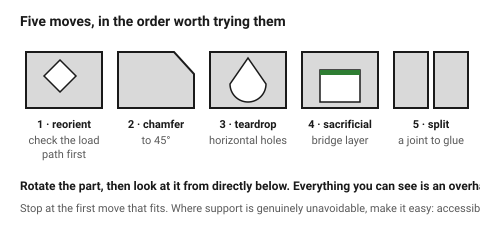
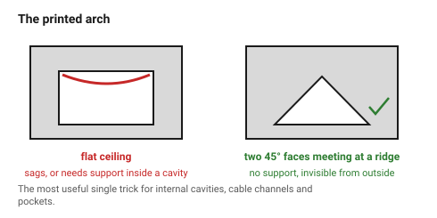

# Designing so supports are not needed

Supports work. They also cost print time, filament, a rough surface wherever
they touched, and the labour of removing them — and they are the most common
reason a printed part looks home-made.

Most of the time they can be designed out, and the changes are small.

## When this applies

Every part, at the geometry stage, after the orientation is chosen. Especially
anything that will be printed more than once.

## Good starting values

The five moves, in the order worth trying them:

| # | Move | Cost |
|---|---|---|
| 1 | **Reorient the part** | may weaken it — check the load path first |
| 2 | **Chamfer the overhang to 45°** | a visible chamfer |
| 3 | **Teardrop or hexagon a horizontal hole** | a slightly non-round hole |
| 4 | **Add a sacrificial bridge layer** | a 0.2–0.4 mm skin to remove |
| 5 | **Split the part** | a joint to glue |

| Situation | Move |
|---|---|
| Underside of a boss or lip | chamfer to 45° |
| Horizontal hole | teardrop, hex, or sacrificial bridge |
| Ceiling of an internal cavity | sacrificial bridge, or split |
| A large flat overhang | reorient, or split |
| An unsupported rib | angle it to 45° |
| A protruding lug | fillet underneath it up to 45° |
| A deep pocket with a flat ceiling | make the ceiling a 45° roof — a "printed arch" |

### The printed arch

Any flat ceiling can be replaced by two 45° faces meeting at a ridge. It
prints with no support, costs a little internal volume, and is invisible from
outside. For internal cavities, cable channels and pockets it is the single
most useful trick in this document.

## How to build it

1. Rotate the part into its chosen orientation, then **look at it from
   directly below**. Everything visible is an overhang.
2. For each one, work down the five moves and stop at the first that fits.
3. Re-check: chamfers and arches change the part's internal volume, which can
   collide with something else.
4. Where a support is genuinely unavoidable, make it **easy**: put the
   supported face on a non-visible side, and keep the supported region small
   and accessible to a tool.

## When to do it differently

- **A one-off, print time irrelevant** → supports are fine. This document is
  for parts that will be printed repeatedly.
- **Organic or sculptural geometry** → support it. The 45° discipline is for
  engineering parts.
- **A soluble-support machine (dual extruder)** → the cost calculation
  changes entirely; design freely and support everything.
- **The chamfer would be visible and ugly** → supports plus sanding may be the
  better trade. Say which you chose and why.

## Images

*Reorient, chamfer, teardrop, sacrificial bridge, split — in that order. The
first one that fits is usually the right one.*

*Two 45° faces meeting at a ridge. No support, invisible from outside, and it
turns an impossible ceiling into ordinary geometry.*

## Source & date

- Support-avoidance techniques:
  [3D Printerly — how to print holes without supports](https://3dprinterly.com/how-to-3d-print-holes-without-supports-is-it-possible/),
  [Hackaday — sacrificial bridge](https://hackaday.com/2017/10/17/sacrificial-bridge-avoids-3d-printed-supports/),
  [UltiMaker — design for FFF](https://ultimaker.com/learn/design-for-fff-3d-printing-maximize-your-success/).
- `confidence: medium`.
