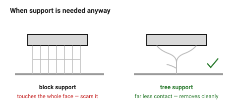

# When supports are the right answer

Designing supports out is the default, not a rule. Sometimes the geometry is
the point, and contorting it to avoid support produces a worse part than
simply supporting it.

## When this applies

After [`designing-without-supports`](designing-without-supports.md) has been
worked through and an overhang remains.

## Good starting values

### Support them when

| Situation | Why |
|---|---|
| The geometry is organic or sculptural | there is no "45° version" of a face |
| A chamfer would break the fit | a mating surface cannot be chamfered |
| A visible surface would be spoiled by the fix | supports plus sanding beats a visible chamfer |
| The part is a one-off | design time costs more than print time |
| The machine has soluble support | the cost calculation is different |
| Splitting the part would weaken it | a glued joint is weaker than a supported overhang |

### Design so the support is easy to remove

| What | Do this |
|---|---|
| Access | supported regions reachable by pliers, not inside a closed cavity |
| Contact area | prefer tree/organic supports — much less contact |
| Interface layer | a 0.2 mm gap in Z; the support should peel, not tear |
| Which face | put supported faces where they will not be seen or measured |
| Critical dimensions | never on a supported face — the surface is rough and oversize |

### What supports cost

| | Typical |
|---|---|
| Extra print time | 15–40 % |
| Extra filament | 10–30 % |
| Surface finish on supported faces | visibly rough; 0.1–0.3 mm oversize |
| Removal labour | minutes per part, every part |

That last row is the one that matters for a part printed more than once.

## How to build it

1. Decide **which faces** will be supported, and check none of them is a
   mating or measured surface.
2. Provide access: no supports inside a sealed cavity.
3. Where a supported face must still be accurate, add 0.3 mm of machining
   stock and clean it up afterwards.
4. Note in the model that the part needs supports, and on which face. A part
   printed without the intended supports fails in a way that looks like a
   design fault.

## When to do it differently

- **A production run** → go back and design them out. Removal labour repeats
  for ever; design time does not.
- **A part with an internal cavity needing support** → split it instead.
  Support inside a closed volume cannot be removed.

## Images

*Tree supports touch far less of the part, so they remove more cleanly and
leave less scarring — usually the better default when support is needed at
all.*

## Source & date

- Support trade-offs: [UltiMaker — design for FFF](https://ultimaker.com/learn/design-for-fff-3d-printing-maximize-your-success/),
  [Xometry Pro — FDM design tips](https://xometry.pro/en/articles/fdm-design-tips/).
- `confidence: medium`.
