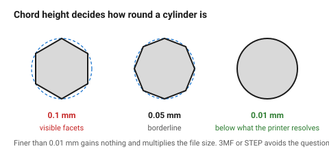

# Exporting — STL, 3MF and units

Three decisions, and all three are silent failures: the **format**, the
**tessellation tolerance**, and the **units**. A part that arrives at 1/25.4
of its intended size, or with visibly faceted cylinders, failed here rather
than in the design.

## When this applies

Every export from CAD to a slicer.

## Good starting values

### Which format

| Format | Verdict |
|---|---|
| **3MF** | **the best choice**. Carries units, colour, multiple parts, and often the print settings. Compact and unambiguous |
| STL | universal and dumb: triangles only, no units, no colour. Still the lingua franca |
| STEP | some slicers now import it and tessellate themselves, which gives the best surface quality. Preferred if supported |
| OBJ | fine, rarely needed |

Export **3MF** where the slicer accepts it, STL otherwise. STEP if the slicer
handles it — it avoids the tessellation question entirely.

### Tessellation for STL

An STL approximates curves with triangles. Too coarse and cylinders are
visibly faceted; too fine and the file is enormous for no benefit.

| Setting | Value | Note |
|---|---|---|
| Chord height / deviation | **0.01 mm** | the setting that actually matters |
| Angle tolerance | 5–10° | |
| Typical file size, small part | 1–10 MB | |
| Too coarse | > 0.05 mm deviation | visible facets on a 20 mm cylinder |
| Pointlessly fine | < 0.005 mm | a 200 MB file that slices no better |

A 0.01 mm chord height is below what an FDM printer can reproduce, so it is
the right place to stop.

### Units

STL has **no unit field**. Every slicer assumes millimetres. A CAD package
working in inches exports a number that is interpreted as millimetres, and the
part arrives 25.4 times too small.

| Check | Do this |
|---|---|
| Work in millimetres | throughout |
| After export | open the file in the slicer and check the bounding box |
| If a part looks tiny or enormous | it is units, not scaling — fix the export |

3MF carries units, which is one more reason to prefer it.

## How to build it

1. Model in millimetres.
2. Export 3MF if possible; otherwise STL at 0.01 mm chord height.
3. **Open the exported file in the slicer** and check the bounding box against
   the intended dimensions.
4. Look at a curved surface in the slicer preview. Visible facets mean the
   tolerance was too coarse.
5. For a multi-part assembly, export 3MF with all parts in one file —
   positions are preserved, and the slicer can keep them arranged.

## When to do it differently

- **A very large model** → coarser tessellation (0.02 mm) keeps the file
  manageable and is still below what the printer resolves.
- **A model with tiny detail** → 0.005 mm, and accept the file size.
- **Sending to someone else** → 3MF with the print profile embedded, plus the
  intended material, nozzle and orientation written in the filename.

## Images

*Chord height decides how round a printed cylinder looks. 0.01 mm is below
what an FDM printer can reproduce, which is the right place to stop.*

## Source & date

- Format and tessellation practice:
  [3D on Demand — design guidelines, file prep](https://www.3d-demand.com/blog/design-guidelines-for-fdm-3d-printing-wall-thickness-tolerances-file-prep),
  [Xometry Pro — FDM design tips](https://xometry.pro/en/articles/fdm-design-tips/).
- `confidence: high` — these are facts about the file formats.
