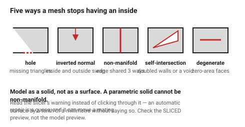

# Watertight meshes and mesh errors

A slicer works by intersecting the model with horizontal planes and asking
"which side is inside?". That question only has an answer if the mesh is a
**closed, consistently oriented surface** — watertight, manifold, normals
outward.

When it is not, the slicer either repairs it silently (and the result is not
what was modelled) or produces geometry that looks correct in preview and
prints wrong.

## When this applies

Every export to STL. Less often with 3MF and not at all with STEP, since a
solid model cannot be non-manifold.

## Good starting values

### The five mesh faults

| Fault | What it looks like | Slicer behaviour |
|---|---|---|
| **Holes** (missing triangles) | a gap in the surface | fills it arbitrarily, or leaves a missing wall |
| **Inverted normals** | a face pointing inward | inside and outside swap; walls appear where air should be |
| **Non-manifold edges** | an edge shared by more than two faces | unpredictable; often a sliver of solid |
| **Self-intersection** | the surface passes through itself | doubled walls, or a void |
| **Duplicate / degenerate faces** | zero-area triangles | usually harmless, sometimes a crash |

### Where they come from

| Source | Typical fault |
|---|---|
| Boolean operations in a mesh editor | self-intersection, non-manifold edges |
| Scanned meshes | holes, inverted normals |
| Sculpting apps | everything |
| **Solid CAD (parametric)** | none — a valid solid exports a valid mesh |
| Zero-thickness surfaces | non-manifold by definition |

### The rule that prevents most of it

> **Model as a solid, not as a surface.** A parametric solid modeller cannot
> produce a non-manifold body. Every mesh fault in this list comes from
> working with surfaces or triangles directly.

## How to build it

1. Export from a solid model wherever possible.
2. Open the exported file in the slicer and look for a warning — most slicers
   report "model is not manifold" and offer to repair. **Read the warning
   rather than clicking through it.**
3. Look at the **sliced preview**, not the model preview. Mesh faults show up
   as missing walls, doubled perimeters or filled cavities in the sliced
   layers.
4. Where a repair is needed, repair in the modeller and re-export. A slicer's
   automatic repair is a guess.
5. For a mesh that came from a scan or a sculpt, run a dedicated repair pass
   before slicing.

## When to do it differently

- **A decorative model from the internet** → let the slicer repair it; the
  stakes are low.
- **A functional part with a fault** → fix it at the source. An automatic
  repair can silently move a mating surface by a tenth of a millimetre.
- **Zero-thickness features in the design** (a "surface" with no volume) →
  this is a modelling error, not an export one. Give it thickness.

## Images

*What each fault does to the sliced result. The slicer's question — "which
side is inside?" — has no answer for any of them.*

## Source & date

- Mesh requirements and slicer behaviour:
  [3D on Demand — file prep](https://www.3d-demand.com/blog/design-guidelines-for-fdm-3d-printing-wall-thickness-tolerances-file-prep),
  [Xometry Pro — FDM design tips](https://xometry.pro/en/articles/fdm-design-tips/).
- `confidence: high`.
